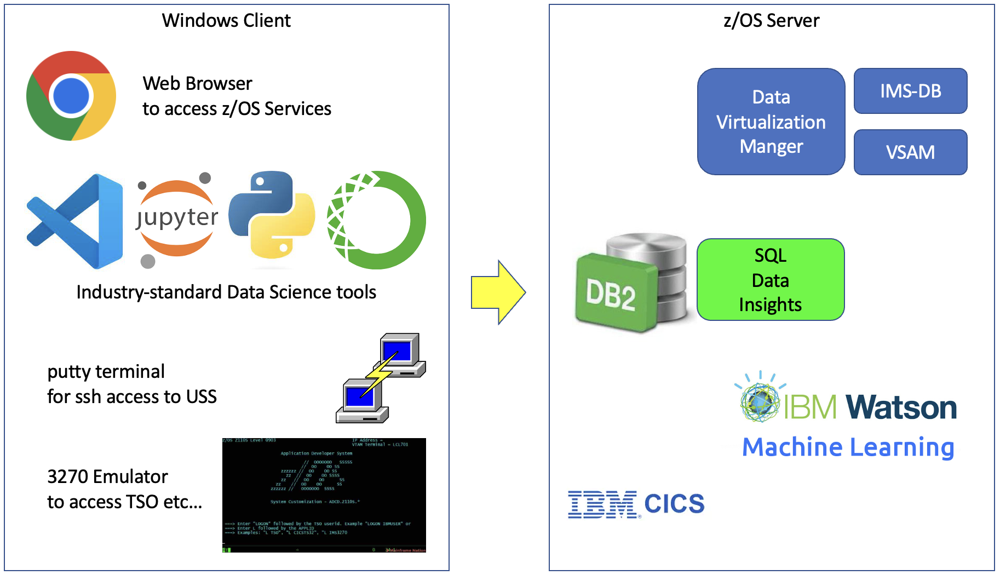
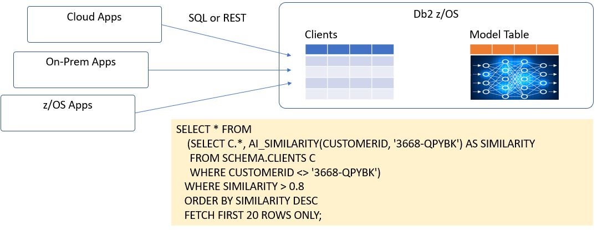

# AI at Scale on IBM Z - Level 3 Hands-On Workbook

***Contents***

1. Objectives and Scope of this workbook
2. Accessing the ZVA environment to perform the hands-on exercises
3. Using Opensource Data Science Tools with IBM Z Data Sources
4. Using Db2 z/OS SQL Data Insights to support the data wrangling process
5. Developing and Training a Model
6. Deploying the Model to Watson Machine Learning for z/OS
7. Calling the Model from CICS for realtime scoring of CICS transactions
8. Calling the Model from anywhere using REST APIs
9. Developing AI scoring services with SQL Data Insights
10. Review the AI lifecycle support available on IBM Z

## 1. Objectives and Scope of this workbook

This workbook is a companion intended for use with the Test Drive System for AI Solutions on z/OS available at 'Z Virtual Access' (ZVA)

* The ZVA image includes a range of Data and AI software on z/OS, prepared and ready for a test drive.
* This workbook is a guided tour for using that software to progress through an AI lifecycle process. (Data analysis, Model Training, Deploying Scoring Models, and Calling the Models from OLTP environments).

The objective is to provide practical insight into deploying AI solutions on the IBM Z platform, using a worked example that is documented in this workbook.

A sister workbook is also available to allow practitioners to rehearse the deployment of the software, to gain experience in the deployment processes before performing a deployment in a customer environment.

## 2. Accessing the ZVA environment to perform the hands-on exercises

[zTrial](https://www.ibm.com/z/trials) is an internet-facing portal for clients to book demonstrations and test environments for z/OS software. The images in zTrial have been carefully designed to provide easy-to-use, well-structured, scripted environments as a self-serve experience. Any client can request a specific zTrial environment, and it will be provisioned in a day or so, and remain accessible for 4 days.

ZVA is the IBM-internal development version of zTrial. It is the place where polished zTrial images are developed. IBMers can request ZVA images for use by either IBMers or clients. ZVA images can be used for hands-on-labs or demonstrations. IBMers can request ZVA images for customer workshops at the following URL within the IBM firewall. [ZVA_Portal](https://zva.wdc1a.cirrus.ibm.com/)

Both ZVA and zTrial images consist of
- a networked combination of a Windows Client and a z/OS server.
- prepared with software and data for specified z Software fanmiliarisation.
- and accessible over the internet, either from a web browser, or an RDP client.

### 2.1 The AI on Z test-drive image.

The image below represents the software available to use during this lab exercise.

### 2.2 Access to the ZVA image.

When you receive your signon creditials, they will look something like this.

|URL|User ID for Web browser|Password|
| --- | --- | --- | 	 	 	 
|https://T-2428-130-198-93-170.ibmztrialmachines.com/	|Administrator	|qufG2d4LiCJG8xvg1B7W!|

or this

|IP Address for Remote Desktop|User ID for Remote Desktop|Password|
| --- | --- | --- | 	 	 
|T-2428-130-198-93-170.ibmztrialmachines.com	|w-2428-k\Administrator	|qufG2d4LiCJG8xvg1B7W!|

The easiest method of accessing the ZVA image is to click on the Browser URL, and cut and paste the userid and password into the logon screen.

If you prefer to use a Remote Desktop Protocol client, paste the RDP IP Address into your RDP client, and then paste the userid and password into the logon screen.

### 2.3 Starting Point

The system that you connect to will be a Windows client, with various tools that access the z/OS image.

* Personal Communications Client - for 3270 access to the host (wg31.washington.ibm.com) on port 23.
* Putty - for ssh connection to z/OS unix system services (USS) on port 22.
* DB2 Connect Command Line Processor (DB2 CLP) for SQL access to Db2 z/OS V13 on port 5045.
* Chrome browser - for http access to the z/OS Software Services ( SQLDI, WMLZ etc... )
* VS Code - ubiquitous development IDE with plugins for Db2 z/OS, Python, Jupyter Notebooks etc...

The userids and passwords that you will be using are
* IBMUSER (SYS1) - a z/OS superuser with limitless powers ;-)
* AIDBADM (AIDBADM) - the SQLDI administrator userid

The z/OS system is pre-installed with
* z/OS V2.5
* Db2 z/OS V13 
* SQL Data Insights feature of Db2 z/OS V13
* Watson Machine Learning for z/OS V2.4

Db2 z/OS V13 will be started already. It's connection details are
* Subsystem ID = DBDG
* DRDA Location Name = DALLASD
* TCPIP hostname = wg31.washington.ibm.com
* DRDA Port = 5045

The outline of the Lab Exercises in the rest of this document is as follows 

3. Using Opensource Data Science Tools with IBM Z Data Sources
4. Using Db2 z/OS SQL Data Insights to support the data wrangling process
5. Developing and Training a Model
6. Deploying the Model to Watson Machine Learning for z/OS
7. Calling the Model from CICS for realtime scoring of CICS transactions
8. Calling the Model from anywhere using REST APIs
9. Developing AI scoring services with SQL Data Insights

## 3. Using Opensource Data Science Tools with IBM Z Data Sources

Data Science is founded in open source technologies. 
The tools needed to perform many aspects of data science are freely available to download from the internet. 
Examples are software tools such as python, anaconda, jupyter, spark, tensorflow and so forth.

Many vendors (including IBM) provide commercial-grade software that combine open source technology with commercial software. 
IBM's Watson Machine Learning for z/OS is an example, where opensource software is compiled to run on IBM Z, and
optimised to exploit the Z16 Telum AI Acceleration Unit, and integrated with transaction and data processing environments like 
IMS, CICS and Db2.

For the purposes of these lab exercises we will start by using some common open source AI tooling, and just connecting it directly 
to IBM z/OS for data access. Specifically, the following software has been installed on the Windows client.

* Anaconda, which helps you create an environment for many different versions of Python and package versions.
* Python itself, and many other analytics packages for data analysis and charting.
* Jupyter Notebooks, which is used for data wrangling by millions of data scientists worldwide
* VSCODE (from Microsoft), which is the ubiquitous IDE for developers, and is a great user interface for running Jupyter Notebooks.

For the purposes of the Lab workbook, we just need to start VSCODE and play some of the Jupyter notebooks that have been prepared earlier.

### 3.1 Invoking the Jupyter-familiarisation notebook.

***Optional Step*** You may skip this step and progress to Step 3.2 if you are already familiar with the concepts of using Juputer notebooks.

From the desktop, open VSCODE.

Now hit File + Open + ...... instructions for opening the introductory jupyter notebook to access Db2.

Get used to the feel of running Jupyter notebooks by clicking through this introductory notebook. 
The notebooks include detailed notes on the steps performed, so that they are self-documenting and independent of this workbook.
This introductory workbook performs the following tasks.

1. Install and import the python and db2 libraries (using anaconda)
2. Load a connection to the Db2 z/OS database
3. Query the data for the classical data science datasets of Penguins and Irises
4. Fit a Data Model and Train the data model

***Insert some selected screenshots from the Notebook here***

That concludes the introductory familiarisation with Jupyter notebooks and Db2 z/OS.

### 3.2 Invoking the Jupyter notebook to analyze the credit card fraud dataset.

The primary dataset that we will use in this lab exercise is a synthetic credit card fraud dataset. 
This dataset includes 24 million credit card transactions by 2,000 credit card holders over a period of 20 years. 
It was developed by Eric Altman of IBM, and has been made available publicly through [kaggle](https://www.kaggle.com/datasets/ealtman2019/credit-card-transactions)

The data has been loaded into Db2 z/OS (where much financial transational data is often located), and 
we will explore this dataset by opening the following Jupyter notebook.

The notebook is well documented with notes to guide you through the following steps.

1. Import the python and db2 libraries (using anaconda)
2. Load a connection to the Db2 z/OS database
3. Query the credit card data to gain some initial insight into the underlying data
4. perform some data wrangling to attempt to discern patterns in the data, and determine what supervised model types might be best suited to predict fraud 

***Insert some selected screenshots from the Notebook here***

This is a really useful point to take a look at SQL Data Insights. 
One of the most valuable use cases for SQL Data Insights is to quickly gain an understanding of the data so that we are in a position to develop supervised machine learning models as quickly as possible.

## 4. Using Db2 z/OS SQL Data Insights to support the data wrangling process

The core concept of SQL Data Insights is that it builds and trains a neural network model for a Db2 table or view, load it into a model table that is associated with the base table, so that a range of Db2 BIFs (built-in-functions) can used within SQL queries for find patterns in the data. For example, if you have a table containing a list of clients and their important characteristics, you can discover which clients are most similar to a chosen client or cluster of clients.

The model used by SQLDI is the Bag of Words model, which is described by many places on the web such as [wikipedia](https://en.wikipedia.org/wiki/Bag-of-words_model)

Using a simple SQL query, you can do things like
- find and rank clients who are most similar to your most profitable clients. 
- find clients who have similar patterns to previous clients who closed their accounts.
- see which data items are most influential towards certain outcomes

SQLDI can operate against Db2 views, or even external data sources like IMS and VSAM.

## 5. Developing and Training a Model

## 6. Deploying the Model to Watson Machine Learning for z/OS

## 7.Calling the Model from CICS for realtime scoring of CICS transactions

## 8.Calling the Model from anywhere using REST APIs

## 9.Developing AI scoring services with SQL Data Insights

## 10. Review the AI lifecycle support available on IBM Z

