# Accessing Db2 on ZVA

These notes and screenshots are an aide-memoire for connecting to DB2 z/OS in the ZVA system.

## Contents

1. SPUFI
2. Db2 Admin Tool
3. DB2 CLP
4. Jupytr Notebooks

## 1. SPUFI 

SPUFI is an acronym. (SQL Processing Using File Input).

It is a very old way of accessing Db2, that originated before Windows was born, and people had to use 3270 terminals

Find the 3270 Emulator on the desktop and open it.

Enter "l tso" to logon to TSO

enter your username "ibmuser"

enter your password "SYS1"

wait for ISPF and *** to appear, then press enter

This is the ISPF main menu

Enter m ( more options )

Enter 15, for the Db2 sub menu

Enter 1 for SPUFI

The panel allows you to specify an input dataset and and output dataset, and a bunch of execution options. Press Enter to proceed

Ignore the code page mismatch. Press Enter to proceed

These are the default settings for interacting with Db2. Accept them. Press Enter to proceed

This the edit screen for your input file.
It contains a couple of SQL statements, each with the semi colon statement delimeter.
You can edit the SQL queries here to practice running SQL. Press Enter to proceed

SPUFI is now ready to submit your file. Press Enter to proceed

These are the results... TA DA !. Use F8 and F7 to scroll down and up. Press F3 when you are done.

Keep repeating this process until you are familiar with the process and running SQL in Db2 z/OS.

## 2. Db2 Admin Tool

Press F3 until you get back to the main panel. Then press m to get to more products again. Then press 16 to get to DB2 ADMIN TOOL.

Ignore the code page warning. Press enter to continue

The Db2 Admin Tool is John McKinnon's favouritest tool in the world. These note will show you how to start using it. But give John a call and ask him to give you the presidential tour. Press 1 to navigate the Db2 System Catalog.

Db2, like other RDBMS servers, stores data about tables it manages in.... a central set of tables called the catalog. ( SYSIBM.SYSTABLES, SYSIBM.SYSCOLUMNS, SYSIBM.SYSVIEWS etc... ). This little application just navigates the Catalog to show you what's stored in this Db2 system.

The Db2 Catalog stores information about lots of different objects. Tables, Views and Columns are Obvious. Tablespaces are the physical datasets that the tables are stored in. packages are bound SQL statements. Lets start with Tables. Press T

This are the tables in the system

You can add masks to narrow what you see. Enter the mask "Q*" under schema to find all the tables in any schema starting with Q

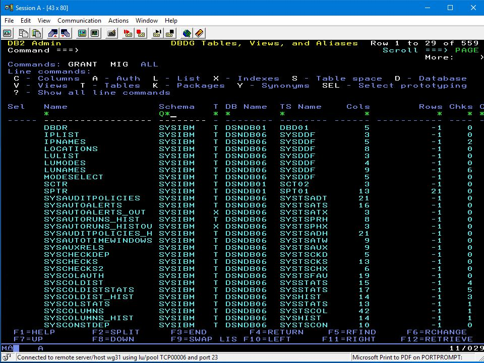

Press Enter and all the tables under schema Q* are displayed. You can enter commands on the left hand side. Some of the common commands are listed at the Top,. ENter "S" against table Q.ORG to find what tablespace it resides in.

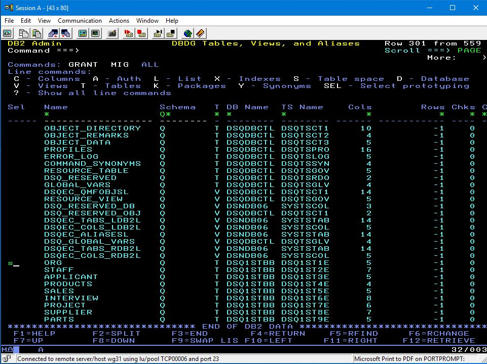

There it is. Now, enter "?" against the tablespace to find what commands are available.

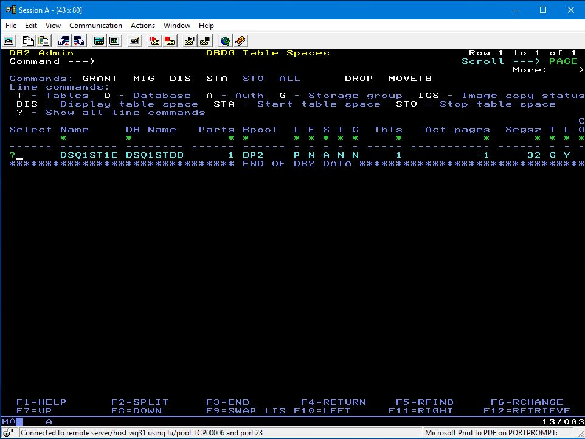

Scroll down, and select the option to perform a utility operation ( Full Copy )

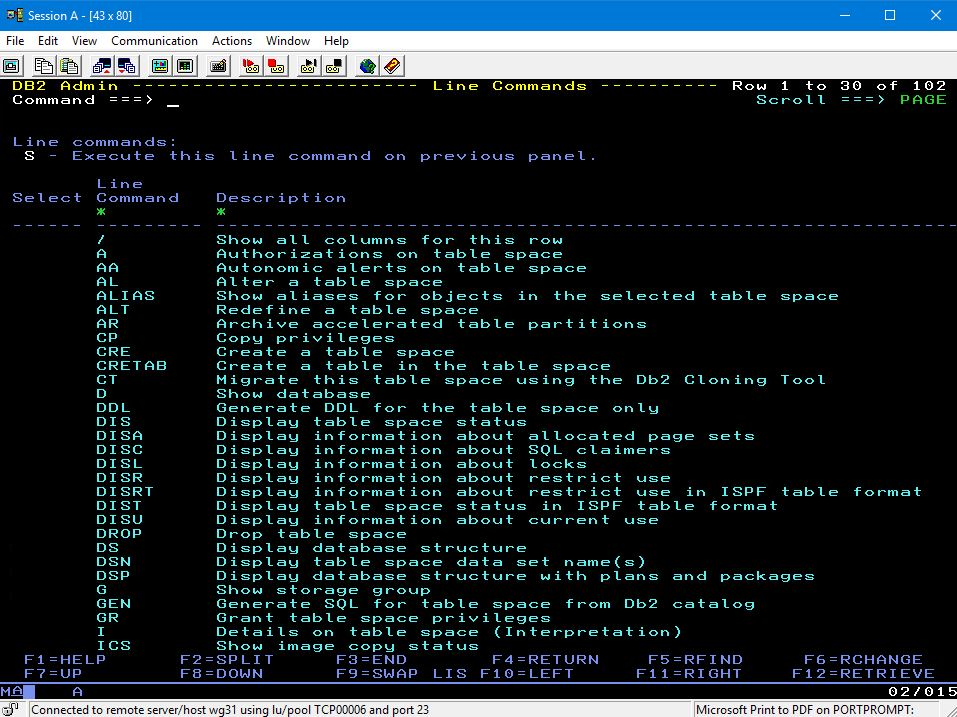

Enter S next to "u.c"

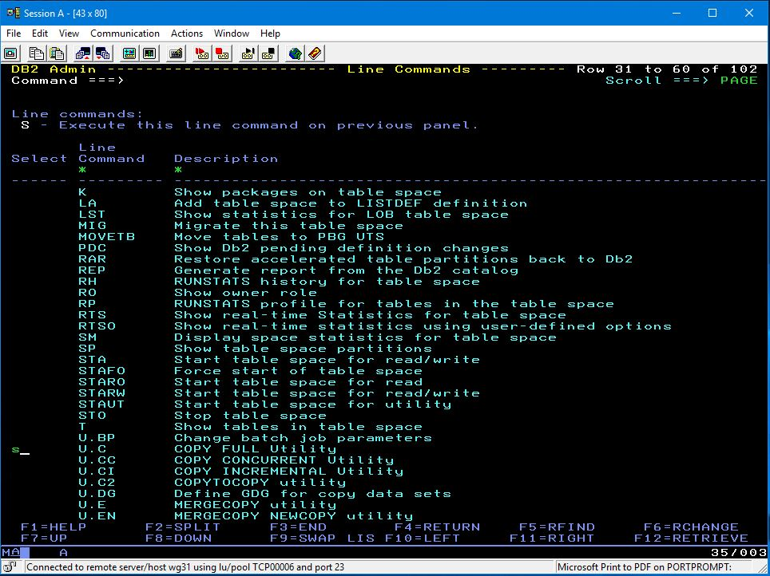

It generates the JCL to submit a Full Copy database utility

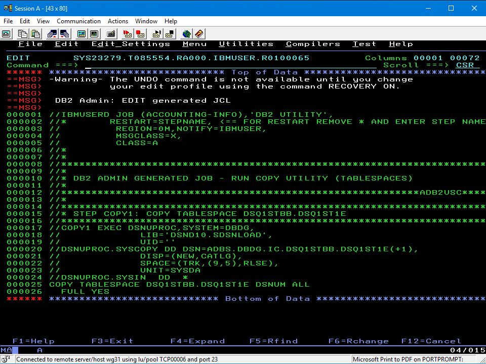

You can just type "sub" to submit thiks job immediately. Or you can copy the JCL into an automated housekeeping suite. If you actuallu submit it, I think it may fail. You might want to get Ben to walk you through the steps to use SDSF to investigate why it failed, and then correct the problem to run it.

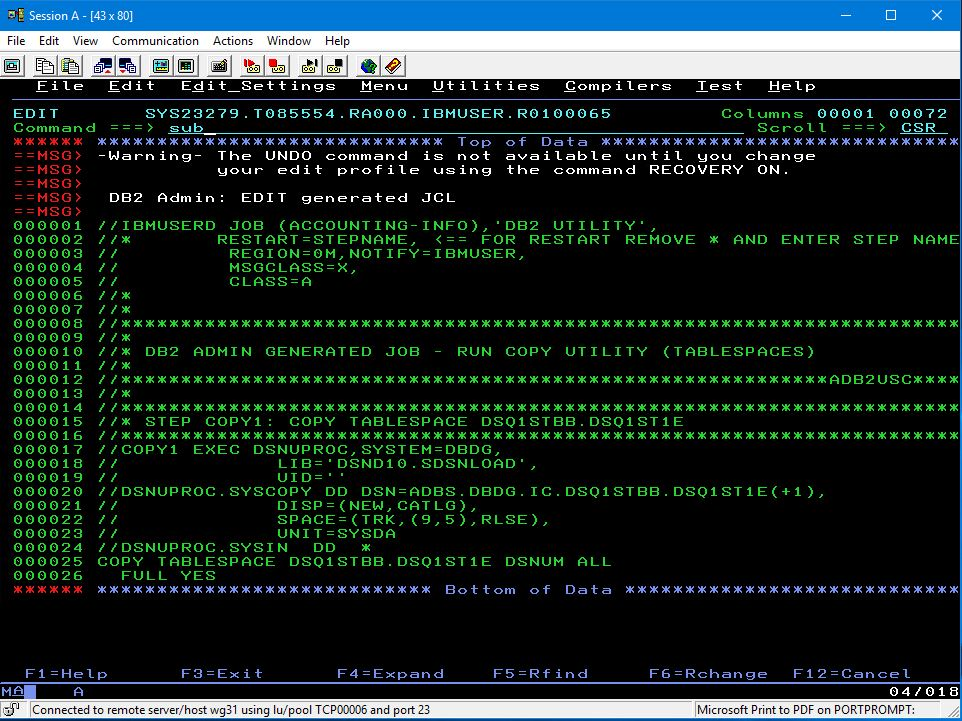

## 3. DB2 CLP

Moving away from 3270 screens, Db2 has a number of clients and drivers that allow applications ( like query tools running on Windows ) to connect to DB2 and access Db2 data. Find the Db2 Command Line Application on the Desktop.

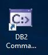

Open it. Type the command " db2 connect to DALLASD user IBM USER using SYS1 " in order to connect to the Db2 systems ( whose name is DALLASD )

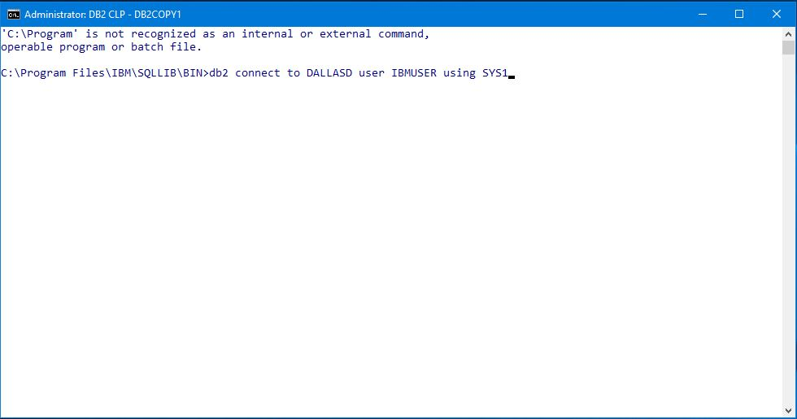

Now, enter an SQL Query

Now disconnect

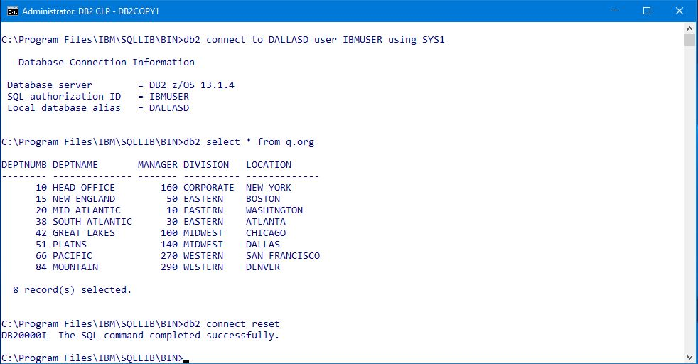

## 4. Jupyter Notebooks

Locate the vscode icon. Open it.

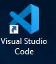

This VSCODE instance has had the Jupyter Notebook plugins installed. That's another way to work with Db2.

After VSCODE initialises, Open the notebook SQL_Data_Insights.ipynb

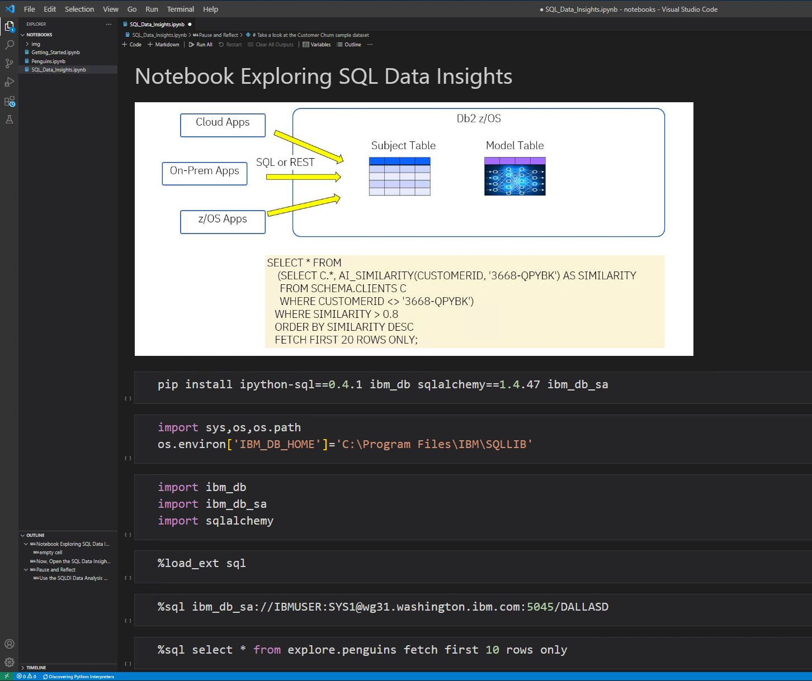

If you know how to use Jupyter Notebooks, then you should be able to work through this notebook

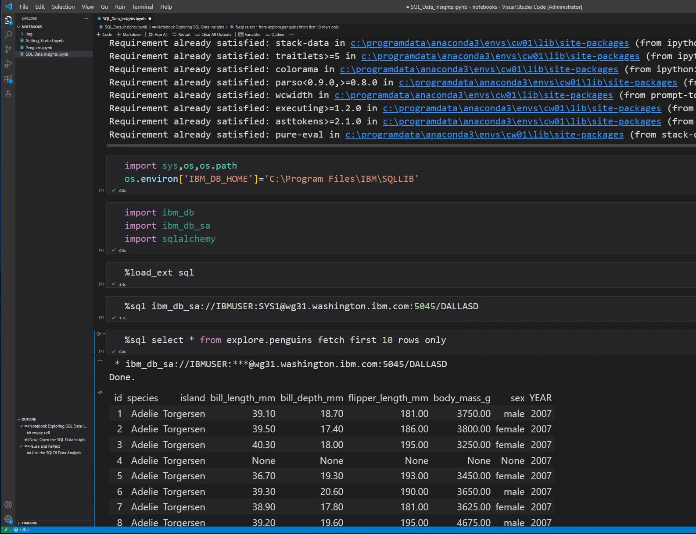

Ignore the code page warning. Press enter to continue

If you want to do the SQL Data Insights Lab Exercises, I attach the workbooks for you to use.

## Summary

These notes are purely to get you started connecting to DB2 in the ZVA image.

Whilst I am away you can use this ZVA image as your own z/OS playground. There will be some limits on what you can do with it, but I would suggest scheduling a couple of webex sessions with Ben and John.

John is Mr Db2
Ben is Mr zOS

