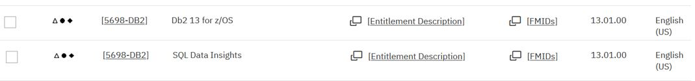

# Accessing Db2 on ZVA

These notes and screenshots are an aide-memoire for connecting to DB2 z/OS in the ZVA system.

## Contents

1. SPUFI
2. Db2 Admin Tool
3. DB2 CLP
4. Jupytr Notebooks

## 1. SPUFI 

The core concept of SQL Data Insights is to build and train a neural network model for a Db2 table or view, load it into a model table that is associated with the base table, so that a range of Db2 BIFs (built-in-functions) can used within SQL queries for find patterns in the data. For example, if you have a table containing a list of clients and their important characteristics, you can discover which clients are most similar to a chosen client or cluster of clients.

The model used by SQLDI is the Bag of Words model, which is described by many places on the web such as [wikipedia](https://en.wikipedia.org/wiki/Bag-of-words_model)

Using a simple SQL query, you can do things like
- find and rank clients who are most similar to your most profitable clients. 
- find clients who have similar patterns to previous clients who closed their accounts.
- see which data items are most influential towards certain outcomes

SQLDI can operate against Db2 views, or even external data sources like IMS and VSAM.

Two of the most likely use cases for SQLDI are
1. Business Analytics Users.
2. Data Scientists who are charged with developing more targetted machine learning scoring models.

## 2. Db2 Admin Tool

SQLDI is a no charge feature of Db2 z/OS V13, but you do need to order this feature explicitly in order to get it. The screenshot below is from ShopZ, showing two separate items to order, each with the same Product ID.

If you already have Db2 z/OS V13 installed, you can order SQL Data Insights as a CBPDO for it's own SMPE CSI, or to add to the Db2 SMPE CSI.

## 3. DB2 CLP

SQLDI is a standard SMPE installation, which will not be addressed in this document.

There are several pre-requisites that you should resolve before ordering SQLDI. As always, you should refer to the current page in the Db2 z/OS knowledge centre to get the latest information. [link to SQLDI Pre-Requisites](https://www.ibm.com/docs/en/db2-for-zos/13?topic=di-preparing-sql-installation)

* z/OS ( V2.4 or V2.5 ) requires several PTFs to be applied to provide the pre-requisite AI libraries.
* Db2 needs the fix for APAR PH49781
* z/OS OpenSSH and the IBM 64-bit JDK are also needed.

## 4. Jupyter Notebooks

When Planning for SQLDI deployment, it is very helpful to consider an architecture diagram of all the moving parts.

SQLDI runs in USS ( z/OS Unix Systems Services ). It only needs to be running when you are training new models. Once the models are trained, and loaded into the model tables, SQLDI can be stopped, and Db2 z/OS will continue to serve AI-enabled queries.
