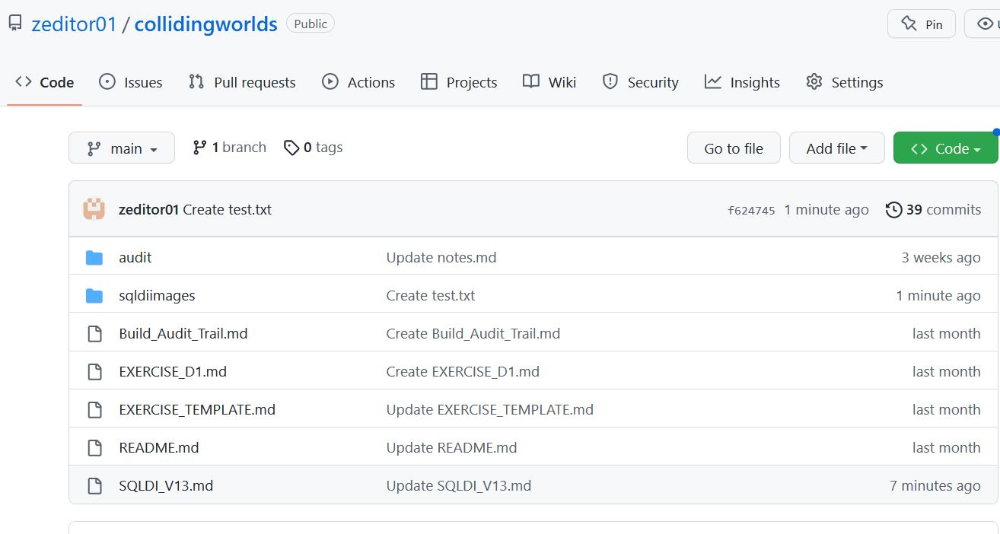

# SQL Data Insights Feature of Db2 V13

SQL Data Insights is a standard feature of Db2 V13, that provides AI-enabled queries. 
This document provides a step-by-step worked example of how to deploy it and use it.
The worked example is based on a z/OS V2.5 system image that IBM can provision for clients for demonstrations and skills transfer.
However, this document is written in a generic way, so that it can be helpful to clients deploying SQLDI in their own systems.

**Note** This document is a worked example, written as a simple "getting started" scenario. It should be used in conjunction with the official Db2 z/OS product documentation, which is referenced at the end of this document.

## Contents

1. SQL Data Insights Overview
2. Ordering
3. Installation with SMPE
4. Planning for SQLDI deployment
5. Deploying an SQLDI instance
6. Installation Verification Test
7. Usage Scenarios ( Tables, Views and Aliases )
8. Usage Considerations
9. References and Further Reading

## 1. SQL Data Insights Overview 

The core concept of 

## 2. Ordering SQLDI

## 3. Installation with SMPE

## 4. Planning for SQLDI deployment

## 5. Deploying an SQLDI instance

## 6. Installation Verification Test

## 7. Usage Scenarios ( Tables, Views and Aliases )

## 8. Usage Considerations

ccc

## 9. References and Further Reading

ccc

