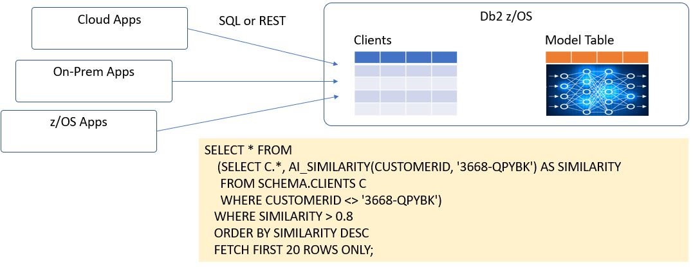
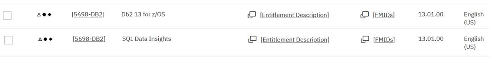

# SQL Data Insights Feature of Db2 V13

SQL Data Insights is a standard feature of Db2 V13, that provides AI-enabled queries. 
This document provides a step-by-step worked example of how to deploy it and use it.
The worked example is based on a z/OS V2.5 system image that IBM can provision for clients for demonstrations and skills transfer.
However, this document is written in a generic way, so that it can be helpful to clients deploying SQLDI in their own systems.

**Note** This document is a worked example, written as a simple "getting started" scenario. It should be used in conjunction with the official Db2 z/OS product documentation, which is referenced at the end of this document.

## Contents

1. SQL Data Insights Overview
2. Ordering SQLDI
3. Installation with SMPE
4. Planning for SQLDI deployment
5. Deploying an SQLDI instance
6. Installation Verification Test
7. Usage Scenarios ( Tables, Views and Aliases )
8. Usage Considerations
9. References and Further Reading

## 1. SQL Data Insights Overview 

The core concept of SQL Data Insights is to build and train a neural network model for a Db2 table or view, load it into a model table that is associated with the base table, so that a range of Db2 BIFs (built-in-functions) can used within SQL queries for find patterns in the data. For example, if you have a table containing a list of clients and their important characteristics, you can discover which clients are most similar to a chosen client or cluster of clients.

Using a simple SQL query, you can do things like
- find and rank clients who are most similar to your most profitable clients. 
- find clients who have similar patterns to previous clients who closed their accounts.
- see which data items are most influential towards certain outcomes

SQLDI can operate against Db2 views, or even external data sources like IMS and VSAM.

Two of the most likely use cases for SQLDI are
1. Business Analytics Users.
2. Data Scientists who are charged with developing more targetted machine learning scoring models.

## 2. Ordering SQLDI

SQLDI is a no charge feature of Db2 z/OS V13, but you do need to order this feature explicitly in order to get it. The screenshot below is from ShopZ, showing two separate items to order, each with the same Product ID.

If you already have Db2 z/OS V13 installed, you can order SQL Data Insights as a CBPDO for it's own SMPE CSI, or to add to the Db2 SMPE CSI.

## 3. Installation with SMPE

SQLDI is a standard SMPE installation, which will not be addressed in this document.

There are several pre-requisites that you should resolve before ordering SQLDI. As always, you should refer to the current page in the Db2 z/OS knowledge centre to get the latest information. [link to SQLDI Pre-Requisites](https://www.ibm.com/docs/en/db2-for-zos/13?topic=di-preparing-sql-installation)

* z/OS ( V2.4 or V2.5 ) requires several PTFs to be applied to provide the pre-requisite AI libraries.
* Db2 needs the fix for APAR PH49781
* z/OS OpenSSH and the IBM 64-bit JDK are also needed.

## 4. Planning for SQLDI deployment

When Planning for SQLDI deployment, it is very helpful to consider an architecture diagram of all the moving parts.

Most of SQLDI runs in USS ( z/OS Unix Systems Services ). However it needs a few integration points with Db2 z/OS and RACF. The notes below explain the diagram.

** The USS Side **
* The AI libraries (shipped as z/OS PTFs) are installed by z/OS convention to the following USS path ( /usr/lpp/IBM/aie )
* The SQLDI product code is provided as a ZFS during the SMPE install process, which must be mounted at /usr/lpp/IBM/db2sqldi/v1r1

** The z/OS Side **

## 5. Deploying an SQLDI instance

## 6. Installation Verification Test

## 7. Usage Scenarios ( Tables, Views and Aliases )

## 8. Usage Considerations

ccc

## 9. References and Further Reading

ccc

