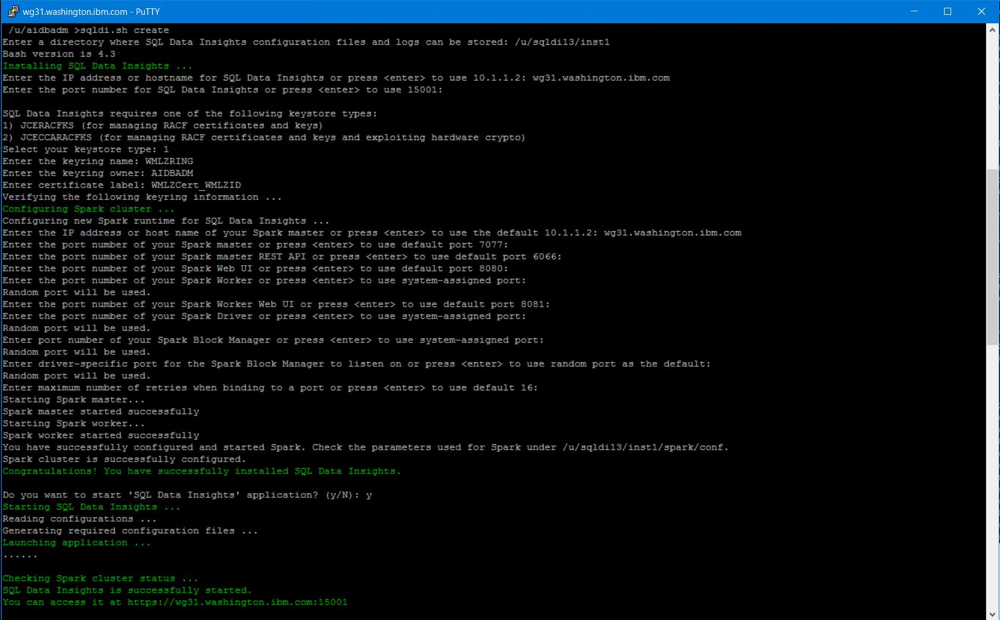
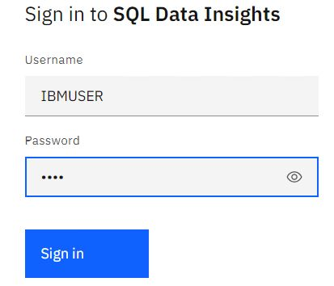
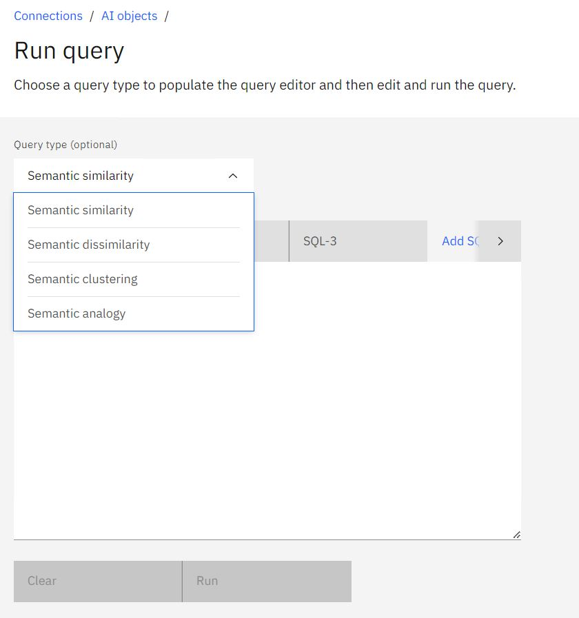
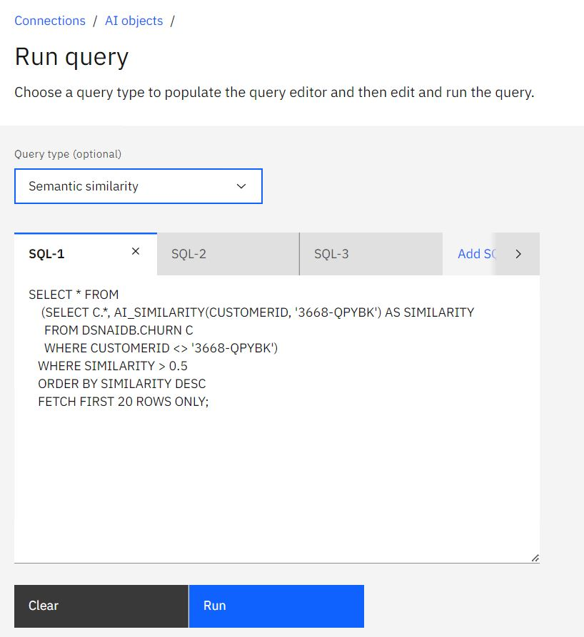
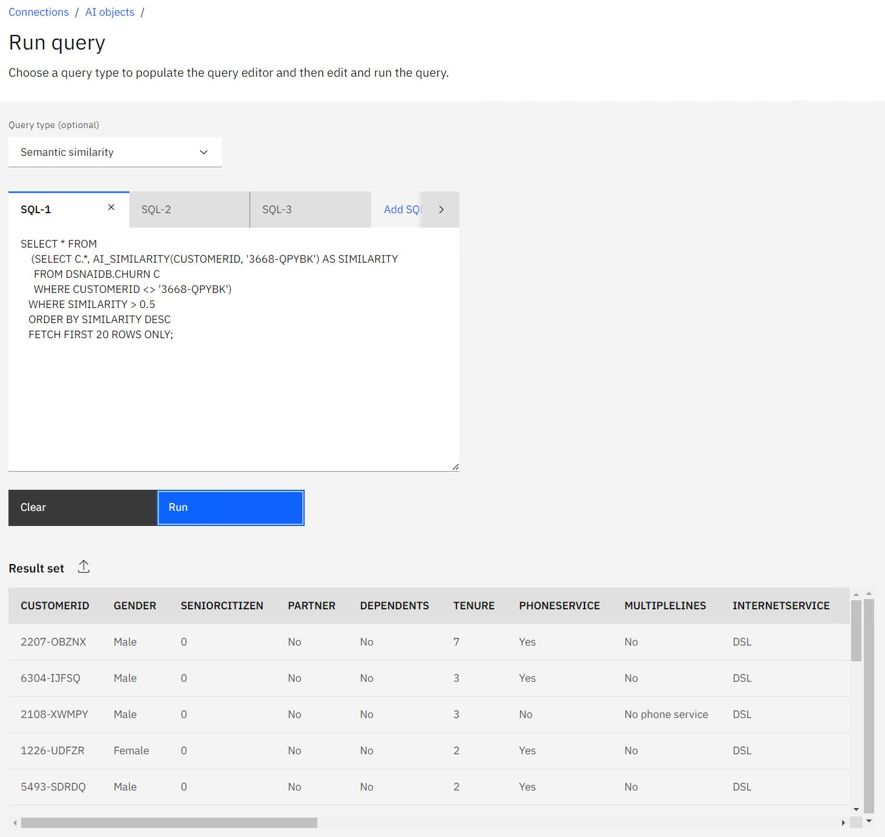

# SQL Data Insights Feature of Db2 V13

SQL Data Insights is a standard feature of Db2 V13, that provides AI-enabled queries. 
This document provides a step-by-step worked example of how to deploy it and use it.
The worked example is based on a z/OS V2.5 system image that IBM can provision for clients for demonstrations and skills transfer.
However, this document is written in a generic way, so that it can be helpful to clients deploying SQLDI in their own systems.

**Note** This document is a worked example, written as a simple "getting started" scenario. It should be used in conjunction with the official Db2 z/OS product documentation, which is referenced at the end of this document.


## Contents

1. SQL Data Insights Overview
2. Ordering SQLDI
3. Installation with SMPE
4. Planning for SQLDI deployment
5. Deploying an SQLDI instance
6. Installation Verification Test
7. Usage Scenarios ( Tables, Views and Aliases )
8. Usage Considerations
9. References and Further Reading

## 1. SQL Data Insights Overview 

The core concept of SQL Data Insights is to build and train a neural network model for a Db2 table or view, load it into a model table that is associated with the base table, so that a range of Db2 BIFs (built-in-functions) can used within SQL queries for find patterns in the data. For example, if you have a table containing a list of clients and their important characteristics, you can discover which clients are most similar to a chosen client or cluster of clients.


Using a simple SQL query, you can do things like
- find and rank clients who are most similar to your most profitable clients. 
- find clients who have similar patterns to previous clients who closed their accounts.
- see which data items are most influential towards certain outcomes

SQLDI can operate against Db2 views, or even external data sources like IMS and VSAM.

Two of the most likely use cases for SQLDI are
1. Business Analytics Users.
2. Data Scientists who are charged with developing more targetted machine learning scoring models.


## 2. Ordering SQLDI

SQLDI is a no charge feature of Db2 z/OS V13, but you do need to order this feature explicitly in order to get it. The screenshot below is from ShopZ, showing two separate items to order, each with the same Product ID.


If you already have Db2 z/OS V13 installed, you can order SQL Data Insights as a CBPDO for it's own SMPE CSI, or to add to the Db2 SMPE CSI.

## 3. Installation with SMPE

SQLDI is a standard SMPE installation, which will not be addressed in this document.

There are several pre-requisites that you should resolve before ordering SQLDI. As always, you should refer to the current page in the Db2 z/OS knowledge centre to get the latest information. [link to SQLDI Pre-Requisites](https://www.ibm.com/docs/en/db2-for-zos/13?topic=di-preparing-sql-installation)

* z/OS ( V2.4 or V2.5 ) requires several PTFs to be applied to provide the pre-requisite AI libraries.
* Db2 needs the fix for APAR PH49781
* z/OS OpenSSH and the IBM 64-bit JDK are also needed.


## 4. Planning for SQLDI deployment

When Planning for SQLDI deployment, it is very helpful to consider an architecture diagram of all the moving parts.


SQLDI runs in USS ( z/OS Unix Systems Services ). It only needs to be running when you are training new models. Once the models are trained, and loaded into the model tables, SQLDI can be stopped, and Db2 z/OS will continue to serve AI-enabled queries.

The model training process has 3 main stages
1. Select the contents of the Subject table/view, and fetch the contents into USS
2. Use a Spark cluster (in USS) to train the model
3. Call the DSNUTILU stored procedure to load the model table in in Db2.

SQLDI needs a few integration points with Db2 z/OS and RACF. The notes below explain the diagram.

***The USS Side (reading top down)***

* The AI libraries (shipped as z/OS PTFs) are installed by z/OS convention to the following USS path: /usr/lpp/IBM/aie  
* The SQLDI product code is provided as a ZFS during the SMPE install process, which must be mounted at /usr/lpp/IBM/db2sqldi/v1r1
* The SQLDI deployment process creates an instance of SQLDI which needs to be mounted on a large ZFS. (4GB minimum, 100GB recommended)
* Once the SQLDI instance is started there are multiple services running, to perform the model training.
* SQLDI provides two helpful user interfaces, both accessible via browser.

1. The SQLDI Service is the primary administration interface, for training new models.
2. The Spark service

***The z/OS Side (reading top down)***

* A RACF userid must be created as the SQLDI owner. It must be a member of RACF Group SQLDIGRP.
* A keyring, with a signed certificate is needed for authentication of the SQLDI instance to RACF.
* The Db2-supplied stored procedures and the WLM environments that they run in must be correctly installed
* An SQLDI Catalog must be created for Db2 z/OS to keep track of the AI-Enabled objects and model tables

Keep this architecture diagram in you mind as you review the SQLDI Instance Deployment notes below.

## 5. Deploying an SQLDI instance

Deploying an SQLDI instance takes about 5 minutes. The hard work is lining up all the ducks in a row before you run the **sqldi.sh create** script!

The comprehensive guide is found in the Db2 z/OS V13 Knowledge Centre [here](https://www.ibm.com/docs/en/db2-for-zos/13?topic=insights-installing-configuring-sql-di).
The goal of this document is provide an easy-to-consume worked example, which will help you consume the Knowledge Centre.

All the jobs used for deployment of SDI in this worked example were saved to PDS ***IBMUSER.SDISETUP***


 **Verify the AI libraries are mounted at the right path.**

Open an ssh session into USS, and navigate to /usr/lpp/IBM/aie

You should expect to find 5 sub-directories, each with contents provided from the installation of the z/OS PTFs.

```
 /usr/lpp/IBM/aie >ls -al
total 112
drwxr-xr-x   7 OMVSKERN OMVSGRP     8192 Mar  7 00:00 .
drwxr-xr-x  52 OMVSKERN OMVSGRP     8192 Mar  6 23:20 ..
drwxr-xr-x   2 OMVSKERN OMVSGRP     8192 Jun  8  2022 IBM
drwxr-xr-x   5 OMVSKERN OMVSGRP     8192 Mar  7 00:01 blas
drwxr-xr-x   4 OMVSKERN OMVSGRP     8192 May  6  2022 zade
drwxr-xr-x   4 OMVSKERN OMVSGRP     8192 May 17  2022 zaio
drwxr-xr-x   4 OMVSKERN OMVSGRP     8192 Mar 15  2022 zdnn

```

 **Verify the SQLDI libraries are mounted at the right path.**

Open an ssh session into USS, and navigate to /usr/lpp/IBM/db2sqldi/v1r1

You should expect to find 5 sub-directories, each with contents provided from the installation of SQLDI.

```
 /usr/lpp/IBM/db2sqldi/v1r1 >ls -al
total 176
drwxr-xr-x   7 OMVSKERN SYS1        8192 Mar  6 23:29 .
drwxr-xr-x   3 OMVSKERN OMVSGRP     8192 Mar  6 23:20 ..
drwxr-xr-x   2 OMVSKERN SYS1        8192 Mar  6 23:29 IBM
-rw-r--r--   2 OMVSKERN SYS1       17940 Mar  6 23:29 NOTICE
-rw-r--r--   2 OMVSKERN SYS1         203 Mar  6 23:29 README
drwxr-xr-x  12 OMVSKERN SYS1        8192 Feb 23  2022 spark24x
drwxr-xr-x   6 OMVSKERN SYS1        8192 May 18  2022 sql-data-insights
drwxr-xr-x   3 OMVSKERN SYS1        8192 May 17  2022 templates
drwxr-xr-x   3 OMVSKERN SYS1        8192 May 17  2022 tools
```

* IBM contains binaries
* spark24x contains the an embedded copy of spark
* sql-data-insights contains the code for SQLDI
* templates contains sample templates for the .profile settings for the SQLDI userid and JCL to operate the SQLDI components
* tools contains a copy of the bash shell, which you could copy to /bin/bash if you wanted.


  **Setup RACF userid and group**

A RACF userid is required to be the SQLDI instance owner.
* It must have an omvs segment with minimum values for CPUTIMEMAX(86400), MEMLIMIT(32G) ASSIZEMAX(1200000000)
* Ideally it should default to the bash shell PROGRAM(/bin/bash)
* The home directory HOME(/u/aidbadm) will need a .profile that sets many USS environment variables 

The job below was used to create the AIDBADM userid.

***IBMUSER.SDISETUP(SDIUSCRT)***
```
//IBMUSERJ JOB  (USR),'ADD USER',CLASS=A,MSGCLASS=H,                    
//       NOTIFY=&SYSUID,MSGLEVEL=(1,1),REGION=0M                        
//********************************************************************  
//*                                                                  *  
//* CREATE SQDLI USERIDS                                             *  
//*                                                                  *  
//********************************************************************  
//NEWID    EXEC PGM=IKJEFT01,DYNAMNBR=75,TIME=100,REGION=6M             
//SYSPRINT DD SYSOUT=*                                                  
//SYSTSPRT DD SYSOUT=*                                                  
//SYSTERM  DD DUMMY                                                     
//SYSUADS  DD DSN=SYS1.UADS,DISP=SHR                                    
//SYSLBC   DD DSN=SYS1.BRODCAST,DISP=SHR                                
//SYSTSIN  DD *                                                         
  AU AIDBADM NAME('AIDBADM') PASSWORD(SYS1)             -               
   OWNER(SYS1) DFLTGRP(SYS1) UACC(READ) OPERATIONS SPECIAL   -          
   TSO(ACCTNUM(ACCT#) PROC(DBSPROCD) JOBCLASS(A) MSGCLASS(X) -          
      HOLDCLASS(X) SYSOUTCLASS(X) SIZE(4048) MAXSIZE(0))     -          
    OMVS(HOME(/u/aidbadm) PROGRAM(/bin/bash) CPUTIMEMAX(86400) -        
    MEMLIMIT(32G) ASSIZEMAX(1200000000) AUTOUID)                        
  PERMIT ACCT#     CLASS(ACCTNUM) ID(AIDBADM)                           
  PERMIT ISPFPROC  CLASS(TSOPROC) ID(AIDBADM)                           
  PERMIT DBSPROC   CLASS(TSOPROC) ID(AIDBADM)                           
  PERMIT JCL       CLASS(TSOAUTH) ID(AIDBADM)                           
  PERMIT OPER      CLASS(TSOAUTH) ID(AIDBADM)                           
  PERMIT ACCT      CLASS(TSOAUTH) ID(AIDBADM)                           
  PERMIT MOUNT     CLASS(TSOAUTH) ID(AIDBADM)                           
  AD 'AIDBADM.*'  OWNER(AIDBADM) UACC(READ) GENERIC                     
```

Additionally, the SQLDI instance owner (and any other userids that will use SQLDI model training) ***must*** be a member of RACF group SQLDIGRP.

***IBMUSER.SDISETUP(SDIRACFG)***
```
//IBMUSERJ JOB  (FB3),'INIT 3380 DASD',CLASS=A,MSGCLASS=H, 
//             NOTIFY=&SYSUID,MSGLEVEL=(1,1),              
//             REGION=0M,COND=(4,LT)                       
//S1       EXEC PGM=IKJEFT01                               
                                                           
//SYSTSPRT DD SYSOUT=*                                     
                                                           
//SYSPRINT DD SYSOUT=*                                     
                                                           
//SYSTSIN  DD *                                            
                                                           
ADDGROUP SQLDIGRP OMVS(AUTOGID) OWNER(IBMUSER)             
                                                           
CONNECT (AIDBADM)  GROUP(SQLDIGRP) OWNER(IBMUSER)          
                                                           
CONNECT (IBMUSER) GROUP(SQLDIGRP) OWNER(IBMUSER)           
                                                           
SETROPTS RACLIST(FACILITY) REFRESH                         
                                                           
/*                                                         
```

 **USS environment variables** 

The SQLDI userid must have several USS environment variables correctly set, so that the binaries and libraries of SQLDI can be found at runtime. The .profile file for user AIDBADM has been edited ( from # SQLDI Setup onwards ) to set the correct paths and variables.

***/u/aidbadm/.profile***
```
# JAVA                                                                  
export JAVA_HOME=/usr/lpp/java/J8.0_64                                  
export PATH=$PATH:/apps/zospt/bin:/usr/lpp/java/J8.0_64/bin             
# ZOAU REQUIREMENTS                                                     
export _BPXK_AUTOCVT=ON                                                 
export ZOAU_HOME=/usr/lpp/IBM/zoautil                                   
export PATH=${ZOAU_HOME}/bin:$PATH                                      
# ZOAU MAN PAGE REQS (OPTIONAL)                                         
export MANPATH=${ZOAU_HOME}/docs/%L:$MANPATH                            
export CLASSPATH=${ZOAU_HOME}/lib/*:${CLASSPATH}                        
export LIBPATH=${ZOAU_HOME}/lib:${LIBPATH}                              
# IBM Python - Ansible supported                                        
export PATH=/usr/lpp/IBM/cyp/v3r9/pyz/bin:$PATH                         
export PYTHONPATH=/usr/lpp/IBM/cyp/v3r9/pyz                             
export PYTHONPATH=${PYTHONPATH}:${ZOAU_HOME}/lib                        
# Rocket Ported Git                                                     
export _CEE_RUNOPTS='FILETAG(AUTOCVT,AUTOTAG) POSIX(ON)'                
export PATH=/usr/lpp/Rocket/rsusr/ported/bin:$PATH  

# SQLDI Setup                                                           
export SQLDI_INSTALL_DIR=/usr/lpp/IBM/db2sqldi/v1r1                     
export ZADE_INSTALL_DIR=/usr/lpp/IBM/aie/zade                           
export ZAIE_INSTALL_DIR=/usr/lpp/IBM/aie                                
export BLAS_INSTALL_DIR=/usr/lpp/IBM/aie/blas                           
export SPARK_HOME=$SQLDI_INSTALL_DIR/spark24x                           
# SQLDI PATH                                                            
PATH=/bin:$PATH                                                         
PATH=$SQLDI_INSTALL_DIR/sql-data-insights/bin:$PATH                     
PATH=$SQLDI_INSTALL_DIR/tools/bin:$PATH                                 
PATH=$ZADE_INSTALL_DIR/bin:$PATH                                        
PATH=$PATH:$JAVA_HOME/bin                                               
export PATH=$PATH                                                       
# SQLDI LIBPATH                                                         
LIBPATH=/lib:/usr/lib                                                   
LIBPATH=$LIBPATH:$JAVA_HOME/bin/classic                                 
LIBPATH=$LIBPATH:$JAVA_HOME/bin/j9vm                                    
LIBPATH=$LIBPATH:$JAVA_HOME/lib/s390x                                   
LIBPATH=$LIBPATH:$SPARK_HOME/lib                                        
LIBPATH=$BLAS_INSTALL_DIR/lib:$LIBPATH                                  
LIBPATH=$ZAIE_INSTALL_DIR/zade/lib:$LIBPATH                             
LIBPATH=$ZAIE_INSTALL_DIR/zdnn/lib:$LIBPATH                             
LIBPATH=$ZAIE_INSTALL_DIR/zaio/lib:$LIBPATH                             
export LIBPATH=$LIBPATH                                                 
# SQLDI OTHER                                                           
export IBM_JAVA_OPTIONS="-Dfile.encoding=UTF-8"                         
export _BPXK_AUTOCVT=ON                                                 
export _BPX_SHAREAS=NO                                                  
export _ENCODE_FILE_NEW=ISO8859-1                                       
export _ENCODE_FILE_EXISTING=UNTAGGED                                   
export _CEE_RUNOPTS="FILETAG(AUTOCVT,AUTOTAG) POSIX(ON)"                
export TERM=xterm                                                       
alias vi1='vi -W filecodeset=utf-8'                                     
alias vi2='vi -W filecodeset=iso8859-1'                                 
alias ll='ls -ltcpa'                                                    
export PS1=' ${PWD} >'                                                  
```


 **RACF Certificate and Keyring** 

A RACF certificate is required for SQLDI to authenticate with RACF when it interacts with Db2. 
In this worked example we use a self-signed certificate and connect it to a keyring. 

The steps in the job below perform the following functions
* Create a Keyring (WMLZRING)
* Create a Certificate Authority cert
* Create a Certificate signed by the CA Cert.
* Connect both the CACert and the Certificate to the keyring
* Permit user AIDBADM and IBMUSER read access to cerificates owned by AIDBADM
* Refresh RACF

***IBMUSER.SDISETUP(RACFKEYR)***
```
//IBMUSERJ JOB  (USR),'ADD USER',CLASS=A,MSGCLASS=H,                  
//       NOTIFY=&SYSUID,MSGLEVEL=(1,1),REGION=0M                      
//********************************************************************
//*                                                                  *
//* CREATE RACF KEYRING FOR SQLDI V12                                *
//*                                                                  *
//********************************************************************
//S1       EXEC PGM=IKJEFT01                                          
//SYSTSPRT DD   SYSOUT=*                                              
//SYSPRINT DD   SYSOUT=*                                              
//SYSTSIN  DD   *                                                     
RACDCERT ADDRING(WMLZRING) ID(AIDBADM)                                
                                                                      
RACDCERT GENCERT CERTAUTH +                                           
SUBJECTSDN( +                                                         
      CN('STLAB41') +                                                 
      C('US') +                                                       
      SP('CA') +                                                      
      L('SAN JOSE') +                                                 
      O('IBM') +                                                      
      OU('WMLZ') +                                                    
) +                                                                   
ALTNAME( +                                                            
      EMAIL('nmarion@us.ibm.com') +                                   
) +                                                                   
WITHLABEL('WMLZCACert') +                                             
NOTAFTER(DATE(2025/01/01))                                            
                                                                      
RACDCERT GENCERT ID(AIDBADM) +                                        
SUBJECTSDN( +                                                         
      CN('STLAB41') +                                                 
      C('US') +                                                       
      SP('CA') +                                                      
      L('SAN JOSE') +                                                 
      O('IBM') +                                                      
      OU('WMLZ') +                                                    
) +                                                                   
ALTNAME( +                                                            
      EMAIL('nmarion@us.ibm.com') +                                   
) +                                                                   
WITHLABEL('WMLZCert_WMLZID') +                                        
SIGNWITH(CERTAUTH LABEL('WMLZCACert')) +                              
NOTAFTER(DATE(2025/01/01))                                            
                                                                      
RACDCERT ID(AIDBADM) CONNECT(CERTAUTH LABEL('WMLZCACert') +           
RING(WMLZRING))                                                       
                                                                      
RACDCERT ID(AIDBADM) CONNECT(ID(AIDBADM) LABEL('WMLZCert_WMLZID') +   
RING(WMLZRING) USAGE(PERSONAL))                                       
                                                                      
PERMIT IRR.DIGTCERT.LISTRING CLASS(FACILITY) ID(AIDBADM) ACCESS(READ) 
PERMIT IRR.DIGTCERT.LISTRING CLASS(FACILITY) ID(IBMUSER) ACCESS(READ) 
                                                                      
SETROPTS RACLIST(FACILITY) REFRESH                                    
                                                                      
/*                                                                          
```

**Note** The RACF jobs are case-sensitive. You must use CAPS-OFF when editing these PDS members to ensure that the RACF artefacts are created correctly. Otherwise you risk the SQLDI instance creation failing if it can't find the RACF certificates and keyring.

Verify the succesful creation of certificates and connection to the keyring with this job. (case-sensitive again).

***IBMUSER.SDISETUP(RACFCHK)***
```
//IBMUSERJ JOB  (USR),'ADD USER',CLASS=A,MSGCLASS=H,                  
//       NOTIFY=&SYSUID,MSGLEVEL=(1,1),REGION=0M                      
//********************************************************************
//*                                                                  *
//* CHECK  RACF KEYRING FOR SQLDI V12                                *
//*                                                                  *
//********************************************************************
//S1       EXEC PGM=IKJEFT01                                          
//SYSTSPRT DD SYSOUT=*                                                
//SYSPRINT DD SYSOUT=*                                                
//SYSTSIN  DD *                                                       
                                                                      
RACDCERT LISTRING(WMLZRING) ID(AIDBADM)                               
                                                                      
RACDCERT CERTAUTH LIST(LABEL('WMLZCACert'))                           
                                                                      
RACDCERT LIST(LABEL('WMLZCert_WMLZID')) ID(AIDBADM)                   
                                                                      
/*                                                                    
```

**Note** a Return code of 0 from this job does not necessarily mean that the objects were found as expected. You must explicitly check the job joutput, as in the screenshot below.


 **Create a HUGE ZFS** 

SQLDI model training can take up a lot of disk space. You need to prepare a ZFS for the SQLDI instance which is at least 4GB in size, or the SQLDI instance creation will fail. In a real-world environment where you are training models on large volumes of data, the disk space may need to be much larger.

In this worked example a ZFS called IBMUSER.SDI13.ZFS is created and mounted at /u/sqldi13

***IBMUSER.SDISETUP(CRTZFS)***
```
//IBMUSERJ JOB  (SDI),'CREATE ZFS',CLASS=A,MSGCLASS=H,                
//             NOTIFY=&SYSUID,MSGLEVEL=(1,1)                          
//********************************************************************
//*                                                                  *
//* PURPOSE: CREATE ZFS DATASET AND MOUNTPOINT                       *
//*                                                                  *
//********************************************************************
//CREATE   EXEC PGM=IDCAMS,REGION=0M                                  
//SYSPRINT DD SYSOUT=*                                                
//SYSIN    DD *                                                       
  DEFINE -                                                            
       CLUSTER -                                                      
         ( -                                                          
             NAME(IBMUSER.SDI13.ZFS) -                                
             LINEAR -                                                 
             CYL(4000 1000) VOLUME(USER0A) -                          
             DATACLASS(DCEXTEAV) -                                    
             SHAREOPTIONS(3) -                                        
         )                                                            
/*                                                                    
//*                                                                   
// SET ZFSDSN='IBMUSER.SDI13.ZFS'                                       
//FORMAT   EXEC PGM=IOEAGFMT,REGION=0M,COND=(0,LT),                     
// PARM='-aggregate &ZFSDSN -compat'                                    
//SYSPRINT DD SYSOUT=*                                                  
//STDOUT   DD SYSOUT=*                                                  
//STDERR   DD SYSOUT=*                                                  
//SYSUDUMP DD SYSOUT=*                                                  
//CEEDUMP  DD SYSOUT=*                                                  
//*                                                                     
//*                                                                     
//* Mount the dataset at the mountpoint directory                       
//*                                                                     
//MOUNT    EXEC PGM=IKJEFT01,REGION=0M,DYNAMNBR=99,COND=(0,LT)          
//SYSTSPRT  DD SYSOUT=*                                                 
//SYSTSIN   DD *                                                        
  PROFILE MSGID WTPMSG                                                  
  MOUNT TYPE(ZFS) +                                                     
    MODE(RDWR) +                                                        
    MOUNTPOINT('/u/sqldi13') +                                          
    FILESYSTEM('IBMUSER.SDI13.ZFS')                                     
/*                                                                      
```

Once you have created and mounted the ZFS, there are a couple more things to do.

Permenantly mount the ZFS in a PARMLIB member

***USER.Z25C.PARMLIB(BPXPRMZZ)***
```
/* Neale's CODE */                               
MOUNT FILESYSTEM('IBMUSER.SDI13.ZFS')            
      TYPE(ZFS)                                  
      MODE(RDWR)                                 
      NOAUTOMOVE                                 
      MOUNTPOINT('/u/sqldi13')                   
/* Neale's CODE */                               
MOUNT FILESYSTEM('SDI.V1R1.ZFS')                 
      TYPE(ZFS)                                  
      MODE(RDWR)                                 
      NOAUTOMOVE                                 
      MOUNTPOINT('/usr/lpp/IBM/db2sqldi/v1r1')   
```

Grow the ZFS to ensure that it is over 4GB in size. This can be done from USS using the following commands

***Command to determine the size of the ZFS (in KB)***
```
IBMUSER:/u: >df -k /u/sqldi13

Mounted on     Filesystem                Avail/Total    Files      Status
/u/sqldi13     (SQLDI.V13.ZFS)           2488135/2880000 4294966001 Available
```

***Command togrow the ZFS***
```
zfsadm grow -aggregate SQLDI.V12.ZFS -size 5000000
```

***Command to verify the increased size of the ZFS (in KB)***
```
IBMUSER:/u: >df -k /u/sqldi13

Mounted on     Filesystem                Avail/Total    Files      Status
/u/sqldi13     (SQLDI.V13.ZFS)           4608239/5000400 4294966001 Available
```


 **Create SQLDI Pseudo Catalog** 

Db2 z/OS V13 provides job DSNTIJAI in SDSNSAMP to create the SQLDI Pseudo Catalog. For this worked example, DSNTIJAI was copied to IBMUSER.SDISETUP for customisation and execution. The job is too long to embed inline within this document, but the code snippet below provides the pseudo-code for the job.

***IBMUSER.SDISETUP(DSNTIJAI)***
```
//IBMUSERJ  JOB  (SDI),'SDI CSI ALA',CLASS=A,MSGCLASS=H,                
//       NOTIFY=&SYSUID,MSGLEVEL=(1,1)                                  
//********************************************************************* 
//* JOB NAME = DSNTIJAI                                                 
//*                                                                     
//* DESCRIPTIVE NAME = INSTALLATION JOB STREAM                          
//*                                                                     
//*    Licensed Materials - Property of IBM                             
//*    5698-DB2                                                         
//*    COPYRIGHT IBM Corp 2022                                          
//*                                                                     
//*    STATUS = Version 13                                              
//*                                                                     
//* FUNCTION = CREATE AI-POWERED SQL PSEUDOCATALOG AND PROCEDURES       
//*                                                                     
//* PSEUDOCODE =                                                        
//*   DSNTICU  STEP     Optional: DROP all objects created in this job  
//*   DSNTIAI1 STEP     Create the SQL Data Insights pseudo-catalog     
//*   DSNTIAI2 STEP     Create the database for model tables            
//*   DSNTIAI3 STEP     Create procedures used by SQL Data Insights     
//*   DSNTIAI4 STEP     Grant authorities to users of SQL Data Insights 
//*                                                                     
//* DEPENDENCIES = None                                                 
```

A Query against SYSIBM.SYSTABLES (where DBNAME like 'DSNAI%') should yield the following
```
CREATOR      NAME                                DBNAME
------------ ----------------------------------- ------------
SYSAIDB      SYSAICONFIGURATIONS                 DSNAIDB1
SYSAIDB      SYSAICOLUMNCONFIG                   DSNAIDB1
SYSAIDB      SYSAIOBJECTS                        DSNAIDB1
SYSAIDB      SYSAIMODELS                         DSNAIDB1
DSNAIDB      AIDB_DSNAIDB_CHURN                  DSNAIDB2
DSNAIDB      CHURN                               DSNAIDB3
SYSAIDB      SYSAITRAININGJOBS                   DSNAIDB1
SYSAIDB      SYSAICOLUMNCENTERS                  DSNAIDB1
SYSAIDB      SYSAIMODELS_METRICS_AUX             DSNAIDB1
SYSAIDB      SYSAIMODELS_INTERPRETABILITY_AUX    DSNAIDB1
SYSAIDB      SYSAITRAININGJOBS_MESSAGES_AUX      DSNAIDB1

  11 record(s) selected.
```
 **Create Sample CHURN Table** 

Db2 z/OS V13 provides job DSNTIJAV in SDSNSAMP to create the SQLDI Pseudo Catalog. For this worked example, DSNTIJAV was copied to IBMUSER.SDISETUP for customisation and execution. The job is too long to embed inline within this document, but the code snippet below provides the pseudo-code for the job.

***IBMUSER.SDISETUP(DSNTIJAV)***
```
//IBMUSERJ  JOB  (SDI),'SDI CSI ALA',CLASS=A,MSGCLASS=H,                
//       NOTIFY=&SYSUID,MSGLEVEL=(1,1)                                  
//********************************************************************* 
//* JOB NAME = DSNTIJAV                                                 
//*                                                                     
//* DESCRIPTIVE NAME = SQL DATA INSIGHTS INSTALL VERIFICATION SAMPLE    
//*                                                                     
//*    Licensed Materials - Property of IBM                             
//*    5698-DB2                                                         
//*    COPYRIGHT IBM CORP 2022.                                         
//*                                                                     
//*    STATUS = Version 13                                              
//*                                                                     
//* FUNCTION = CREATE SQL DATA INSIGHTS INSTALL VERIFICATION SAMPLE     
//*                                                                     
//* PSEUDOCODE =                                                        
//*   DSNTIAV0 STEP     Optional: DROP objects created in this job      
//*   DSNTIAV1 STEP     Create the sample objects                       
//*   DSNTIAV2 STEP     Insert data into the sample objects             
//*                                                                     
//* DEPENDENCIES = None                                                 
//*                                                                     
```

The DDL from IBMUSER.SDISETUP(DSNTIJAV) for the Sample table is shown below. Essentially it stores details of CLients' Telco accounts, and identifies those accounts which have been terminated (CHURN).

```
CREATE TABLE DSNAIDB.CHURN              
  (                                     
    CUSTOMERID            VARCHAR(30),  
    GENDER                VARCHAR(10),  
    SENIORCITIZEN         VARCHAR(10),  
    PARTNER               VARCHAR(10),  
    DEPENDENTS            VARCHAR(10),  
    TENURE                INTEGER,      
    PHONESERVICE          VARCHAR(10),  
    MULTIPLELINES         VARCHAR(20),  
    INTERNETSERVICE       VARCHAR(30),  
    ONLINESECURITY        VARCHAR(30),  
    ONLINEBACKUP          VARCHAR(30),  
    DEVICEPROTECTION      VARCHAR(30),  
    TECHSUPPORT           VARCHAR(30),  
    STREAMINGTV           VARCHAR(30),  
    STREAMINGMOVIES       VARCHAR(20),  
    CONTRACT              VARCHAR(20),  
    PAPERLESSBILLING      VARCHAR(10),  
    PAYMENTMETHOD         VARCHAR(30),  
    MONTHLYCHARGES        DECIMAL(10,2),
    TOTALCHARGES          DECIMAL(10,2),
    CHURN                 VARCHAR(10)   
  ) IN DSNAIDB3.DSNAITS1;               
                                        
 CREATE UNIQUE INDEX DSNAIDB.CHURNIX    
   ON DSNAIDB.CHURN                     
   (CUSTOMERID);                        
                                        
COMMIT;                                 
                                        
GRANT SELECT ON DSNAIDB.CHURN TO PUBLIC;
                                        
```
 **TCPIP ports** 

SQLDI makes use of several TCPIP ports for communication between the various Spark and SQLDI components. You can control the values of all of these ports during the SQLDI instance create process if you need to. 
The default ports (which can all be over-ridden) are documented [here](https://www.ibm.com/docs/en/db2-for-zos/13?topic=di-configuring-network-ports-sql).

From TSO option 6 you can use the ***netstat portlist*** command to see what ports are already in use. If there are any clashes you need to decide which SQLDI ports need to be changed from their defaults, and enter that information when you run the ***sqldi.sh create*** script to create the SQLDI instance.

  
.


 **Create the SQLDI Instance** 

**Pause and Review:** Take a fresh look at the SQLDI architecture diagram. The architecture is fairly simple, but there is quite a bit of legwork to get right before you are ready to create an SQLDI instance. If you don't have ***all*** the steps above implemented correctly, the SQLDI instance creation will fail.


The SQLDI instance creation, and operation, is controlled by the **sqldi.sh** script located in /usr/lpp/IBM/db2sqldi/v1r1/sql-data-insights/bin 

You need to be the intended instance owner (AIDBADM) to create the SQLDI instance, because the .profile and the RACF pre-requisites were created around this userid.

Open an ssh session into USS, and type in "sqldi.sh". You can do this from any USS path because the folder is in the PATH. It will feedback to you the command options supported by the script.

```
 /u/aidbadm >sqldi.sh

This script installs, starts, and stops SQL Data Insights. Before running the script, make sure
that you allocate a minimum of 4GB disk space to your zFS file system and meet other system requirements.
In case of an error, resolve the error and then rerun the script.

Usage:
  sqldi.sh [action] [-Xms <value>] [-Xmx <value>]

Action:
  create             Installs the SQL Data Insights application.
  start              Starts the SQL Data Insights application.
  stop               Stops the SQL Data Insights application.
  start_spark        Starts the embedded Spark cluster.
  stop_spark         Stops the embedded Spark cluster.

JVM Options:
  -Xms ''            Specifies the initial memory allocation for JVM in the format of [0-9]*[M,G],
                            e.g. 512M (Optional).
  -Xmx ''            Specifies the maximum memory allocation for JVM in the format of [0-9]*[M,G],
                            e.g. 1G (Optional).

Examples:
  ./sqldi.sh create
  ./sqldi.sh create -Xms 512M -Xmx 1024M
  ./sqldi.sh start
  ./sqldi.sh stop
  ./sqldi.sh start_spark
  ./sqldi.sh stop_spark

```

You can stop and start spark independently, but that is not necessary because when you stop and start SQLDI the script will automatically check the status of spark for you. So the basic set of operations to be used are

* sqldi.sh create
* sqldi.sh start
* sqldi.sh stop

OK, so you run the ***sqldi.sh create*** command script, and you need to be prepared to answer a number of questions.

For this worked example, the data entry values that I need to have to hand are
* USS path to store the SQLDI instance
* hostname or IP address of the z/OS (wg31.washington.ibm.com)
* multiple port numbers, including 15001 for the SQLDI instance, and 8080 for the Spark console
* the name of the keyring holding the certificate (WMLZRING)
* the owner of the keyring (AIDBADM)
* The label of the certificate (WMLZCert_WMLZID)
* hostname or IP address of the Spark master (wg31.washington.ibm.com)

The screenshot below captures the execution of the ***sqldi.sh create*** command script. If everything works fine it even offers to start the SQLDI instance for you.



Once SQLDI is started, you will want to open a browser against the two SQLDI user interfaces.

***The Spark Web UI*** located at http://wg31.wqashington.ibm.com:8080


***The SQLDI UI*** located at https://wg31.wqashington.ibm.com:15001


## 6. Installation Verification Test

SQLDI is up and running. The next thing to do is to enable AI for the sample CHURN table and run some AI queries against it.

SQLDI is running under user AIDBADM, which was prepared specifically for that purpose. It can be used by anybody who has the requisite Db2 privileges. In this example we will use IBMUSER which has sufficient Db2 privileges for this task.

***Sign on to SQLDI.***



***Click to Add a Connection***


***Enter the connection details for Db2 V13***


***List the existing AI-Enabled Objects***


***Click on "Add Object"***


***Filter by Schema (DSNAIDB) and Press the search icon***


***Tick DSNAIDB.CHURN and Press the "Enable AI" Button***


***Select all columns, change the column type of "CustomerID" to "Key", and press "Next".***


***This time, don't apply any column filters. Push "Enable".***


***See the status of the table change to "Enabling".***


***Check the Spark Web UI to see the tasks in progress. It should take 3 - 5 minutes on this small demo system without a Telum processor.***


***Check back to the SQLDI UI to check the model was trained. Then press "Run Query"***


***Use the drop down to retrieve one of the template SQL queries. Choose "Semantic Similarity"***



***The template SQL statements are just plain text based on the ICP table (DSNAIDB.CHURN). Review the Query and Press "Run".***



***Let the query complete and review the results. This query lists the top 20 clients that are most similar to CUSTOMERID '3668-QPYBK'***



***Analyze Data. Return to the AI Objects, select "Analyze Data"***


***Check Out the Data Statistics***


***Check Out the Column Influences***


That completes a basic installation verification test.


## 7. Usage Scenarios ( Tables, Views and Aliases )

You can now experiment with a number of usage scenarios

1. Query from any SQL client. (SPUFI, DB2 Connect, etc... )
2. Experiment with all four of the SQL AI template queries
3. Experiment with DB2 Views
4. Experiment with DVM Views
5. Load your own data science datasets and explore.

### 7.1 Query from any SQL client. (SPUFI, DB2 Connect, etc... )


### 7.2 Experiment with all four of the SQL AI template queries

### 7.3 Experiment with DB2 Views

### 7.4 Experiment with DVM Views

### 7.5 Load your own data science datasets and explore.

## 8. Usage Considerations

Like any AI model, SQLDI models need to be updated for a couple of reasons.

1. 

order of columns.

keeping model tables updated.


## 9. References and Further Reading

ccc

