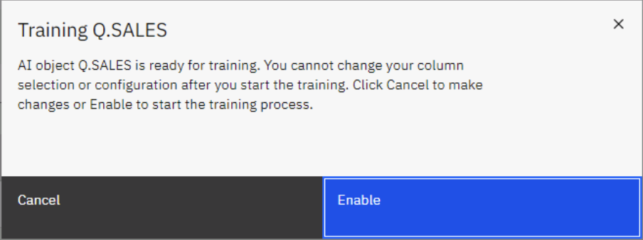
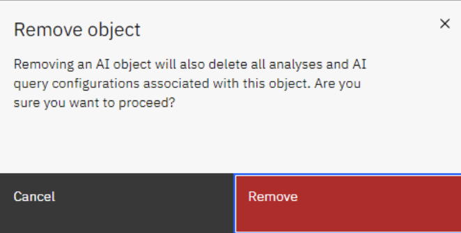
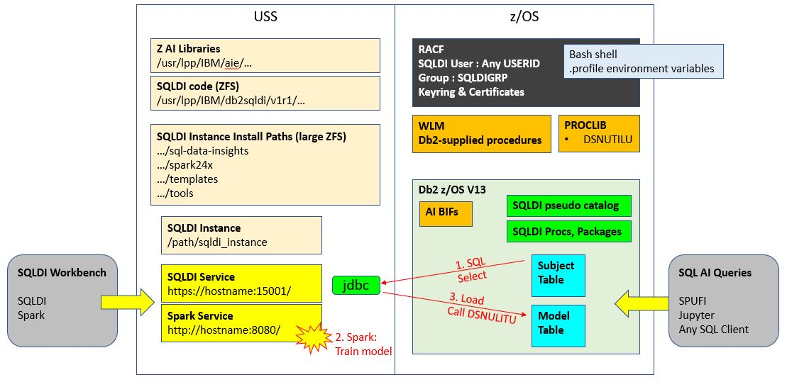

# SQL Data Insights V13 Lab Exercises

This document contains the instructions for performing a hands-on lab exercise for using SQLDI V13 using the IBM "Z Virtual Access" (ZVA) service for provisioning environments for demos and workshops.


## Two Documents

There are two documents covering SQL Data Insights V13

1. The SQLDI_V13_Deployment document ( online @ https://github.com/zeditor01/collidingworlds/blob/main/SQLDI_V13.md ), which is an audit trail of how to deploy SQL Data Insights V13
2. ***This*** Lab_Exercises document ( online @ https://github.com/zeditor01/collidingworlds/blob/main/SQLDI_V13_Lab_Exercises.md ), which should be used in conjunction with the ZVA-provisioned image for taking and SQLDI test drive.


## A word about ZVA and zTrial.

[zTrial](https://www.ibm.com/z/trials) is an internet-facing portal for clients to book demonstrations and test environments for z/OS software. The images in zTrial have been carefully designed to provide easy-to-use, well-structured, scripted environments as a self-serve experience. Any client can request a specific zTrial environment, and it will be provisioned in a day or so, and remain accessible for 4 days.

ZVA is the IBM-internal development version of zTrial. It is the place where polished zTrial images are developed. IBMers can request ZVA images for use by either IBMers or clients. ZVA images can be used for hands-on-labs or demonstrations. IBMers can request ZVA images for customer workshops at the following URL within the IBM firewall. [ZVA_Portal](https://zva.wdc1a.cirrus.ibm.com/)

Both ZVA and zTrial images consist of
- a networked combination of a Windows Client and a z/OS server.
- prepared with software and data for specified z Software fanmiliarisation.
- and accessible over the internet, either from a web browser, or an RDP client.

This lab environment is a ZVA image for learning how to use the SQL Data Insights feature of Db2 z/OS V13.


## Access to the ZVA image for SQL Data Insights.

When you receive your signon creditials, they will look something like this.

|URL|User ID for Web browser|Password|
| --- | --- | --- | 	 	 	 
|https://T-2428-130-198-93-170.ibmztrialmachines.com/	|Administrator	|qufG2d4LiCJG8xvg1B7W!|

or this

|IP Address for Remote Desktop|User ID for Remote Desktop|Password|
| --- | --- | --- | 	 	 
|T-2428-130-198-93-170.ibmztrialmachines.com	|w-2428-k\Administrator	|qufG2d4LiCJG8xvg1B7W!|


The easiest method of accessing the ZVA image is to click on the Browser URL, and cut and paste the userid and password into the logon screen.

If you prefer to use a Remote Desktop Protocol client, paste the RDP IP Address into your RDP client, and then paste the userid and password into the logon screen.


## Starting Point

The system that you connect to will be a Windows client, with various tools that access the z/OS image.

* Personal Communications Client - for 3270 access to the host (wg31.washington.ibm.com) on port 23.
* Putty - for ssh connection to z/OS unix system services (USS)
* DB2 Connect Command Line Processor (DB2 CLP) for SQL access to Db2 z/OS V13
* Chrome browser - for http access to the SQLDI Server components (Spark web UI, and SQLDI server)

The userids and passwords that you will be using are
* IBMUSER (SYS1) - a z/OS superuser with limitless powers ;-)
* AIDBADM (AIDBADM) - the SQLDI administrator userid

The z/OS system is pre-installed with
* z/OS V2.5
* Db2 z/OS V13 
* SQL Data Insights feature of Db2 z/OS V13

Db2 z/OS V13 will be started already. It's connection details are
* Subsystem ID = DBDG
* DRDA Location Name = DALLASD
* TCPIP hostname = wg31.washington.ibm.com
* DRDA Port = 5045

SQL Data Insights has already been installed, configured and tested. A Db2 z/OS table has been "AI-Enabled" already. SQLDI and Spark have not been started since IPL.

The outline of the Lab Exercises in the rest of this document is as follows

1. Start SQLDI, and view the Web User Interfaces for SQLDI and Spark
2. Perform some AI-Enabled Queries against the sample table, to become familiar with the Build-In functions for AI provided by Db2
3. Follow the process to AI-Enable another table
4. Define a View against the sample table, and AI-Enable the view
5. Review the underlying configuration that is required to support SQLDI
6. Delete the existing SQLDI instance, and perform the provisioning workflow yourself to deploy an SQLDI instance

The chronologically-logical sequence of steps would start at #6 (provision SQLDI instance) and then follow steps #1 to #5 against the SQLDI instance that you have created. However, the author feels that it is better to start off with the experience if using SQLDI to understand it, and then perform the more complex task of provisioning an instance. Feedback is welcome :-)


## Lab #1. Start SQLDI, and view the Web User Interfaces for SQLDI and Spark

Once you connect to the ZVA image, you will see a Windows desktop. You will be using 4 applications from the desktop

* Personal Communications Client - for 3270 access to the host (wg31.washington.ibm.com) on port 23.
* Putty - for ssh connection to z/OS unix system services (USS)
* DB2 Connect Command Line Processor (DB2 CLP) for SQL access to Db2 z/OS V13
* Chrome browser - for http access to the SQLDI Server components (Spark web UI, and SQLDI server)


Double click on the putty icon to open an ssh session with z/OS USS. Load the wg31 profile. Depending on your device, you will probably want to increase the default font size (16 point courier new is suggested). Press "open"

 

* Login as aidbadm ( password aidbadm ).
* type bash, to enter the bash shell
* type sqldi.sh start, to start SQL Data Insights


 

Open the Chrome Browser ***from inside the RDP-connected Windows system*** to access the Spark Web UI and the SQLDI web UI. The browsers on your desktop client will NOT connect through to the backend z/OS system. The Spark Web UI and the SQLDI Web UI are both bookmarked from Chrome.


 

You can check the spark web UI is showing healthy and active. (spark is deployed as part of the SQLDI instance, and is the environment used by SQLDI to train the models). The URL is bookmarked in the bookmark bar, and is http://wg31.washington.ibm.com:8080 

 

***Open another Chrome tab and check the SQLDI portal.*** 
The URL is bookmarked in the bookmark bar, and is https://wg31.washington.ibm.com:15001 


  

***Sign on to SQLDI.***
User IBMUSER, password SYS1


***Connect to DBDG***
The Db2 V13 database has already been defined to this SQLDI instance. You can click on the "dots" icon and the right to connect to it, edit the connection parameters, list AI objects, or disconnect from it.

 


***DSNAIDB.CHURN is already AI-enabled***
Connect to Db2 subsystem DBDG, and then List AI objects. You should see DSNAIDB.CHRUN in "Enabled" status


Before we progress to Lab #2, it's worth taking a moment to look at the structure and contents of the DSNAIDB.CHURN table. It is a synthethic dataset listing the characteristics of the customers of a telecommunications company, plus a "labe" indicating whether the account has been lost (CHURN='YES') or whether it is still active (CHURN='NO').

The DDL for the table is as follows


The customer characteristics contain a mixture of information about personal status, scope of services provided, billing amount and billing method. A data scientist, or a business analyst might want to examine any patterns in this data to identify patterns that tend to lead to good or bad outcomes. A bad outcome might be whether the client cancelled their contract. A good outcome might be a higher than average billing revenue. 

It's not the greatest data science dataset, but we are using it for this Lab exercise because it is the sample that is shipped with SQLDI.


If you have completed all the steps above, then you have verified that SQLDI and DB2 are started and ready to receive your queries.


## Lab #2 Perform some AI-Enabled Queries against the sample table.

In this lab we will perform some AI-Enabled Queries against the sample table, to become familiar with the Built-In functions for AI provided by Db2.


### 2.1 Start with a basic Semantic Similarity Query


***Press the "Run Query" button***


***Use the drop down to retrieve one of the template SQL queries. Choose "Semantic Similarity"***


***The template SQL statements are just plain text based on the ICP table (DSNAIDB.CHURN). Review the Query and Press "Run".***


***Let the query complete and review the results. This query lists the top 20 clients that are most similar to CUSTOMERID '3668-QPYBK'***


### 2.2 Pause and Think

If you've been following the bouncing ball to complete the lab tasks, this is the right point to ***PAUSE*** and take a moment to examine the results of the query and consider what really just happened.

The essence of the SQL query was to list and rank the 20 customers who are most similar to CUSTOMERID '3668-QPYBK'. If you had tried to write that query with "normal" SQL how would you have done it ?

You might react by saying something like this

"Well, I would figure out which fields in the data are most significant to the nature of our clients, and then I would write a query with some predicates based on the values in those fields for all our other clients"

So, let me ask you to write that piece of SQL in the second SQL tab, and see how easy it is. The challenges that you will face include

1. whether you are confident enough to discount certain fields because you judge them to be unimportant
2. how to write SQL expressions for the remaining fields for the difference between candidate clients and our reference client '3668-QPYBK'
3. how to merge and weight all the different deviations of all the chosen fields
4. how to design a numerical value that represents the "similarity" of different clients
5. etc...

When you think about it, the SQL would be very challenging if it was even possible, and it would require expert knowledge of the data in question. So how do those clever Built-in-Functions do it in such simple SQL syntax ?

The answer is to understand what the SQLDI model is doing. When you push that "Enable AI" button to build and train a model, and then load it into the model table, you are training an unsupervised neural network. The important word is "unsupervised", because it reflects that their is no human interaction to provide expertise in the data subject or seek any particular outcomes. The link below explains the difference between "supervised" and "unsupervised" models.

[supervised_or_unsupervised](https://www.ibm.com/cloud/blog/supervised-vs-unsupervised-learning)

A supervised model is based on using historical labels (outcomes) to predict future outcomes. But an unsupervised model has no labels. It explores the data to discover patterns that exist. It is focussed on data insights. 

The power of SQL Data Insights is that is a remarkably easy way to gain insights into data and data patterns, without needing subject matter expertise. It is a powerful adjunct to the subject matter expert ( or the data scientist ) because it finds similarities and differences in data records based on the values of data fields, and allows you to see which data fields are most significant by reviewing the results.

The existing model type is a "Bag of Words" model. If you want to explore the data science behind this model, there are many articles discussing this model type, such as [wikipedia](https://en.wikipedia.org/wiki/Bag-of-words_model).

At this point, the SQLDI model is used to support 3 Db2 Built-in-Functions. However, additional BIFs may be released in future function levels of Db2 z/OS to provide additional insight from this model.

### 2.3 Experiment with all four of the SQL AI template queries

Review the documentation on each of the functions, and review the template SQL, and execute it.

We've already run a semantic similarity query using AI_SIMILARITY. We can also change the SQL predicates to turn it into a dissimilarity. The documentation for this BIF is here: 
[ai_similarity scalar function](https://www.ibm.com/docs/en/db2-for-zos/13?topic=functions-ai-similarity)

### 2.3.1 AI_SIMILARITY

***Experiment with changes to the SQL template to get a feel for using the AI_Similarity BIF***

Note that the ai_similarity function can used in different ways within SQL. The following example uses AI_SIMILARITY to score a relationship between a field (PAYMENTMETHOD) and an outcome (CHURN='YES'). Hence, even though the SQLDI model is unsupervised (i.e. no labels) you can use it to derivesimilarities between different columns and an outcome that is recorded as a column in the table.

```
SELECT DISTINCT AI_SIMILARITY(PAYMENTMETHOD, 'YES' USING MODEL COLUMN CHURN), 
PAYMENTMETHOD
FROM CHURN
ORDER BY 1 DESC
FETCH FIRST 3 ROWS ONLY
```


***Note the predicate against the ai_similarity function to flip the polarity of the SQL query.***


### 2.3.2 AI_SEMANTIC_CLUSTER


The semantic clustering BIF is documented here: [ai_semantic cluster scalar function](https://www.ibm.com/docs/en/db2-for-zos/13?topic=functions-ai-semantic-cluster)

AI_SEMANTIC_CLUSTER determines a similarity score of a cluster of 3 records. It can smooth out some of the peculiarities of a single record. At this point it is based on a cluster of specifically 3 records.


### 2.3.3 AI_ANALOGY

AI_ANALOGY gives a score for the analogy between one record and an outcome (CHURN='YES') and compares it with other records and another outcome from that same column (eg CHURN='NO'). Of course, the outcome column might n=have more than two values in your data.

The semantic analogy BIF is documented here: 
[ai_analogy scalar function](https://www.ibm.com/docs/en/db2-for-zos/13?topic=functions-ai-analogy)


### 2.3.4 Use any SQL client to run AI-Enabled Queries

Once the Table is AI-enabled, SQLDI instance does not play any part in running AI-enabled queries. You can use SPUFI or DB2 Connect CLP to verify this.

You can login to TSO to use SPUFI. 
* Use PCOMM
* Login as IBMUSER/SYS1
* ISPF M.15 to access DB2I

Edit your SQL in IBMUSER.SPUFI(TEST) ; Output to IBMUSER.SPUFIOUT.


You can also use the DB2 Connect Command Line Processor (on the Windows desktop) if you like that interface.

```
db2 connect to DALLASD user IBMUSER using SYS1

db2 -tvf sqldi.sql
```


Paste your SQL queries into a file within C:\Program Files\IBM\SQLLIB\BIN> and submit them.


## Lab #3 Follow the process to AI-Enable another table

The Churn table was already AI-enabled when you connected to the system. Lets walk through the process of AI-enabling another table in the Db2 subsystem.

In further versions of this system, there will be additional data science datasets loaded into Db2 tables to explore. In this instance we will just pick a simple sample table and walk through the process to "Enable AI"

***Return to the Database Connections Page, and List AI Objects***

  

***Click on "Add Object", use the schema drop down to select a schema (Q), press the search button (magnifying glass on the right)***

  

***Choose a table to train (eg: Q.SALES). Press "Enable AI Query"***

  

***Select some or all of the columns. Optionally specify a key column. Press "Next***

  

***Option to filter columns out. Press "Enable"***

  

***Confirm "Enable"***

  

***Observe the status of the table recorded as 'Enabling"***

  

***Check the Spark Web UI, to see that the training job is running***

  

***When finished, check the status of the table is "Enabled"

  


Job Done. It's a simple process. The run time will depend on the volume of data, the processor speed, and whether your system is a Z16 with a Telum AIU. Be aware that the ZVA environment is a tiny emulated system for a functional demo without Telum, and times are not representative of what you will get on a real Z server.


## Lab #4 Define a View against the sample table, and AI-Enable the view

Views and Aliases can also be AI-Enabled.

Views are important, so that you can bring all the columns of interest into a single logical table for model training.

Likewise, Aliases against remote objects (eg: VSAM or IMS data sources connected by Data Virtualisation Manager) can open up data that is often considered inaccessible for analytics purposes.

Optional Exercise. Define a view against the DSNAIDB.CHURN table, and then enable AI Query against that view. Use SPUFI, Db2 Admin Tool or DB2CLP as you please.

```
Potential view that you could create as user IBMUSER

create view DSNAIDB.VCHURN01
(customerid, tenure, contract, paymentmethod, totalcharges)
as select
customerid, tenure, contract, paymentmethod, totalcharges
from DSNAIDB.CHURN ;

```


## Lab #5 Review the underlying configuration that is required to support SQLDI

Section 5 of the [SQLDI_V13_Deployment](https://github.com/zeditor01/collidingworlds/blob/main/SQLDI_V13.md) document, provides chapter and verse on everything that was done to prepare the SQLDI instance, following the SMPE installation.

If you want to review the setup work that was done before the SQLDI instance was created, refer to Ducks 1 thru 9 in Section 5 of that document, and inspect the work on the system that you are using now. All the USS paths and JCL jobs are named clearly in that document.


## Lab #6 Delete the existing SQLDI instance, and perform the provisioning workflow yourself to deploy an SQLDI instance

If you would like the experience of creating a new SQLDI instance, then this is the Lab Exercise for you.

First you must remove the existing instance (because their isn't enough disk space on this system to support a second SQLDI instance), then you can create a new one.

Removing is very easy

***Step 1: Remove all Models to empty the SQLDI pseudo catalog***

Go to the AI-Enabled objects view, and select "remove" against each model.

  

You will need to confirm each remnove request

 


***Step 2: Stop SQLDI and Spark***


Open putty session 1 (wg31.washington.ibm.com:23)

signon aidbadm/aidbadm

sqldi.sh stop 


  

sqldi.sh stop_spark


  


***Step 3: Remove the directory where SQLDI was deployed***

Open putty session 2 (wg31.washington.ibm.com:23)

signon ibmuser/sys1

cd /u/sqldi13

rm -rf inst1 


  


***Step 4: reset the .profile of the SQLDI instance owner***

Edit /u/aidbadm/.profile from ISPF

delete everything generated by SQLDI. (line 57 in this screenshot)

  


### All Done. 
The old SQLDI instance is removed.

### Deploy New SQLDI instance.


 **Create the SQLDI Instance** 

**Pause and Review:** Take a fresh look at the SQLDI architecture diagram. The architecture is fairly simple, but there is quite a bit of legwork to get right before you are ready to create an SQLDI instance. If you don't have ***all*** the steps above implemented correctly, the SQLDI instance creation will fail.


The SQLDI instance creation, and operation, is controlled by the **sqldi.sh** script located in /usr/lpp/IBM/db2sqldi/v1r1/sql-data-insights/bin 

You need to be the intended instance owner (AIDBADM) to create the SQLDI instance, because the .profile and the RACF pre-requisites were created around this userid.

Open an ssh session into USS, and type in "sqldi.sh". You can do this from any USS path because the folder is in the PATH. It will feedback to you the command options supported by the script.

```
 /u/aidbadm >sqldi.sh

This script installs, starts, and stops SQL Data Insights. Before running the script, make sure
that you allocate a minimum of 4GB disk space to your zFS file system and meet other system requirements.
In case of an error, resolve the error and then rerun the script.

Usage:
  sqldi.sh [action] [-Xms <value>] [-Xmx <value>]

Action:
  create             Installs the SQL Data Insights application.
  start              Starts the SQL Data Insights application.
  stop               Stops the SQL Data Insights application.
  start_spark        Starts the embedded Spark cluster.
  stop_spark         Stops the embedded Spark cluster.

JVM Options:
  -Xms ''            Specifies the initial memory allocation for JVM in the format of [0-9]*[M,G],
                            e.g. 512M (Optional).
  -Xmx ''            Specifies the maximum memory allocation for JVM in the format of [0-9]*[M,G],
                            e.g. 1G (Optional).

Examples:
  ./sqldi.sh create
  ./sqldi.sh create -Xms 512M -Xmx 1024M
  ./sqldi.sh start
  ./sqldi.sh stop
  ./sqldi.sh start_spark
  ./sqldi.sh stop_spark

```

You can stop and start spark independently, but that is not necessary because when you stop and start SQLDI the script will automatically check the status of spark for you. So the basic set of operations to be used are

* sqldi.sh create
* sqldi.sh start
* sqldi.sh stop

OK, so you run the ***sqldi.sh create*** command script, and you need to be prepared to answer a number of questions.

For this worked example, the data entry values that I need to have to hand are
* USS path to store the SQLDI instance
* hostname or IP address of the z/OS (wg31.washington.ibm.com)
* multiple port numbers, including 15001 for the SQLDI instance, and 8080 for the Spark console
* the name of the keyring holding the certificate (WMLZRING)
* the owner of the keyring (AIDBADM)
* The label of the certificate (WMLZCert_WMLZID)
* hostname or IP address of the Spark master (wg31.washington.ibm.com)

The screenshot below captures the execution of the ***sqldi.sh create*** command script. If everything works fine it even offers to start the SQLDI instance for you.


Once SQLDI is started, you will want to open a browser against the two SQLDI user interfaces.

***The Spark Web UI*** located at http://wg31.wqashington.ibm.com:8080


***The SQLDI UI*** located at https://wg31.wqashington.ibm.com:15001


