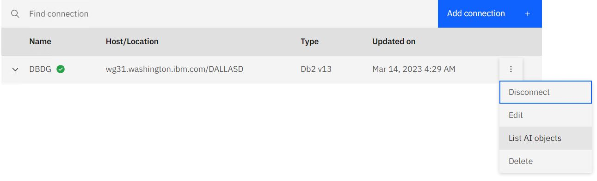

# SQL Data Insights V13 Lab Exercises

This document contains the instructions for performing a hands-on lab exercise for using SQLDI V13 using the IBM "Z Virtual Access" (ZVA) service for provisioning environments for demos and workshops.

## Two Documents

There are two documents covering SQL Data Insights V13

1. The [SQLDI_V13_Deployment](https://github.com/zeditor01/collidingworlds/blob/main/SQLDI_V13.md) document, which is an audit trail of how to deploy SQL Data Insights V13
2. ***This*** Lab_Exercises document, which should be used in conjunction with the ZVA-provisioned image for taking and SQLDI test drive.

## A word about ZVA and zTrial.

[zTrial](https://www.ibm.com/z/trials) is an internet-facing portal for clients to book demonstrations and test environments for z/OS software. The images in zTrial have been carefully designed to provide easy-to-use, well-structured, scripted environments as a self-serve experience. Any client can request a specific zTrial environment, and it will be provisioned in a day or so, and remain accessible for 4 days.

ZVA is the IBM-internal development version of zTrial. It is the place where polished zTrial images are developed. IBMers can request ZVA images for use by either IBMers or clients. ZVA images can be used for hands-on-labs or demonstrations. IBMers can request ZVA images for customer workshops at the following URL within the IBM firewall. [ZVA_Portal](https://zva.wdc1a.cirrus.ibm.com/)

Both ZVA and zTrial images consist of
- a networked combination of a Windows Client and a z/OS server.
- prepared with software and data for specified z Software fanmiliarisation.
- and accessible over the internet, either from a web browser, or an RDP client.

This lab environment is a ZVA image for learning how to use the SQL Data Insights feature of Db2 z/OS V13.

## Access to the ZVA image for SQL Data Insights.

When you receive your signon creditials, they will look something like this.

|URL|User ID for Web browser|Password|
| --- | --- | --- | 	 	 	 
|https://T-2428-130-198-93-170.ibmztrialmachines.com/	|Administrator	|qufG2d4LiCJG8xvg1B7W!|

or this

|IP Address for Remote Desktop|User ID for Remote Desktop|Password|
| --- | --- | --- | 	 	 
|T-2428-130-198-93-170.ibmztrialmachines.com	|w-2428-k\Administrator	|qufG2d4LiCJG8xvg1B7W!|

The easiest method of accessing the ZVA image is to click on the Browser URL, and cut and paste the userid and password into the logon screen.

If you prefer to use a Remote Desktop Protocol client, paste the RDP IP Address into your RDP client, and then paste the userid and password into the logon screen.

## Starting Point

The system that you connect to will be a Windows client, with various tools that access the z/OS image.

* Personal Communications Client - for 3270 access to the host (wg31.washington.ibm.com) on port 23.
* Putty - for ssh connection to z/OS unix system services (USS)
* DB2 Connect Command Line Processor (DB2 CLP) for SQL access to Db2 z/OS V13
* Chrome browser - for http access to the SQLDI Server components (Spark web UI, and SQLDI server)

The userids and passwords that you will be using are
* IBMUSER (SYS1) - a z/OS superuser with limitless powers ;-)
* AIDBADM (AIDBADM) - the SQLDI administrator userid

The z/OS system is pre-installed with
* z/OS V2.5
* Db2 z/OS V13 
* SQL Data Insights feature of Db2 z/OS V13

Db2 z/OS V13 will be started already. It's connection details are
* Subsystem ID = DBDG
* DRDA Location Name = DALLASD
* TCPIP hostname = wg31.washington.ibm.com
* DRDA Port = 5045

SQL Data Insights has already been installed, configured and tested. A Db2 z/OS table has been "AI-Enabled" already. SQLDI and Spark have not been started since IPL.

The outline of the Lab Exercises in the rest of this document is as follows

1. Start SQLDI, and view the Web User Interfaces for SQLDI and Spark
2. Perform some AI-Enabled Queries against the sample table, to become familiar with the Build-In functions for AI provided by Db2
3. Follow the process to AI-Enable another table
4. Define a View against the sample table, and AI-Enable the view
5. Review the underlying configuration that is required to support SQLDI
6. Delete the existing SQLDI instance, and perform the provisioning workflow yourself to deploy an SQLDI instance

The chronologically-logical sequence of steps would start at #6 (provision SQLDI instance) and then follow steps #1 to #5 against the SQLDI instance that you have created. However, the author feels that it is better to start off with the experience if using SQLDI to understand it, and then perform the more complex task of provisioning an instance. Feedback is welcome :-)

## Lab #1. Start SQLDI, and view the Web User Interfaces for SQLDI and Spark

Once you connect to the ZVA image, you will see a Windows desktop. You will be using 4 applications from the desktop

* Personal Communications Client - for 3270 access to the host (wg31.washington.ibm.com) on port 23.
* Putty - for ssh connection to z/OS unix system services (USS)
* DB2 Connect Command Line Processor (DB2 CLP) for SQL access to Db2 z/OS V13
* Chrome browser - for http access to the SQLDI Server components (Spark web UI, and SQLDI server)

Double click on the putty icon to open an ssh session with z/OS USS. load the wg31 profile, and press "open"

 

* Login as aidbadm ( password aidbadm ).
* type bash, to enter the bash shell
* type sqldi.sh start, to start SQL Data Insights

 

Open the Chrome Browser and check the spark web UI is showing healthy and active. (spark is deployed as part of the SQLDI instance, and is the environment used by SQLDI to train the models). The URL is bookmarked in the bookmark bar, and is http://wg31.washington.ibm.com:8080 

 

***Open another Chrome tab and check the SQLDI portal.*** 
The URL is bookmarked in the bookmark bar, and is https://wg31.washington.ibm.com:15001 

  

***Sign on to SQLDI.***
User IBMUSER, password SYS1

***Connect to DBDG***
The Db2 V13 database has already been defined to this SQLDI instance. You can click on the "dots" icon and the right to connect to it, edit the connection parameters, list AI objects, or disconnect from it.

***DSNAIDB.CHURN is already AI-enabled***
Connect to Db2 subsystem DBDG, and then List AI objects. You should see DSNAIDB.CHRUN in "Enabled" status

## Lab #2 Perform some AI-Enabled Queries against the sample table.

Perform some AI-Enabled Queries against the sample table, to become familiar with the Build-In functions for AI provided by Db2

## Lab #3 Follow the process to AI-Enable another table

## Lab #4 Define a View against the sample table, and AI-Enable the view

## Lab #5 Review the underlying configuration that is required to support SQLDI

## Lab #6 Delete the existing SQLDI instance, and perform the provisioning workflow yourself to deploy an SQLDI instance

## Lab 1 - Use SQLDI

putty - start SQLDI
spark web ui
sqldi web ui
run quries 

## Lab 2 - Train other objects

Table (?)
View ( against Churn )

## Lab 3 Review Setup Steps

## Lab 4 - Destroy instance, recreate

SQLDI

remove all AI models

Open putty session 1 (wg31.washington.ibm.com:23)

signon aidbadm/aidbadm

sqldi.sh stop 

sqldi.sh stop_spark

Open putty session 2 (wg31.washington.ibm.com:23)

signon ibmuser/sys1

cd /u/sqldi13

rm -rf inst1 

Edit /u/aidbadm/.profile

delete everything generated by SQLDI.

