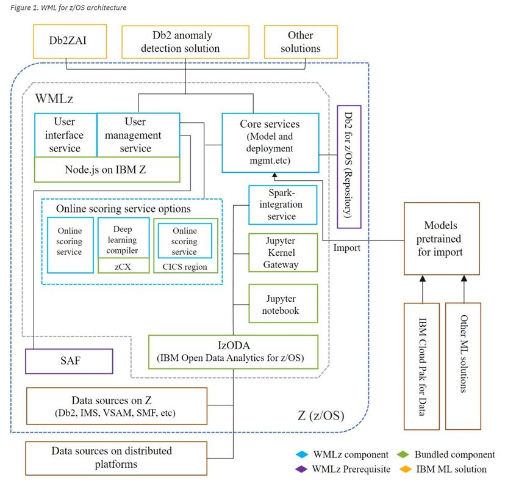
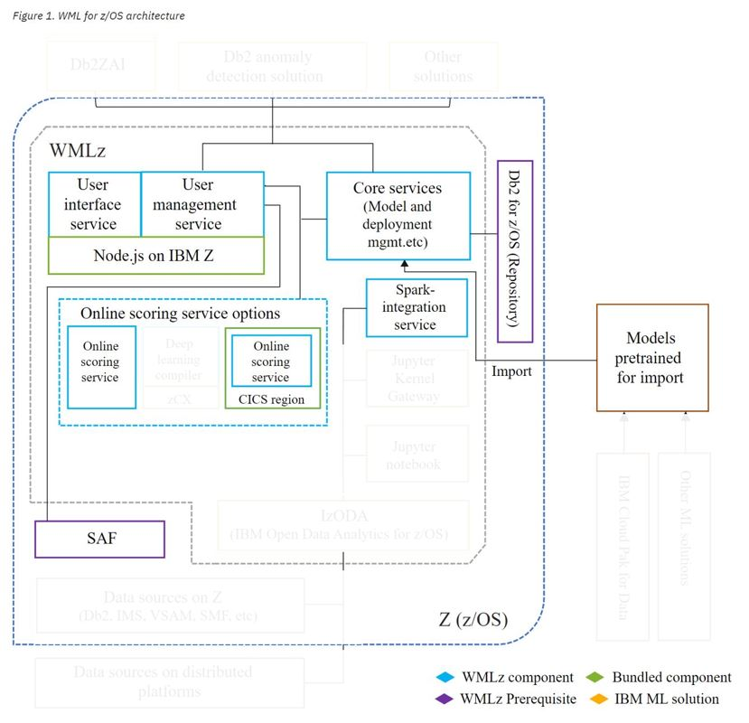
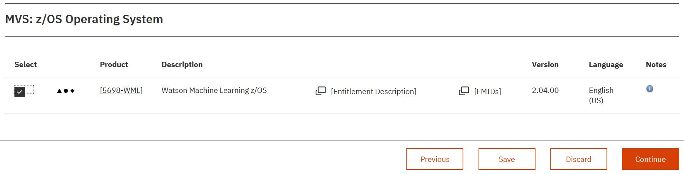

# Deploying WMLZ V2.4 on ZVA

Watson Machine Learing for z/OS (WMLZ) is IBM's premiere product for supporting the AI lifecycle of machine learning and deep learning models on z/OS.
WMLZ deploymemt is mostly implemented with Uniz System Services (USS) within z/OS.
This document provides a step-by-step worked example of how to deploy it and use it.
The worked example is based on a z/OS V2.5 system image that IBM can provision for clients for demonstrations and skills transfer.
However, this document is written in a generic way, so that it can be helpful to clients deploying WMLZ in their own systems.

**Note** This document is a worked example, written as a simple "getting started" scenario. It should be used in conjunction with the official WMLZ product documentation, which is localed [here](https://www.ibm.com/docs/en/wml-for-zos/2.4.0).

## Two Documents

There are two documents covering WMLZ V2.4

1. ***This*** document, the WMLZ Deployment document, which is an audit trail of how to deploy WMLZ V2.4
2. The [Lab_Exercises](https://github.com/zeditor01/collidingworlds/blob/main/WMLZ_Lab_Exercises.md) document, which should be used in conjunction with the ZVA-provisioned image for taking a WMLZ test drive.


## Contents

1. Purpose of this deployment worked example
2. Planning and Pre-Requisites
3. Deploying a simple WMLZ Instance
4. Installation Verification Test
5. Operational Considerations
6. Expanded Usage Scenarios
7. References and Further Reading


## 1.0 Purpose of this deployment worked example

The purpose of this document is to provide a clear and simple worked example of what is involved in deploying Watson Machine Learning for z/OS.

This document is written in support of a ***"Test Drive"*** system, in Techzone and/or ZVA, that can be provisioned by IBMers for the purposes of self-education, demonstrations or customer workshops.

It ***IS NOT*** a performance test environment.

It ***IS*** a functional test environment for the purposes of learning about dpeloying and using WMLZ/


## 2.0 Planning and Pre-Requisites

WMLZ requires a considerable amount of hardware resources to deploy. Bare minimum spec is 1 CP, 4 zIIPs, 100GB memory, 300GB DASD. The requirements are documented in the knowledge centre at this link [link](https://www.ibm.com/docs/en/wml-for-zos/2.4.0?topic=wmlz-planning-system-capacity)

The Knowledge Center provides a helpful representation of the architectural components of WMLZ.



However, for this simple worked example (which serves models that were developed elsewhere) we are not going to be deploying all the components.

* We will only deploy the online and CICS scoring services. (zCX deep learning services can be deployed later).
* We will not install python or the Jupyter notebook components. 
* We will not configure izODA and the MDS feature for accessing data sources for model development.
* We will not deploy the optional Db2 anomoly detection solution

Having selected a subset of components for a first deployment, the diagram below summarizes what this simple worked example aims to cover.



* The user interface service supports html pages that allow WMLZ administration to be performed.
* The user management service interacts with other components to perform requested actions 
* The core services manage the administration tasks (e.g. configure a scoring service or deploy a model) 
* The scoring services are responsible to support application requests to invoke models
* The spark integration service is responsible for invoking spark processes
* Db2 z/OS is used to stor the WMLZ metadata
* Your chosen System Authorisation Facility (eg: RACF) is responsible for authentication and encryption services using keyrings and certifictes

The interaction between the various services is performed using TCPIP. You will need a range of ports to be reserved for WMLZ. You should also be aware that other z/OS products may also be using IzODA and Spark components, and you will need to choose which products get to use the default ports for IzODA and Spark, and which products are configured to use non-default ports.

## 3.0 Deploying a simple WMLZ Instance

There are the 21 implementation steps for WMLZ V2.4 which are well documented in 
the [Knowledge Center](https://www.ibm.com/docs/en/wml-for-zos/2.4.0?topic=installation-roadmap) 

The list below is an overview of the 21 steps, including an indication of the skills required to complete them, and whether they are needed for this ***simple*** worked example.


* Step 1	Preparing for WMLz installation	(Sysprog - High Level Planning)	 
* Step 2	Planning system capacity for WMLz	(Sysprog - Detailed Planning)	 
* Step 3	Obtaining SMP/E image and PTFs for WMLz	(Sysprog - ShopZ order)	 
* Step 4	Procuring, installing, and configuring prerequisites for WMLz (Sysprog with SMPE and USS skills)	 
* Step 5	Installing WMLz, including the bundled IzODA (Spark, Anaconda, and MDS) (Sysprog with SMPE skills) 
* Step 6	Configuring WMLz setup user ID	(Sysprog with USS & Security skills)	 
* Step 7	Configuring additional user IDs	(Sysprog with USS & Security skills) ***... omitted this time***
* Step 8	Configuring network ports for WMLz	(Sysprog with USS & Security skills)	 
* Step 9	Configuring secure network communications for WMLz	(Sysprog with USS & Security skills)
* Step 10	Configuring WMLz (Sysprog with USS skills)	 
* Step 11	Configuring ONNX compiler service ... Optional (Sysprog with USS  & zCX skills)  ***... omitted this time***	
* Step 12	Configuring Python runtime environment ... Optional (Sysprog with USS skills)	 ***... omitted this time***
* Step 13	Configuring client authentication for z/OS Spark  ... Optional (Sysprog with USS skills)	 ***... omitted this time*** 
* Step 14	Configuring WML for z/OS scoring services (Sysprog with USS skills)	
* Step 15	Configuring WML for z/OS scoring services in a CICS region	... Optional (Sysprog with USS skills; CICS skills) 
* Step 16	Configuring scoring services for high availability ...	Optional	(Sysprog with USS skills; Network skills)	 
* Step 17	Configuring Db2 anomaly detection solution	... Optional (Sysprog with USS skills)  ***... omitted this time***
* Step 18	Configuring WMLz for high performance ...	Optional (Sysprog with USS skills)	 ***... omitted this time*** 
* Step 19	Configuring a WMLz cluster for high availability	... Optional	(Sysprog with USS skills)  ***... omitted this time***
* Step 20	Configuring a standalone Jupyter notebook server	... Optional	(Sysprog with USS skills)  ***... omitted this time***
* Step 21	Verifying WMLz installation and configuration	... Optional	(Sysprog with USS skills)	

An audit trail of following each of the required steps above follows now


### 3.1 Step 1 Preparing for WMLz installation	 

Be sure to check all the pre-requisites carefully on [pereqs_page](https://www.ibm.com/docs/en/wml-for-zos/2.4.0?topic=wmlz-installing-prerequisites) 

A brief summary of meeting the pre-reqs in this system is as follow.

***System*** z16, z15™, z14, z13®, or zEnterprise® EC12 system. (This example is deployed on a ZVDT-virtualised Z server).

***z/OS*** z/OS 2.5 or 2.4. (This example is running z/OS V2.5, taken from the ADCD distribution volumes) 

***PTFs*** For z/OS 2.5, apply PTFs UI64830, UI64837, and UI64940. (all applied)

***zDNN*** For z/OS 2.5, apply APARs OA62901, OA62902, and OA62903. (all applied, even though this worked example won't deploy zCX)
 
***z/OS Integrated Cryptographic Service Facility (ICSF).***  (Yup - standard part of ADCD.)

***z/OS OpenSSH***. See z/OS OpenSSH for instructions. (Yup - standard part of ADCD.)

***IBM 64-bit SDK for z/OS Java*** Yup Version 8 SR6 FP25 or later. (Yup - standard part of ADCD.)

***Db2® 12 for z/OS*** or later. (Yup - ADCD includes both Db2 z/OS V12 and V13.)

***CICS TS for z/OS 5.6.0*** with PTFs UI77466, UI80396 and UI80397 or later. (Yup - ADCD includes CICS V5.6 and V6.1).

***IBM z/OS Container Extensions 2.4*** with PTF OA59111 applied (zCX container extensions is not supported by ZD&T and ZVDT)

So, we're good to go!

### 3.2 Step 2 Planning system capacity for WMLz	

The [minimum system capacity](https://www.ibm.com/docs/en/wml-for-zos/2.4.0?topic=wmlz-planning-system-capacity) is described as 4 zIIPs, 1 GCP, 100GB memory, 100GB DASD. If you wanted to perform model training on WMLZ, the same link gives capacity guidelines for different intensities of model training.

This deployment, using the "Z Virtual Access" service for demonstrations is based on ZVDT. The system resources given to a ZVDT applicance can be varied to satisfy the minimum requirements listed above.

### 3.3 Step 3 Obtaining SMP/E image and PTFs for WMLz	

WMLZ should be ordered from ShopZ as a Portable Software Instance, screenshot below



Use the Download to host JCL to download the PSI image files into a large ZFS on your z/OS system. 
The base size of the PSI image is about 20GB, so you will need to allocate a large multi-volume ZFS with extended data class attributes to store the image.
Use the z/OSMF Software Configuration app to download the PSI image to your ZFS.

Once the PSI image is downloaded you will need to switch to the Deploymemts tab of z/OSMF Software Configuration app to deploy the software to z/OS.
Aside from the sheer size of the WMLZ PSI image, the SMPE installation is no different from any other Portable Sofware Instance deployment.

Be sure the run the post-deployment steps which allocate ZFS file systems and polish of the SMPE CSI dataset.

Having chosen a HLQ of ***WMLZ*** The following target libraries will be deployed.

```
'WMLZ.AZK.SAZKBIN' 
'WMLZ.AZK.SAZKCNTL'
'WMLZ.AZK.SAZKDBRM'
'WMLZ.AZK.SAZKEXEC'
'WMLZ.AZK.SAZKLOAD'
'WMLZ.AZK.SAZKMAP' 
'WMLZ.AZK.SAZKMENU'
'WMLZ.AZK.SAZKOBJX'
'WMLZ.AZK.SAZKPENU'
'WMLZ.AZK.SAZKRPC' 
'WMLZ.AZK.SAZKSAMP'
'WMLZ.AZK.SAZKSLIB'
'WMLZ.AZK.SAZKSMAP'
'WMLZ.AZK.SAZKTENU'
'WMLZ.AZK.SAZKXATH'
'WMLZ.AZK.SAZKXCMD'
'WMLZ.AZK.SAZKXEXC'
'WMLZ.AZK.SAZKXSQL'
'WMLZ.AZK.SAZKXTOD'
'WMLZ.AZK.SAZKXVTB'
```

Much of the WMLZ product us deployed within USS. Parmlib should be updated to permanently mount the following ZFS filesystems at the mountpoints prescribed for WMLZ. Specifically 

* WMLZ mountpoint is ```/usr/lpp/IBM/aln```
* Anaconda mountpoint is ```/usr/lpp/IBM/izoda/anaconda```
* Spark mopuntpoint is ```/usr/lpp/IBM/izoda/spark```

```
/* WMLZ ZFS */                                   
MOUNT FILESYSTEM('WMLZ.OMVS.SALNROOT')           
      TYPE(ZFS)                                  
      MODE(RDWR)                                 
      NOAUTOMOVE                                 
      MOUNTPOINT('/usr/lpp/IBM/aln/v2r4')        
/* WMLZ ANACONDA */                              
MOUNT FILESYSTEM('WMLZ.OMVS.SANBZFS')            
      TYPE(ZFS)                                  
      MODE(RDWR)                                 
      NOAUTOMOVE                                 
      MOUNTPOINT('/usr/lpp/IBM/izoda/anaconda')  
/* WMLZ SPARK */                                 
MOUNT FILESYSTEM('WMLZ.OMVS.SAZKROOT')           
      TYPE(ZFS)                                  
      MODE(RDWR)                                 
      NOAUTOMOVE                                 
      MOUNTPOINT('/usr/lpp/IBM/izoda/spark') 
```


### 3.4 Step 4 Procuring, installing, and configuring prerequisites for WMLz 

Blah blah blah 

### 3.5 Step 5 Installing WMLz, including the bundled IzODA (Spark, Anaconda, and MDS) 

Blah blah blah 


### 3.6 Step 6 Configuring WMLz setup user ID	 

Blah blah blah 

### 3.7 Step 7 Configuring additional user IDs	 

***omitted this time*** No need for additional users in this worked example.

### 3.8 Step 8 Configuring network ports for WMLz	

Blah blah blah 

### 3.9 Step 9 Configuring secure network communications for WMLz	

Blah blah blah 

### 3.10 Step 10 Configuring WMLz  

Blah blah blah 

### 3.11 Step 11 Configuring ONNX compiler service ... Optional (Sysprog with USS  & zCX skills)  

***omitted this time*** Using the IBM Deep Learning compiler to support ONNX models requires z/OC container extensions to be deployed.
zCX can be deployed using an IBM-provided workflow in z/OSMF.
This is outside the scope of this worked example.

### 3.12 Step 12 Configuring Python runtime environment ... Optional  	 

***omitted this time*** Using python for data wrangling and model development is outside the scope of this worked example.

### 3.13 Step 13 Configuring client authentication for z/OS Spark  ... Optional  

***omitted this time*** Client authentication is outside the scope of this worked example.

### 3.14 Step 14 Configuring WML for z/OS scoring services  	

Blah blah blah 

### 3.15 Step 15 Configuring WML for z/OS scoring services in a CICS region	

Blah blah blah 

### 3.16 Step 16 Configuring scoring services for high availability ...	Optional	 

***omitted this time*** outside the scope of this worked example.

### 3.17 Step 17 Configuring Db2 anomaly detection solution	... Optional  

***omitted this time*** outside the scope of this worked example.

### 3.18 Step 18 Configuring WMLz for high performance ...	Optional  

***omitted this time*** outside the scope of this worked example.

### 3.19 Step 19 Configuring a WMLz cluster for high availability	... Optional	 

***omitted this time*** outside the scope of this worked example.

### 3.20 Step 20 Configuring a standalone Jupyter notebook server	... Optional	 

***omitted this time*** outside the scope of this worked example.


## 4.0 Installation Verification Test

Finally - Step 21 - the installation verification test.

## 5.0 Operational Considerations


## 6.0 Expanded Usage Scenarios


## 7.0 References and Further Reading


