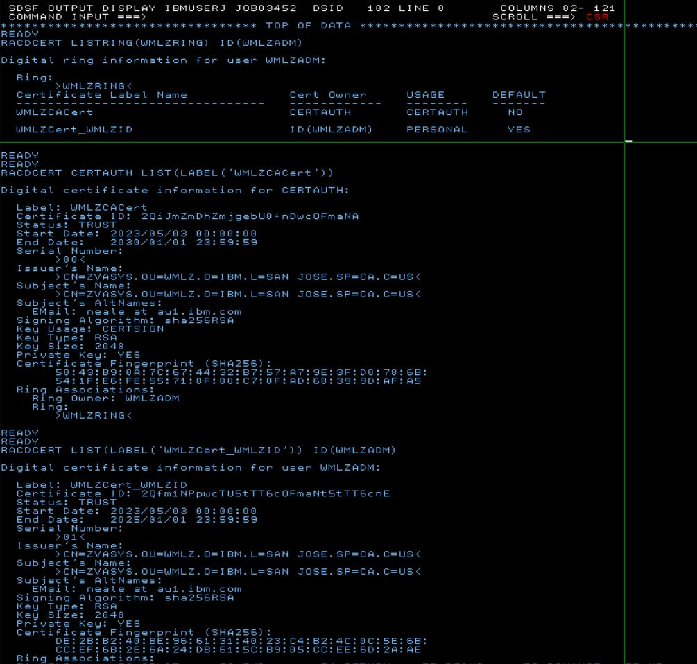

# Deploying WMLZ V2.4 on ZVA

Watson Machine Learing for z/OS (WMLZ) is IBM's premiere product for supporting the AI lifecycle of machine learning and deep learning models on z/OS.
WMLZ deploymemt is mostly implemented with Uniz System Services (USS) within z/OS.
This document provides a step-by-step worked example of how to deploy it and use it.
The worked example is based on a z/OS V2.5 system image that IBM can provision for clients for demonstrations and skills transfer.
However, this document is written in a generic way, so that it can be helpful to clients deploying WMLZ in their own systems.

**Note** This document is a worked example, written as a simple "getting started" scenario. It should be used in conjunction with the official WMLZ product documentation, which is localed [here](https://www.ibm.com/docs/en/wml-for-zos/2.4.0).

## Two Documents

There are two documents covering WMLZ V2.4

1. ***This*** document, the WMLZ Deployment document, which is an audit trail of how to deploy WMLZ V2.4
2. The [Lab_Exercises](https://github.com/zeditor01/collidingworlds/blob/main/WMLZ_Lab_Exercises.md) document, which should be used in conjunction with the ZVA-provisioned image for taking a WMLZ test drive.


## Contents

1. Purpose of this deployment worked example
2. Planning and Pre-Requisites
3. Deploying a simple WMLZ Instance
4. Installation Verification Test
5. Operational Considerations
6. Expanded Usage Scenarios
7. References and Further Reading


## 1.0 Purpose of this deployment worked example

The purpose of this document is to provide a clear and simple worked example of what is involved in deploying Watson Machine Learning for z/OS.

This document is written in support of a ***"Test Drive"*** system, bookable from Techzone or ZVA, that can be provisioned by IBMers for the purposes of self-education, demonstrations or customer workshops.

It ***IS NOT*** a performance test environment.

It ***IS*** a functional test environment for the purposes of learning about dpeloying and using WMLZ/


## 2.0 Planning and Pre-Requisites

WMLZ requires a considerable amount of hardware resources to deploy. Bare minimum spec is 1 CP, 4 zIIPs, 100GB memory, 300GB DASD. The requirements are documented in the knowledge centre at this link [link](https://www.ibm.com/docs/en/wml-for-zos/2.4.0?topic=wmlz-planning-system-capacity)

The Knowledge Center provides a helpful representation of the architectural components of WMLZ.


However, for this simple worked example (which serves models that were developed elsewhere) we are not going to be deploying all the components.

* We will only deploy the online and CICS scoring services. (zCX deep learning services can be deployed later).
* We will not install python or the Jupyter notebook components. 
* We will not configure izODA and the MDS feature for accessing data sources for model development.
* We will not deploy the optional Db2 anomoly detection solution

Having selected a subset of components for a first deployment, the diagram below summarizes what this simple worked example aims to cover.


* The user interface service supports html pages that allow WMLZ administration to be performed.
* The user management service interacts with other components to perform requested actions 
* The core services manage the administration tasks (e.g. configure a scoring service or deploy a model) 
* The scoring services are responsible to support application requests to invoke models
* The spark integration service is responsible for invoking spark processes
* Db2 z/OS is used to stor the WMLZ metadata
* Your chosen System Authorisation Facility (eg: RACF) is responsible for authentication and encryption services using keyrings and certifictes

The interaction between the various services is performed using TCPIP. You will need a range of ports to be reserved for WMLZ. You should also be aware that other z/OS products may also be using IzODA and Spark components, and you will need to choose which products get to use the default ports for IzODA and Spark, and which products are configured to use non-default ports.

## 3.0 Deploying a simple WMLZ Instance

There are the 21 implementation steps for WMLZ V2.4 which are well documented in 
the [Knowledge Center](https://www.ibm.com/docs/en/wml-for-zos/2.4.0?topic=installation-roadmap) 

The list below is an overview of the 21 steps, including an indication of the skills required to complete them, and whether they are needed for this ***simple*** worked example.


* Step 1	Preparing for WMLz installation	(Sysprog - High Level Planning)	 
* Step 2	Planning system capacity for WMLz	(Sysprog - Detailed Planning)	 
* Step 3	Obtaining SMP/E image and PTFs for WMLz	(Sysprog - ShopZ order)	 
* Step 4	Procuring, installing, and configuring prerequisites for WMLz (Sysprog with SMPE and USS skills)	 
* Step 5	Installing WMLz, including the bundled IzODA (Spark, Anaconda, and MDS) (Sysprog with SMPE skills) 
* Step 6	Configuring WMLz setup user ID	(Sysprog with USS & Security skills)	 
* Step 7	Configuring additional user IDs	(Sysprog with USS & Security skills) ***... omitted this time***
* Step 8	Configuring network ports for WMLz	(Sysprog with USS & Security skills)	 
* Step 9	Configuring secure network communications for WMLz	(Sysprog with USS & Security skills)
* Step 10	Configuring WMLz (Sysprog with USS skills)	 
* Step 11	Configuring ONNX compiler service ... Optional (Sysprog with USS  & zCX skills)  ***... omitted this time***	
* Step 12	Configuring Python runtime environment ... Optional (Sysprog with USS skills)	 ***... omitted this time***
* Step 13	Configuring client authentication for z/OS Spark  ... Optional (Sysprog with USS skills)	 ***... omitted this time*** 
* Step 14	Configuring WML for z/OS scoring services (Sysprog with USS skills)	
* Step 15	Configuring WML for z/OS scoring services in a CICS region	... Optional (Sysprog with USS skills; CICS skills) 
* Step 16	Configuring scoring services for high availability ...	Optional	(Sysprog with USS skills; Network skills)	 
* Step 17	Configuring Db2 anomaly detection solution	... Optional (Sysprog with USS skills)  ***... omitted this time***
* Step 18	Configuring WMLz for high performance ...	Optional (Sysprog with USS skills)	 ***... omitted this time*** 
* Step 19	Configuring a WMLz cluster for high availability	... Optional	(Sysprog with USS skills)  ***... omitted this time***
* Step 20	Configuring a standalone Jupyter notebook server	... Optional	(Sysprog with USS skills)  ***... omitted this time***
* Step 21	Verifying WMLz installation and configuration	... Optional	(Sysprog with USS skills)	

An audit trail of following each of the required steps above follows now


### 3.1 Step 1 Preparing for WMLz installation	 

Be sure to check all the pre-requisites carefully on [pereqs_page](https://www.ibm.com/docs/en/wml-for-zos/2.4.0?topic=wmlz-installing-prerequisites) 

A brief summary of meeting the pre-reqs in this system is as follow.

***System*** z16, z15™, z14, z13®, or zEnterprise® EC12 system. (This example is deployed on a ZVDT-virtualised Z server).

***z/OS*** z/OS 2.5 or 2.4. (This example is running z/OS V2.5, taken from the ADCD distribution volumes) 

***PTFs*** For z/OS 2.5, apply PTFs UI64830, UI64837, and UI64940. (all applied)

***zDNN*** For z/OS 2.5, apply APARs OA62901, OA62902, and OA62903. (all applied, even though this worked example won't deploy zCX)
 
***z/OS Integrated Cryptographic Service Facility (ICSF).***  (Yup - standard part of ADCD.)

***z/OS OpenSSH***. See z/OS OpenSSH for instructions. (Yup - standard part of ADCD.)

***IBM 64-bit SDK for z/OS Java*** Yup Version 8 SR6 FP25 or later. (Yup - standard part of ADCD.)

***Db2® 12 for z/OS*** or later. (Yup - ADCD includes both Db2 z/OS V12 and V13.)

***CICS TS for z/OS 5.6.0*** with PTFs UI77466, UI80396 and UI80397 or later. (Yup - ADCD includes CICS V5.6 and V6.1).

***IBM z/OS Container Extensions 2.4*** with PTF OA59111 applied (zCX container extensions is not supported by ZD&T and ZVDT)

So, we're good to go!

### 3.2 Step 2 Planning system capacity for WMLz	

The [minimum system capacity](https://www.ibm.com/docs/en/wml-for-zos/2.4.0?topic=wmlz-planning-system-capacity) is described as 4 zIIPs, 1 GCP, 100GB memory, 100GB DASD. If you wanted to perform model training on WMLZ, the same link gives capacity guidelines for different intensities of model training.

This deployment, using the "Z Virtual Access" service for demonstrations is based on ZVDT. The system resources given to a ZVDT applicance can be varied to satisfy the minimum requirements listed above.

### 3.3 Step 3 Obtaining SMP/E image and PTFs for WMLz	

WMLZ should be ordered from ShopZ as a Portable Software Instance, screenshot below


Use the "Download to host" sample JCL to download the PSI image files into a large ZFS on your z/OS system. 
The base size of the PSI image is about 20GB, so you will need to allocate a large multi-volume ZFS with extended data class attributes to store the image.
Use the z/OSMF Software Configuration app to download the PSI image to your ZFS.

### 3.4 Step 4 Procuring, installing, and configuring prerequisites for WMLz 

In this worked example I was fortunate that all the pre-requisites were already installed. 

### 3.5 Step 5 Installing WMLz, including the bundled IzODA (Spark, Anaconda, and MDS) 

This document does not attempt to capture the SMPE download and install process, 
because there is nothing special or different about the SMPE process for WMLZ.
The only thing that is slightly unusual is the size of the WMLZ portable software instance, which is about 20GB.

Once the PSI image is downloaded from ShopZ you will need to switch to the Deploymemts tab of z/OSMF Software Configuration app to deploy the software to z/OS.

Be sure the run all the post-deployment steps which allocate ZFS file systems and polish of the SMPE CSI dataset.

Having chosen a HLQ of ***WMLZ*** The following target libraries will be deployed.

```
'WMLZ.AZK.SAZKBIN' 
'WMLZ.AZK.SAZKCNTL'
'WMLZ.AZK.SAZKDBRM'
'WMLZ.AZK.SAZKEXEC'
'WMLZ.AZK.SAZKLOAD'
'WMLZ.AZK.SAZKMAP' 
'WMLZ.AZK.SAZKMENU'
'WMLZ.AZK.SAZKOBJX'
'WMLZ.AZK.SAZKPENU'
'WMLZ.AZK.SAZKRPC' 
'WMLZ.AZK.SAZKSAMP'
'WMLZ.AZK.SAZKSLIB'
'WMLZ.AZK.SAZKSMAP'
'WMLZ.AZK.SAZKTENU'
'WMLZ.AZK.SAZKXATH'
'WMLZ.AZK.SAZKXCMD'
'WMLZ.AZK.SAZKXEXC'
'WMLZ.AZK.SAZKXSQL'
'WMLZ.AZK.SAZKXTOD'
'WMLZ.AZK.SAZKXVTB'
```

Much of the WMLZ product us deployed within USS. Parmlib should be updated to permanently mount the following ZFS filesystems at the mountpoints prescribed for WMLZ. Specifically 

* WMLZ mountpoint is ```/usr/lpp/IBM/aln```
* Anaconda mountpoint is ```/usr/lpp/IBM/izoda/anaconda```
* Spark mopuntpoint is ```/usr/lpp/IBM/izoda/spark```

```
/* WMLZ ZFS */                                   
MOUNT FILESYSTEM('WMLZ.OMVS.SALNROOT')           
      TYPE(ZFS)                                  
      MODE(RDWR)                                 
      NOAUTOMOVE                                 
      MOUNTPOINT('/usr/lpp/IBM/aln/v2r4')        
/* WMLZ ANACONDA */                              
MOUNT FILESYSTEM('WMLZ.OMVS.SANBZFS')            
      TYPE(ZFS)                                  
      MODE(RDWR)                                 
      NOAUTOMOVE                                 
      MOUNTPOINT('/usr/lpp/IBM/izoda/anaconda')  
/* WMLZ SPARK */                                 
MOUNT FILESYSTEM('WMLZ.OMVS.SAZKROOT')           
      TYPE(ZFS)                                  
      MODE(RDWR)                                 
      NOAUTOMOVE                                 
      MOUNTPOINT('/usr/lpp/IBM/izoda/spark') 
```

SMPE will create the SMPE Zone ```WMLZ.SMPE.GLOBAL.CSI``` which you can inspect. It will show that you installed 4 FMIDs, as follows.

* HANA110 (anaconda)
* HAQN240 (WMLZ Base)
* HMDS120 (MDS - ie DVM)
* HSPK120 (spark)


### 3.6 Step 6 Configuring WMLz setup user ID	 

The WMLZ setup userid is the anchor point for deploying WMLZ. 
This is because WMLZ mostly runs in USS, and needs to run in an environment that controls Paths, Libraries, Environment Variables, RACF certificates and so forth. The WMLZ setup userid must have a .profile that defines the environment perfectly, so that when the WMLZ services are started under the WMLZ setup userid they can access everything that they need at runtime.

The [knowledge_center](https://www.ibm.com/docs/en/wml-for-zos/2.4.0?topic=wmlz-configuring-setup-user-id) does a very good job of explaining the hows and whys of setting up the wmlz setup userid. This paper provides the jobs that were used to create the userid in this worked example.

The job below (in IBMUSER.NEALEJCL(WMLZUSER) on the ZVA system) was used to create the RACF group and USERID.

```
//IBMUSERJ JOB  (FB3),'INIT 3380 DASD',CLASS=A,MSGCLASS=H,    
//             NOTIFY=&SYSUID,MSGLEVEL=(1,1)                  
//*                                                           
//*   JOB TO CREATE WMLZ SETUP USERID                         
//*                                                           
//RACF     EXEC PGM=IKJEFT01,REGION=0M                        
//SYSTSPRT DD SYSOUT=*                                        
//SYSTSIN  DD *                                               
                                                              
ADDGROUP WMLZGRP OMVS(AUTOGID) OWNER(SYS1)                    
                                                              
AU WMLZADM NAME('WMLZADM') PASSWORD(SYS1) -                   
OWNER(SYS1) DFLTGRP(WMLZGRP) UACC(READ) OPERATIONS SPECIAL   -
TSO(ACCTNUM(ACCT#) PROC(DBSPROCD) JOBCLASS(A) MSGCLASS(X) -   
HOLDCLASS(X) SYSOUTCLASS(X) SIZE(4048) MAXSIZE(0))     -      
OMVS(HOME(/u/wmlzadm) -                                       
PROGRAM(/usr/lpp/IBM/aln/v2r4/iml-zostools/bin/bash) -        
CPUTIMEMAX(86400) -                                           
MEMLIMIT(32G) ASSIZEMAX(1200000000) AUTOUID)                  
                                                              
PERMIT ACCT#     CLASS(ACCTNUM) ID(WMLZADM)                   
PERMIT ISPFPROC  CLASS(TSOPROC) ID(WMLZADM)                   
PERMIT DBSPROC   CLASS(TSOPROC) ID(WMLZADM)                   
PERMIT JCL       CLASS(TSOAUTH) ID(WMLZADM)                   
PERMIT OPER      CLASS(TSOAUTH) ID(WMLZADM)                   
PERMIT ACCT      CLASS(TSOAUTH) ID(WMLZADM)                   
PERMIT MOUNT     CLASS(TSOAUTH) ID(WMLZADM)                   
                                                              
```
        

#### 3.6.1 WMLZADM home directory


The home directory of the WMZL setup userid needs a minimum of 500 MB disk space. So, we need to

create the home directory for wmlzadm

```mkdir /u/wmlzadm```

Change the ownership of the home directory to wmlzadm

```chown –R wmlzadm:wmlzgrp $IML_HOME/```

Create a ZFS of approx 500MB and mount it at ```/u/wmlzadm```. The actual Job to setup home directory space is

```
//IBMUSERJ JOB  (FB3),'CREATE ZFS',CLASS=A,MSGCLASS=H,                  
//             NOTIFY=&SYSUID,MSGLEVEL=(1,1)                            
//********************************************************************  
//CREATE   EXEC PGM=IDCAMS,REGION=0M                                    
//SYSPRINT DD SYSOUT=*                                                  
//SYSIN    DD *                                                         
  DEFINE -                                                              
       CLUSTER -                                                        
         ( -                                                            
             NAME(IBMUSER.WMLZHOME.ZFS) -                               
             LINEAR -                                                   
             CYL(600 50) VOLUME(USER0A USER0B USER0C) -                 
             DATACLASS(DCEXTEAV) -                                      
             SHAREOPTIONS(3) -                                          
         )                                                              
/*                                                                      
//*                                                                     
// SET ZFSDSN='IBMUSER.WMLZHOME.ZFS'                                    
//FORMAT   EXEC PGM=IOEAGFMT,REGION=0M,COND=(0,LT),                     
// PARM='-aggregate &ZFSDSN -compat'                                    
//SYSPRINT DD SYSOUT=*                                                  
//STDOUT   DD SYSOUT=*                                                  
//STDERR   DD SYSOUT=*                                                  
//SYSUDUMP DD SYSOUT=*                                                  
//CEEDUMP  DD SYSOUT=*                                                  
//*                                                                     
//*                                                                     
//* Mount the dataset at the mountpoint directory                       
//*                                                                     
//MOUNT    EXEC PGM=IKJEFT01,REGION=0M,DYNAMNBR=99,COND=(0,LT)          
//SYSTSPRT  DD SYSOUT=*                                                 
//SYSTSIN   DD *                                                        
  PROFILE MSGID WTPMSG                                                  
  MOUNT TYPE(ZFS) +                                                     
    MODE(RDWR) +                                                        
    MOUNTPOINT('/u/wmlzadm') +                                          
    FILESYSTEM('IBMUSER.WMLZHOME.ZFS')                                  
/*                                                                      
```

and permanently mount the ZFS by updating the appropriate PARMLIB BPX member.

```
/* WMLZADM ZFS */                          
MOUNT FILESYSTEM('IBMUSER.WMLZHOME.ZFS')   
      TYPE(ZFS)                            
      MODE(RDWR)                           
      NOAUTOMOVE                           
      MOUNTPOINT('/u/wmlzadm')             
```


#### 3.6.2 $IML_HOME directory


$IML_HOME is used as the environment parameter that representrs where the WMLZ instance is to be mounted. 
100GB is the recommended minimum size, so it will need to be allocated in an SMS extendable data class.


create the USS path 

```mkdir /u/aiz/wmlz```

and change ownership


```chown –R wmlzadm:wmlzgrp /u/aiz/wmlz```


Create an ACS Rule in the SMS Control Dataset to place HLQ ***WMLZ*** on SGEXTEAV

Display the SMS CDS

```
CDS Name  : SYS1.S0W1.SCDS

DATACLAS  SYS1.SMS.CNTL            ACSSTORD  IBMUSER   
                                                       
                                                       
MGMTCLAS  -----------------------  --------  --------  
                                                       
                                                       
STORCLAS  SYS1.SMS.CNTL            STORCLAS  IBMUSER   
                                                       
                                                       
STORGRP   SYS1.SMS.CNTL            STORGRP   IBMUSER   
```

Update the STORCLAS member of SYS1.SMS.CNTL, adding

```
WHEN (&DSN = &AIZ_HLQ)                
  DO                                  
    SET &STORCLAS = 'SCEXTEAV'        
    EXIT CODE(0)                      
  END                                 
```  
 
and Update the STORGRP member of SYS1.SMS.CNTL, adding

```
WHEN (&STORCLAS= 'SCEXTEAV')          
  DO                                  
    SET &STORGRP = 'SGEXTEAV'
    WRITE '&STORGRP = ' &STORGRP      
    EXIT CODE(0)                      
  END                                 
```

Then use ISMF panels to translate and validate the new ACS rules, before activating the new SMS CDS.

Next, create the ZFS ( must be able to grow to 50GB plus ) using JCL in ```IBMUSER.NEALEJCL(IMLHOME)```.

```
//IBMUSERJ JOB  (FB3),'CREATE ZFS',CLASS=A,MSGCLASS=H,                
//             NOTIFY=&SYSUID,MSGLEVEL=(1,1)                          
//********************************************************************
//CREATE   EXEC PGM=IDCAMS,REGION=0M                                  
//SYSPRINT DD SYSOUT=*                                                
//SYSIN    DD *                                                       
  DEFINE -                                                            
       CLUSTER -                                                      
         ( -                                                          
             NAME(AIZ.WMLZ.ZFS) -                                     
             LINEAR -                                                 
             CYL(4000 200) VOLUME(EAV001 EAV002) -                    
             DATACLASS(DCEXTEAV) -                                    
             SHAREOPTIONS(3) -                                        
         )                                                            
/*                                                                    
//*                                                                   
// SET ZFSDSN='AIZ.WMLZ.ZFS'                                          
//FORMAT   EXEC PGM=IOEAGFMT,REGION=0M,COND=(0,LT),                   
// PARM='-aggregate &ZFSDSN -compat'                                  
//SYSPRINT DD SYSOUT=*                                                
//STDOUT   DD SYSOUT=*                                                
//STDERR   DD SYSOUT=*                                                
//SYSUDUMP DD SYSOUT=*                                                
//CEEDUMP  DD SYSOUT=*                                                
//*                                                                   
//*                                                                   
//* Mount the dataset at the mountpoint directory                     
//*                                                                   
//MOUNT    EXEC PGM=IKJEFT01,REGION=0M,DYNAMNBR=99,COND=(0,LT)        
//SYSTSPRT  DD SYSOUT=*                                               
//SYSTSIN   DD *                                                      
  PROFILE MSGID WTPMSG                                                
  MOUNT TYPE(ZFS) +                                                   
    MODE(RDWR) +                                                      
    MOUNTPOINT('/u/aiz/wmlz') +                                       
    FILESYSTEM('AIZ.WMLZ.ZFS')                                        
/*                                                                    
```

and permanently mount the ZFS by updating the appropriate PARMLIB BPX member.

```
/* WMLZ IMLHOME ZFS */            
MOUNT FILESYSTEM('AIZ.WMLZ.ZFS')  
      TYPE(ZFS)                   
      MODE(RDWR)                  
      NOAUTOMOVE                  
      MOUNTPOINT('/u/aiz/wmlz')   
```

and change the owner


#### 3.6.3 USS Environment 


Configure your z/OS UNIX shell environment for wmlzadm.  

Copy the WMLZ-provided profile template to /u/wmlzadm/.profile

```cp /usr/lpp/IBM/aln/v2r4/alnsamp/profile.template /u/wmlzadm/.profile```

Edit /u/wmlzadm/.profile to set all the environment variables correctly for this system. End result below


```
# This is a sample user profile for <mlz_setup_userid> which is used to install and configure IBM Watson Machine Learning for z/OS                      
# Place the customized version of the .profile file under the user home of <mlz_setup_userid>                                                           
                                                                                                                                                        
                                                                                                                                                        
# Spark environment variable                                                                                                                            
export SPARK_HOME=/usr/lpp/IBM/izoda/spark/spark24x                                                                                                     
                                                                                                                                                        
# Anaconda environment variable                                                                                                                         
export ANACONDA_ROOT=/usr/lpp/IBM/izoda/anaconda                                                                                                        
                                                                                                                                                        
# Java environment variable                                                                                                                             
export JAVA_HOME=/usr/lpp/java/J8.0_64                                                                                                                  
                                                                                                                                                        
# AIE environment variable                                                                                                                              
# export AIE_INSTALL_DIR=/usr/lpp/IBM/aie                                                                                                               
                                                                                                                                                        
# WML for z/OS environment variable                                                                                                                     
export IML_HOME=/u/aiz/wmlz                                                                                                                             
                                                                                                                                                        
# WML for z/OS environment variable                                                                                                                     
export IML_INSTALL_DIR=/usr/lpp/IBM/aln/v2r4                                                                                                            
                                                                                                                                                        
# WML for z/OS environment variable                                                                                                                     
export IML_JOBNAME_PREFIX=ALN                        #REQUIRED Jobname prefix for each service. Default value is ALN                                    
                                                     # Job name prefix has max 4 characters limit. First character has to be alphabetic. The rest charac
                                                                                                                                                        
# COBOL cob2 utility installation directory                                                                                                             
export COBOL_INSTALL_DIR=/usr/lpp/IBM/cobol/igyv6r4                                                                                                     
                                                                                                                                                        
# PATH                                                                                                                                                  
PATH=/bin:                                                                                                                                              
PATH="${IML_INSTALL_DIR}"/iml-zostools/bin:$PATH                                                                                                        
PATH=$PATH:"${ANACONDA_ROOT}"/bin                    #OPTIONAL Only set this if you have ANACONDA_ROOT environment variable set                         
PATH=$PATH:"${JAVA_HOME}"/bin                                                                                                                           
PATH=$PATH:"${SPARK_HOME}"/bin:"${SPARK_HOME}"/sbin                                                                                                     
PATH=$PATH:"${IML_INSTALL_DIR}"/nodejs/bin                                                                                                              
PATH=$PATH:"${COBOL_INSTALL_DIR}/bin"                #OPTIONAL Only set this if you have COBOL_INSTALL_DIR environment variable set                     
                                                                                                                                                        
export PATH="$PATH"                                                                                                                                     
                                                                                                                                                        
#LIBPATH                                                                                                                                                
LIBPATH=/lib:/usr/lib                                                                                                                                   
LIBPATH=$LIBPATH:"${AIE_INSTALL_DIR}"/zdnn/lib       #OPTIONAL Only set this if you have AIE_INSTALL_DIR environment variable set                       
LIBPATH=$LIBPATH:"${JAVA_HOME}"/bin/classic                                                                                                             
LIBPATH=$LIBPATH:"${JAVA_HOME}"/bin/j9vm                                                                                                                
LIBPATH=$LIBPATH:"${JAVA_HOME}"/lib/s390x                                                                                                               
LIBPATH=$LIBPATH:"${SPARK_HOME}"/lib                                                                                                                    
                                                                                                                                                        
export LIBPATH="$LIBPATH"                                                                                                                               
                                                                                                                                                        
                                                                                                                                                        
# Other system environment variables                                                                                                                    
export IBM_JAVA_OPTIONS="-Dfile.encoding=UTF-8"                                                                                                         
export IBM_JAVA_OPTIONS="$IBM_JAVA_OPTIONS -Djava.security.properties=${IML_HOME}/configuration/java.security"  #OPTIONAL Only add this if you have a cu
export _BPXK_AUTOCVT=ON                                                                                                                                 
export _BPX_SHAREAS=NO                                                                                                                                  
export _ENCODE_FILE_NEW=ISO8859-1                                                                                                                       
export _ENCODE_FILE_EXISTING=UNTAGGED                                                                                                                   
export _CEE_RUNOPTS="FILETAG(AUTOCVT,AUTOTAG) POSIX(ON)"                                                                                                
# export STEPLIB=<DSN1:DSN2:DSN3>                 #OPTIONAL Set up the load library search order for executable files. Consider setting this when xlc   
                                                    #EX: STEPLIB=IGY.V6R4M0.SIGYCOMP:CBC.SCCNCMP                                                        
```


#### 3.6.4 WMLZADM permissions 
The comprehensive set of permissions is documented in the [KC](https://www.ibm.com/docs/en/wml-for-zos/2.4.0?topic=wmlz-configuring-setup-user-id)

In the ADCD z/OS V2.5 system used in this example there was no need for any additional permission setting. 
The instructions to change the owner of /u/wmlzadm and $IML_HOME, combined with the default permissions set by the WMLZ SMPE install covered all the bases.


#### 3.6.5 OMVS properties

Varioud omvs properties need to be set to allow for the workload characteristics that WMLZ needs to support. 
The RACF job provided in section 3.6.1 actually set the 4 required omvs parameter.
However, if you are using an existing user, the following command will do the job.

```
ALTUSER wmlzadm OMVS(ASSIZEMAX(1200000000) MEMLIMIT(32G) CPUTIMEMAX(86400))
```


Check with the ulimit command in USS.

```
/bin/ulimit -a 
core file         8192b
cpu time          unlimited 
data size         unlimited 
file size         unlimited 
stack size        unlimited 
file descriptors  520000
address space     1048576k
memory above bar  24576m
```
        
#### 3.6.6 Verify

WMLZ provides a configuration checker tool to very that the wmlz setup userid has indeed been setup correctly.
The tool is found here

```/usr/lpp/IBM/aln/v2r4/alnsamp/wmlz-configuration-checker.sh```

There are two modes for invoking the configuration checker, depending on whether you plan to use python in this instance or not.

```
./wmlz-configuration-checker.sh -preconfig

./wmlz-configuration-checker.sh -preconfig -no-python
```

I ran the checker with the -no-python option and got some errors and warnings first time.

```
======================================
=                                    =
=         WMLz PREREQ REPORT         =
=                                    =
======================================

=-=-=-=-= REQUIRED SOFTWARE LEVEL =-=-=-=-=
Spark location           /usr/lpp/IBM/izoda/spark/spark24x/bin/spark-submit
Spark version            2.4.8

Conda location           /usr/lpp/IBM/izoda/anaconda/bin/conda
Conda version
Conda level

Bash location            /usr/lpp/IBM/aln/v2r4/iml-zostools/bin/bash
Bash version             4.3.48

Java location            /usr/lpp/java/J8.0_64/bin/java
Java version             1.8.0

Node.js location         /usr/lpp/IBM/aln/v2r4/nodejs/bin/node
Node.js version          16.14.2


=-=-=-=- ENVIRONMENT VARIABLES =-=-=-=
SPARK_HOME               /usr/lpp/IBM/izoda/spark/spark24x
ANACONDA_ROOT            /usr/lpp/IBM/izoda/anaconda
JAVA_HOME                /usr/lpp/java/J8.0_64
IML_HOME                 /u/aiz/wmlz
IML_INSTALL_DIR          /usr/lpp/IBM/aln/v2r4
IML_JOBNAME_PREFIX       ALN
LIBPATH                  /lib:/usr/lib:/zdnn/lib:/usr/lpp/java/J8.0_64/bin/classic:/usr/lpp/java/J8.0_64/bin/j9vm:/usr/lpp/java/J8.0_64/lib/s390x:/usr/lpp/IBM/izoda/spark/spark24x/lib
PATH                     /usr/lpp/IBM/aln/v2r4/iml-zostools/bin:/bin::/usr/lpp/IBM/izoda/anaconda/bin:/usr/lpp/java/J8.0_64/bin:/usr/lpp/IBM/izoda/spark/spark24x/bin:/usr/lpp/IBM/izoda/spark/spark24x/sbin:/usr/lpp/IBM/aln/v2r4/nodejs/bin:/usr/lpp/IBM/cobol/igyv6r4/bin
IBM_JAVA_OPTIONS         -Dfile.encoding=UTF-8 -Djava.security.properties=/u/aiz/wmlz/configuration/java.security
_BPXK_AUTOCVT            ON
_BPX_SHAREAS             NO
_ENCODE_FILE_NEW         ISO8859-1
_ENCODE_FILE_EXISTING    UNTAGGED
_CEE_RUNOPTS             FILETAG(AUTOCVT,AUTOTAG) POSIX(ON)
XL_CONFIG


=-=-=-=-=- USER ID SETTINGS -=-=-=-=-=
MEMLIMIT (Non-shared memory of OMVS segment) 32768M
ASSIZEMAX (JVM maximum address space size)   1171875K
IML Home Disk Space (Available)              2850687K


======================================
=                                    =
=        ERROR & WARNING REPORT      =
=                                    =
======================================

=-=-=-=-=-=-=-= ERRORS =-=-=-=-=-=-=-=
WMLz:   ERROR:      2850687KB available for /u/aiz/wmlz  (10GB is required and 50GB is recommended)

--------------> 1 error.

=-=-=-=-=-=-=- WARNINGS -=-=-=-=-=-=-=
WMLz:   WARNING:    XL_CONFIG environment variable is not configured. Verify if you need a customized xlc configuration file to enable the xlc utility.

WMLz:   WARNING:    ITOA_HOME is not set.

--------------> 2 warnings.

```

The error was fixed by growing the ZFS filesystem as follows

```
IBMUSER:/u/aiz: >df -k | grep aiz
/u/aiz/wmlz    (AIZ.WMLZ.ZFS)            2850663/2880000 4294967289 Available

IBMUSER:/u/aiz: >zfsadm grow -aggregate AIZ.WMLZ.ZFS -size 15000000
IOEZ00173I Aggregate AIZ.WMLZ.ZFS successfully grown
AIZ.WMLZ.ZFS (R/W COMP): 14969471 K free out of total 15000480

IBMUSER:/u/aiz: >df -k | grep aiz
/u/aiz/wmlz    (AIZ.WMLZ.ZFS)            14969471/15000480 4294967289 Available
```

The warnings are not relevant because we do not plan to use the C compiler or deploy the Db2 anomoly detection solution.


### 3.7 Step 7 Configuring additional user IDs	 

***omitted this time*** No need for additional users in this worked example.

### 3.8 Step 8 Configuring network ports for WMLz	

WMLZ requires many network ports to facilitate communication between the various services.
The complete list is [here](https://www.ibm.com/docs/en/wml-for-zos/2.4.0?topic=wmlz-configuring-ports)

It's always simplest to go with the default ports for any given piece of software. 
WMLZ will offer you the following defaults, which all worked fine for this system.
* Db2 5045 
* Spark 7077 6066 8080 8081 10080
* Jupyter 8889
* WMLZ 9888 11442 50000 
* zCX & ONNX 8022 18080
* Db2 anomoly 15001 

However, it is essential to check that there will be no port conflicts.
Port Conflicts will be likely if you have any other products that use overlapping components.
A couple of examples are 
* SQL Data Insights feature of Db2, which also includes an embedded copy of Spark
* Data Virtualisation Manager which is incorporated into the MDS feature of IzODA.

Open up a USS shell and invoke the /bin/netstat command to view the active ports on your system. 
The output below is a subset of the (very) long output showing which local ports are listening for incoming connections, and which local ports already have established sessions with foreign sockets.

```
IBMUSER:/bin: >./netstat
MVS TCP/IP NETSTAT CS V2R5       TCPIP Name: TCPIP           00:20:01
User Id  Conn     Local Socket           Foreign Socket         State
-------  ----     ------------           --------------         -----
AVZS     000000A2 0.0.0.0..12010         0.0.0.0..0             Listen
AVZS     000000A1 0.0.0.0..12011         0.0.0.0..0             Listen
BLZBFA7  0000004C 0.0.0.0..5555          0.0.0.0..0             Listen
BLZISPFD 000000E7 127.0.0.1..4152        0.0.0.0..0             Listen
BPXOINIT 0000000B 0.0.0.0..10007         0.0.0.0..0             Listen
BUZAGNT1 00000064 127.0.0.1..1025        127.0.0.1..1026        Establsh
BUZAGNT3 00000063 127.0.0.1..1026        127.0.0.1..1025        Establsh
CFZCIM   0000004B 0.0.0.0..5989          0.0.0.0..0             Listen
CSQ9CHIN 00000046 0.0.0.0..1414          0.0.0.0..0             Listen
DBDGDIST 00003016 192.168.1.191..5045    192.168.1.191..8207    Establsh
DBDGDIST 00003057 192.168.1.191..5045    192.168.1.191..8236    Establsh
DBDGDIST 000031E9 192.168.1.191..5045    192.168.1.191..8308    Establsh
DBDGDIST 000031EF 192.168.1.191..5045    192.168.1.191..8309    Establsh
DBDGDIST 000031F4 192.168.1.191..5045    192.168.1.191..8310    Establsh
DBDGDIST 00003283 192.168.1.191..5045    192.168.1.191..8332    Establsh
DBDGDIST 00003011 192.168.1.191..5045    192.168.1.191..8204    Establsh
DBDGDIST 000038E8 192.168.1.191..5045    192.168.1.191..8659    Establsh
DBDGDIST 00003014 192.168.1.191..5045    192.168.1.191..8206    Establsh
DBDGDIST 0000003D 0.0.0.0..5047          0.0.0.0..0             Listen
DBDGDIST 0000001E 0.0.0.0..5046          0.0.0.0..0             Listen
DBDGDIST 00000013 0.0.0.0..5045          0.0.0.0..0             Listen
FTPD1    00000054 0.0.0.0..21            0.0.0.0..0             Listen
HTTPD17  00000039 0.0.0.0..80            0.0.0.0..0             Listen
IZUSVR1  00000084 192.168.1.191..10443   0.0.0.0..0             Listen
```

If you wish to focus on a particular port you can issue a variation of the command. For example, the following command listens only for active sockets and filters the results with the string '11442'.

```
IBMUSER:/bin: >./netstat -a | grep 11442
WMLZADM7 00003021 0.0.0.0..11442         0.0.0.0..0             Listen
```

At this point we are just checking on available ports. We get to choose the actual ports that WMLZ will use in Step 10 (Configuring WMLZ)

### 3.9 Step 9 Configuring secure network communications for WMLz	

WMLZ offers secure network authentication and encryption capabilities. 
* TLS for WMLZ authentication is required. 
* TLS encryption for WMLZ is optional. 

TLS encryption is entirely transparent to WMLZ because the z/OS standard is to you Application-Transparent TLS. (AT-TLS). 
The z/OS philosophy is that TLS encryption should be programmed once by a common service, in order to relieve every application from the effort and responsibility of this standard requirement. The z/OS Communications Server Policy Agent (PAGENT) is that common service.

This worked example is focussed on WMLZ, and skips implementation of TLS encryption.

TLS authentication is performed by RACF. A certificate needs to be generated and placed in a keyring for the purposes of TLS authentication from browsers to connect to the WMLZ interfaces. In this example we use a self-signed certificate.

 The [knowledge center](https://www.ibm.com/docs/en/wml-for-zos/2.4.0?topic=communications-configuring-keyring-based-keystore) provides details on what needs to be setup. This example condensed those requirements into a single Job. Here's what was actually submitted

```
//IBMUSERJ JOB (RACF),'KEYRING CERT',CLASS=A,MSGCLASS=H,               
//       NOTIFY=&SYSUID,MSGLEVEL=(1,1),REGION=0M                       
//******************************************************************** 
//*                                                                  * 
//* CREATE RACF KEYRING FOR SQLDI V12                                * 
//*                                                                  * 
//******************************************************************** 
//S1       EXEC PGM=IKJEFT01                                           
//SYSTSPRT DD   SYSOUT=*                                               
//SYSPRINT DD   SYSOUT=*                                               
//SYSTSIN  DD   *                                                      
RACDCERT ADDRING(WMLZRING) ID(WMLZADM)                                 
                                                                       
RACDCERT GENCERT CERTAUTH +                                            
SUBJECTSDN( +                                                          
      CN('ZVASYS') +                                                   
      C('US') +                                                        
      SP('CA') +                                                       
      L('SAN JOSE') +                                                  
      O('IBM') +                                                       
      OU('WMLZ') +                                                     
) +                                                                    
ALTNAME( +                                                             
      EMAIL('neale@au1.ibm.com') +                                     
) +                                                                    
WITHLABEL('WMLZCACert') +                                              
NOTAFTER(DATE(2030/01/01))                                             
                                                                       
RACDCERT GENCERT ID(WMLZADM) +                                         
SUBJECTSDN( +                                                          
      CN('ZVASYS') +                                                   
      C('US') +                                                        
      SP('CA') +                                                       
      L('SAN JOSE') +                                                  
      O('IBM') +                                                       
      OU('WMLZ') +                                                     
) +                                                                    
ALTNAME( +                                                             
      EMAIL('neale@au1.ibm.com') +                                     
) +                                                                    
WITHLABEL('WMLZCert_WMLZID') +                                         
SIGNWITH(CERTAUTH LABEL('WMLZCACert')) +                               
NOTAFTER(DATE(2025/01/01))                                             
                                                                       
RACDCERT ID(WMLZADM) CONNECT(CERTAUTH LABEL('WMLZCACert') +            
RING(WMLZRING))                                                        
                                                                       
RACDCERT ID(WMLZADM) CONNECT(ID(WMLZADM) LABEL('WMLZCert_WMLZID') +    
RING(WMLZRING) USAGE(PERSONAL) DEFAULT)                                
                                                                       
PERMIT IRR.DIGTCERT.LISTRING CLASS(FACILITY) ID(WMLZADM) ACCESS(READ)  
PERMIT IRR.DIGTCERT.LISTRING CLASS(FACILITY) ID(IBMUSER) ACCESS(READ)  
                                                                       
SETROPTS RACLIST(FACILITY) REFRESH                                     
                                                                       
RDEFINE RDATALIB WMLZID.WMLZRING.LST UACC(NONE)                        
SETROPTS CLASSACT(RDATALIB) RACLIST(RDATALIB)                          
SETROPTS CLASSACT(RDATALIB)                                            
PERMIT WMLZID.WMLZRING.LST CLASS(RDATALIB) ID(WMLZADM) ACCESS(READ)    
SETROPTS RACLIST(RDATALIB) REFRESH                                     
                                                                       
                                                                       
/*                                                                                    
```

The following job IBMUSER.NEALEJCL(RACFCHCK) is designed to verify that the RACF artefacts were created correctly.

```
//IBMUSERJ JOB (RACF),'KEYRING CERT',CLASS=A,MSGCLASS=H,              
//       NOTIFY=&SYSUID,MSGLEVEL=(1,1),REGION=0M                      
//********************************************************************
//*                                                                  *
//* CREATE RACF KEYRING FOR SQLDI V12                                *
//*                                                                  *
//********************************************************************
//S1       EXEC PGM=IKJEFT01                                          
//SYSTSPRT DD   SYSOUT=*                                              
//SYSPRINT DD   SYSOUT=*                                              
//SYSTSIN  DD   *                                                     
RACDCERT LISTRING(WMLZRING) ID(WMLZADM)                               
                                                                      
RACDCERT CERTAUTH LIST(LABEL('WMLZCACert'))                           
                                                                      
RACDCERT LIST(LABEL('WMLZCert_WMLZID')) ID(WMLZADM)                   
                                                                                                                                        
/*                                                                    
```



### 3.10 Step 10 Configuring WMLz  

Locate the configtool.sh script in the $IML_INSTALL_DIR/iml-utilities/configtool directory.

```
./configtool.sh start
or
./configtool.sh start --no-python
```

* IP Address and Port
* the script will display the full URL for the web user interface (UI) of the configuration tool and the access token required by the web UI.
* On the Environment readiness page, verify that your system and environment are ready for configuration.
* On the Authentication page, decide if you want to enable the AT-TLS support and then select a keystore for secure communications and user authentication
* On the Metadata repository page, specify a Db2 for z/OS system and schema name for WMLz metadata objects
* On the UI and core services page, specify the port number for your UI service, specify the port number for WMLz core services, set the password for the default user admin, and add one user as a WMLz system administrator
* On the Runtime environment page, specify the default runtime environment for WMLz that includes both Spark and Python runtime engines.
* On the Db2 anomaly detection service page, specify if you want to enable the service for the optional anomaly detection solution.
* On the Review and configure page, review all your settings, correct any error, and configure WMLz and services.

Run the config tool

        
        
```
WMLZADM:/usr/lpp/IBM/aln/v2r4/iml-utilities/configtool: >./configtool.sh start --no-python
Checking for required Bash and IML_HOME ...
Bash version is 4.3.48
IML_HOME is /u/aiz/wmlz
IML_JOBNAME_PREFIX is ALN
Enter IP address or hostname of your z/OS system where the configuration tool will run or press <enter> to use 10.1.1.2:192.168.1.191
Checking 192.168.1.191
Enter port of your z/OS system where the configuration tool will run or press <enter> to use 50000:
Starting the WMLz configuration tool ...
The configuration tool is successfully started.
Open your browser, copy and paste http://192.168.1.191:50000 into the address field, and launch the web interface of the configuration tool.
Enter access token 1L+lRBhMI4udWOoeTJ+cGiub/0FlfQGeCyMY5d2jtIs= and click Start to start the configuration of WMLz.
WMLZADM:/usr/lpp/IBM/aln/v2r4/iml-utilities/configtool: >
```

So, launch the config tool & enter the access token
        

        
        
Review the environment readiness display
        

        
        
Enter the authentication credentials. Keystore, but no AT-TLSk. The GUI will spin for a bit, whilst it checks the RACF keyring.
        

        
        
Provide the Db2 details for the repository. The GUI will spin for a bit, whilst it checks the Db2 connection.
        

        

If the Schema doesn't yet exist, click on the option to create new schema
        

        

The config tool will prompt you to provide a database name, stogroup and bufferpool (which must be a 32K bufferpool)
        

        

Provide Ports and TCPIP details for the UI and the core services. 
For this implementation we will not be deploying a core services HA cluster, and will will not be implementating traces for model governance.
Annoyingly the password needs to be 8 characters minimum
        

        

Specify the runtime environment. For this first deployment we will not bother with spark client authentication. 
We willa ccept all the default ports.
        

        

It has already worked out that we don't have the pre-reqs for the Db2 anomoly detection solution..
        

        
We are presented with a summary of our configuration choices, and can press the 'Configure' Button
        


Now be patient
        

        
Not bad for a first attempt. Seems we have a connection error when trying to connect to the WMLZ UI.
        


        
ERROR: Failed to create user: connect ECONNREFUSED 192.168.1.191:11442
        
Problem Determination
* SYSLOG - no error messages
* 2021 APAR for WMLZ V2.3 https://www.ibm.com/support/pages/apar/PH38510
        
      


SDSF no use - cant see into a USSS service 
        


Wait for the service to come up.
        
Then check whether there is anything actually listening on the port

```
IBMUSER:/bin: >./netstat -a | grep 11442
WMLZADM7 000022B3 0.0.0.0..11442         0.0.0.0..0             Listen
```
        
Then press retry and we ge stuck into creating the admin user.
        
        

### 3.11 Step 11 Configuring ONNX compiler service ... Optional (Sysprog with USS  & zCX skills)  

***omitted this time*** Using the IBM Deep Learning compiler to support ONNX models requires z/OC container extensions to be deployed.
zCX can be deployed using an IBM-provided workflow in z/OSMF.
This is outside the scope of this worked example.

### 3.12 Step 12 Configuring Python runtime environment ... Optional  	 

***omitted this time*** Using python for data wrangling and model development is outside the scope of this worked example.

### 3.13 Step 13 Configuring client authentication for z/OS Spark  ... Optional  

***omitted this time*** Client authentication is outside the scope of this worked example.

### 3.14 Step 14 Configuring WML for z/OS scoring services  	

Blah blah blah 

### 3.15 Step 15 Configuring WML for z/OS scoring services in a CICS region	

Blah blah blah 

### 3.16 Step 16 Configuring scoring services for high availability ...	Optional	 

***omitted this time*** outside the scope of this worked example.

### 3.17 Step 17 Configuring Db2 anomaly detection solution	... Optional  

***omitted this time*** outside the scope of this worked example.

### 3.18 Step 18 Configuring WMLz for high performance ...	Optional  

***omitted this time*** outside the scope of this worked example.

### 3.19 Step 19 Configuring a WMLz cluster for high availability	... Optional	 

***omitted this time*** outside the scope of this worked example.

### 3.20 Step 20 Configuring a standalone Jupyter notebook server	... Optional	 

***omitted this time*** outside the scope of this worked example.


## 4.0 Installation Verification Test

Finally - Step 21 - the installation verification test.

## 5.0 Operational Considerations


## 6.0 Expanded Usage Scenarios


## 7.0 References and Further Reading


