# WMLZ Deployment

These are the WMLZ moving parts.

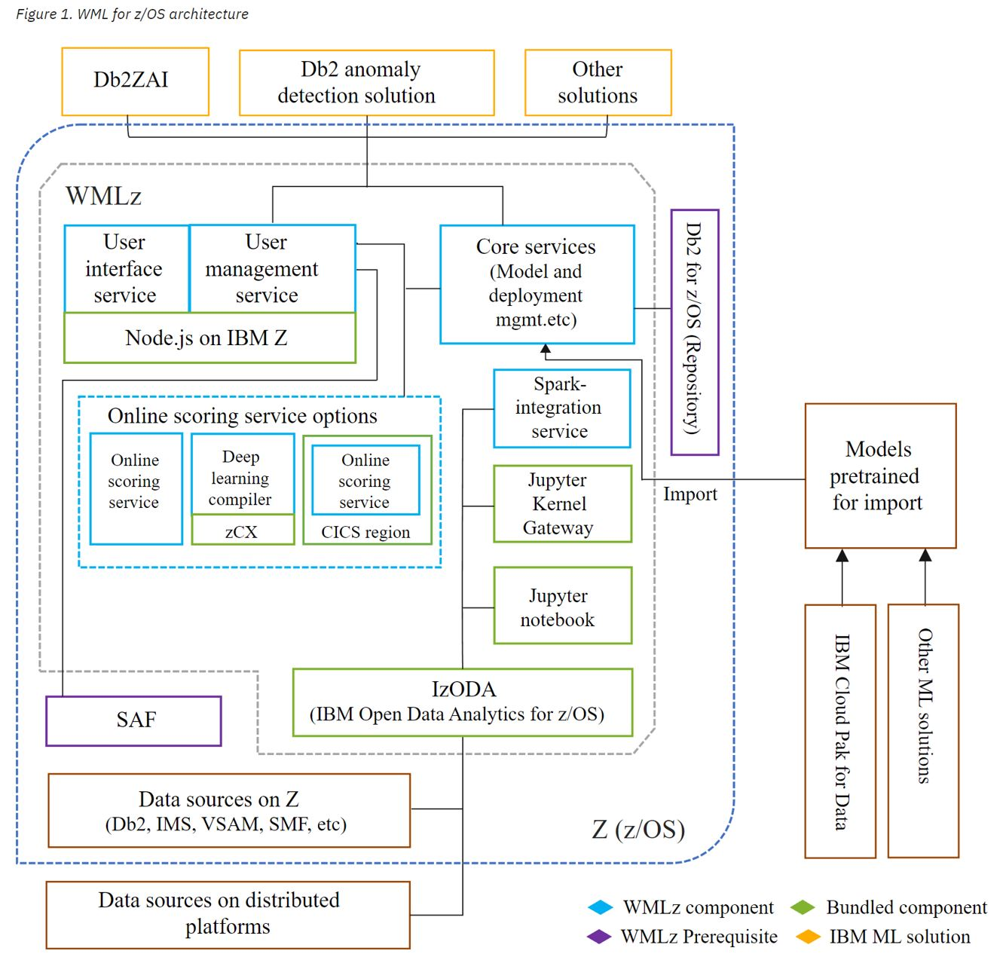


There are the 21 implementation steps for WMLZ V2.4  

The [KC_Link](https://www.ibm.com/docs/en/wml-for-zos/2.4.0?topic=installation-roadmap) 


```
Step 1	Preparing for WMLz installation	(Sysprog, WMLz user)	 
Step 2	Planning system capacity for WMLz	(Sysprog, WMLz user)	 
Step 3	Obtaining SMP/E image and PTFs for WMLz	z/OS (Sysprog)	 
Step 4	Procuring, installing, and configuring prerequisites for WMLz (Sysprog with USS skills)	 
Step 5	Installing WMLz, including the bundled IzODA (Spark, Anaconda, and MDS) (Sysprog with USS skills) 
Step 6	Configuring WMLz setup user ID	(Sysprog with USS & Security skills)	 
Step 7	Configuring additional user IDs	(Sysprog with USS & Security skills)
Step 8	Configuring network ports for WMLz	(Sysprog with USS & Security skills)	 
Step 9	Configuring secure network communications for WMLz	(Sysprog with USS & Security skills)
        Security mechanisms: AT-TLS policy ; Keyring-based keystore ; File-based keystore
Step 10	Configuring WMLz (Sysprog with USS skills)	 
Step 11	Configuring ONNX compiler service ... Optional (Sysprog with USS skills)	
Step 12	Configuring Python runtime environment ... Optional (Sysprog with USS skills)	
Step 13	Configuring client authentication for z/OS Spark  ... Optional (Sysprog with USS skills)	 
Step 14	Configuring WML for z/OS scoring services (Sysprog with USS skills)	
        Configuration method: administration dashboard ; interactive shell scripts 
Step 15	Configuring WML for z/OS scoring services in a CICS region	... Optional (Sysprog with USS skills; CICS skills) 
Step 16	Configuring scoring services for high availability ...	Optional	(Sysprog with USS skills; Network skills)	 
Step 17	Configuring Db2 anomaly detection solution	... Optional (Sysprog with USS skills)
Step 18	Configuring WMLz for high performance ...	Optional (Sysprog with USS skills)	 
Step 19	Configuring a WMLz cluster for high availability	... Optional	(Sysprog with USS skills) 
Step 20	Configuring a standalone Jupyter notebook server	... Optional	(Sysprog with USS skills) 
Step 21	Verifying WMLz installation and configuration	... Optional	(Sysprog with USS skills)	

```

So, Tally Ho, Lets get on with it.

## Step 1	Preparing for WMLz installation	(Sysprog, WMLz user)	

[KC_pereqs_page](https://www.ibm.com/docs/en/wml-for-zos/2.4.0?topic=wmlz-installing-prerequisites) 

***System*** z16, z15™, z14, z13®, or zEnterprise® EC12 system. ( I've got ZVDT & ZPDT, which emulate these bad boys ).

***z/OS*** z/OS 2.5 or 2.4. Bingo : z/OS V2.5 

***PTFs*** For z/OS 2.5, apply PTFs UI64830, UI64837, and UI64940. (all applied for SQLDI)

***zDNN*** For z/OS 2.5, apply APARs OA62901, OA62902, and OA62903. (all applied for SQLDI)
 
***z/OS Integrated Cryptographic Service Facility (ICSF).*** Make sure that the ICSF component is properly configured and started. 
Yup - standard part of ADCD.

***z/OS OpenSSH***. See z/OS OpenSSH for instructions. Yup

***IBM 64-bit SDK for z/OS Java*** Yup Version 8 SR6 FP25 or later.

***Db2® 12 for z/OS*** or later. Yup V12 & V13

***CICS TS for z/OS 5.6.0*** with PTFs UI77466, UI80396 and UI80397 or later only if you plan to configure and run a scoring service in a CICS region. Yup.

***IBM z/OS Container Extensions 2.4*** with PTF OA59111 applied ( PTF not found in MVST )

So, we're good to go for everything except zCX 


## Step 2	Planning system capacity for WMLz	(Sysprog, WMLz user)	

***Planning system capacity*** Ha ha ( 4 zIIPs, 1 GCP, 100GB memory, 100GB DASD ). Can emulate everything except 100GB memory.
Probably be OK.

## Step 3	Obtaining SMP/E image and PTFs for WMLz	z/OS (Sysprog)	 

Ordered WMLZ Portable Software Instance from ShopZ. Good to go. 

## Step 4	Procuring, installing, and configuring prerequisites for WMLz (Sysprog with USS skills)	 

Nothing to do, Good to go. 


## Step 5	Installing WMLz, including the bundled IzODA (Spark, Anaconda, and MDS) (Sysprog with USS skills) 

Review the [KC_Link](https://www.ibm.com/docs/en/wml-for-zos/2.4.0?topic=wmlz-installing)

The SMP/E program installs WMLz in the default /usr/lpp/IBM/aln/v2r4 directory, which is referred as $IML_INSTALL_DIR. The directory structure should look similar to the following example:

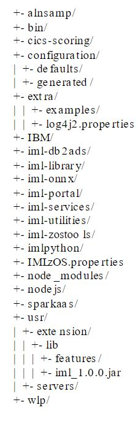


The April 2023 download 
1. is missing the IMIzOS.properties directory.
2. includes /Z25C/usr/lpp/IBM/aln/v2r4/usr/extension/installableApps/scoring-wola.war


I think I may be missing a couple of pre-reqs. 
* zCX is optional, and only needed for deep learning models
* izoda is probably only needed for the WMLZ IDE, which we dont need. Check with Maggie Lin

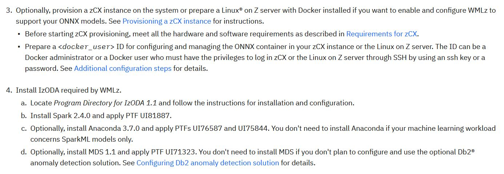


Checked the SMPE Zone ```WMLZ.SMPE.GLOBAL.CSI``` to find that Izoda, Anaconda and Spark are all installed in the CSI Zone.
Infer that the docco was written prior to PSI packaging.

* HANA110 (anaconda)
* HAQN240 (WMLZ Base)
* HMDS120 (MDS - ie DVM)
* HSPK120 (spark)

Install Spark 2.4.0 and apply PTF UI81887. (SUPBY UI90277 ... which is installed.)

Install Anaconda 3.7.0 and apply PTFs UI76587 and UI75844. (Installed)

Install MDS 1.1 and apply PTF UI71323. (Installed)

So, we're all good to go.


## Step 6 Configuring WMLz setup user ID (Sysprog with USS & Security skills)	


### Create <mlz_setup_userid>


```
//CREATE JOB (0),'WMLZ RACF',CLASS=A,REGION=0M,
//             MSGCLASS=H,NOTIFY=&SYSUID
//*------------------------------------------------------------*/
//RACF     EXEC PGM=IKJEFT01,REGION=0M
//SYSTSPRT DD SYSOUT=*
//SYSTSIN  DD *
ADDGROUP <mlz_group> OMVS(GID(<group-identifier>)) OWNER(SYS1)
ADDUSER <mlz_setup_userid> DFLTGRP(<mlz_group>) OMVS(UID(<user-identifier>) HOME(/u/<mlz_setup_userid>) -
PROGRAM($IML_INSTALL_DIR/iml-zostools/bin/bash)) -
NAME('WMLZ ID') PASSWORD(<password>) NOOIDCARD
/*
```

where


* mlz_setup_userid is the user ID that you will use to configure and run WMLz.
* mlz_group is a RACF group that you will use to associate WML for z/OS users and manage their access.
* group-identifier is the identifier for mlz_group.
* user-identifier is the identifier for mlz_setup_userid. Do not use UID 0 for mlz_setup_userid.
* IML_INSTALL_DIR is the directory where WMLz is installed. The default is /usr/lpp/IBM/aln/v2r4.


Actual Job ```IBMUSER.NEALEJCL(WMLZUSER)``` run was

```
//IBMUSERJ JOB  (FB3),'INIT 3380 DASD',CLASS=A,MSGCLASS=H,    
//             NOTIFY=&SYSUID,MSGLEVEL=(1,1)                  
//*                                                           
//*   JOB TO CREATE WMLZ SETUP USERID                         
//*                                                           
//RACF     EXEC PGM=IKJEFT01,REGION=0M                        
//SYSTSPRT DD SYSOUT=*                                        
//SYSTSIN  DD *                                               
                                                              
ADDGROUP WMLZGRP OMVS(AUTOGID) OWNER(SYS1)                    
                                                              
AU WMLZADM NAME('WMLZADM') PASSWORD(SYS1) -                   
OWNER(SYS1) DFLTGRP(WMLZGRP) UACC(READ) OPERATIONS SPECIAL   -
TSO(ACCTNUM(ACCT#) PROC(DBSPROCD) JOBCLASS(A) MSGCLASS(X) -   
HOLDCLASS(X) SYSOUTCLASS(X) SIZE(4048) MAXSIZE(0))     -      
OMVS(HOME(/u/wmlzadm) -                                       
PROGRAM(/usr/lpp/IBM/aln/v2r4/iml-zostools/bin/bash) -        
CPUTIMEMAX(86400) -                                           
MEMLIMIT(32G) ASSIZEMAX(1200000000) AUTOUID)                  
                                                              
PERMIT ACCT#     CLASS(ACCTNUM) ID(WMLZADM)                   
PERMIT ISPFPROC  CLASS(TSOPROC) ID(WMLZADM)                   
PERMIT DBSPROC   CLASS(TSOPROC) ID(WMLZADM)                   
PERMIT JCL       CLASS(TSOAUTH) ID(WMLZADM)                   
PERMIT OPER      CLASS(TSOAUTH) ID(WMLZADM)                   
PERMIT ACCT      CLASS(TSOAUTH) ID(WMLZADM)                   
PERMIT MOUNT     CLASS(TSOAUTH) ID(WMLZADM)                   
                                                              
```
        

### Paths and ZFS


Allocate a minimum of 500 MB disk space to the home directory for <mlz_setup_userid>

Create the $IML_HOME directory. Make sure that $IML_HOME is mounted to a zFS file system with at least 50 GB storage available

Consider creating the $IML_HOME/spark subdirectory  mounted on a separate zFS file system with at least 4 GB storage available.

chown –R <mlz_setup_userid>:<mlz_group> $IML_HOME/

To allocate zFS data sets for $IML_HOME and $IML_HOME/spark that are larger than 4GB, make sure that you specify DFSMS data class with extended format and extended addressability.

Actual Job to setup home directory space
```
//IBMUSERJ JOB  (FB3),'CREATE ZFS',CLASS=A,MSGCLASS=H,                  
//             NOTIFY=&SYSUID,MSGLEVEL=(1,1)                            
//********************************************************************  
//CREATE   EXEC PGM=IDCAMS,REGION=0M                                    
//SYSPRINT DD SYSOUT=*                                                  
//SYSIN    DD *                                                         
  DEFINE -                                                              
       CLUSTER -                                                        
         ( -                                                            
             NAME(IBMUSER.WMLZHOME.ZFS) -                               
             LINEAR -                                                   
             CYL(600 50) VOLUME(USER0A USER0B USER0C) -                 
             DATACLASS(DCEXTEAV) -                                      
             SHAREOPTIONS(3) -                                          
         )                                                              
/*                                                                      
//*                                                                     
// SET ZFSDSN='IBMUSER.WMLZHOME.ZFS'                                    
//FORMAT   EXEC PGM=IOEAGFMT,REGION=0M,COND=(0,LT),                     
// PARM='-aggregate &ZFSDSN -compat'                                    
//SYSPRINT DD SYSOUT=*                                                  
//STDOUT   DD SYSOUT=*                                                  
//STDERR   DD SYSOUT=*                                                  
//SYSUDUMP DD SYSOUT=*                                                  
//CEEDUMP  DD SYSOUT=*                                                  
//*                                                                     
//*                                                                     
//* Mount the dataset at the mountpoint directory                       
//*                                                                     
//MOUNT    EXEC PGM=IKJEFT01,REGION=0M,DYNAMNBR=99,COND=(0,LT)          
//SYSTSPRT  DD SYSOUT=*                                                 
//SYSTSIN   DD *                                                        
  PROFILE MSGID WTPMSG                                                  
  MOUNT TYPE(ZFS) +                                                     
    MODE(RDWR) +                                                        
    MOUNTPOINT('/u/wmlzadm') +                                          
    FILESYSTEM('IBMUSER.WMLZHOME.ZFS')                                  
/*                                                                      
```

and permenant mount

```
/* WMLZADM ZFS */                          
MOUNT FILESYSTEM('IBMUSER.WMLZHOME.ZFS')   
      TYPE(ZFS)                            
      MODE(RDWR)                           
      NOAUTOMOVE                           
      MOUNTPOINT('/u/wmlzadm')             
```


and change ownership

```
drwxr-xr-x   2 WMLZADM  WMLZGRP        0 May  1 01:04 wmlzadm
```

IML_HOME (where the WMLZ instance will be laid down?)

create the path ```/u/aiz/wmlz```

and change ownership

```
drwxr-xr-x   2 WMLZADM  WMLZGRP        0 May  1 01:15 wmlz
```

Create an ACS Rule to place HLQ on SGEXTEAV

```
CDS Name  : SYS1.S0W1.SCDS

DATACLAS  SYS1.SMS.CNTL            ACSSTORD  IBMUSER   
                                                       
                                                       
MGMTCLAS  -----------------------  --------  --------  
                                                       
                                                       
STORCLAS  SYS1.SMS.CNTL            STORCLAS  IBMUSER   
                                                       
                                                       
STORGRP   SYS1.SMS.CNTL            STORGRP   IBMUSER   


===

WHEN (&DSN = &AIZ_HLQ)                
  DO                                  
    SET &STORCLAS = 'SCEXTEAV'        
    EXIT CODE(0)                      
  END                                 
  
  

WHEN (&STORCLAS= 'SCEXTEAV')          
  DO                                  
    SET &STORGRP = 'SGEXTEAV'
    WRITE '&STORGRP = ' &STORGRP      
    EXIT CODE(0)                      
  END                                 
  
  
```

Create the ZFS ( must be able to grow HUGE 50GB plus ) using JCL in ```IBMUSER.NEALEJCL(IMLHOME)```.

```
//IBMUSERJ JOB  (FB3),'CREATE ZFS',CLASS=A,MSGCLASS=H,                
//             NOTIFY=&SYSUID,MSGLEVEL=(1,1)                          
//********************************************************************
//CREATE   EXEC PGM=IDCAMS,REGION=0M                                  
//SYSPRINT DD SYSOUT=*                                                
//SYSIN    DD *                                                       
  DEFINE -                                                            
       CLUSTER -                                                      
         ( -                                                          
             NAME(AIZ.WMLZ.ZFS) -                                     
             LINEAR -                                                 
             CYL(4000 200) VOLUME(EAV001 EAV002) -                    
             DATACLASS(DCEXTEAV) -                                    
             SHAREOPTIONS(3) -                                        
         )                                                            
/*                                                                    
//*                                                                   
// SET ZFSDSN='AIZ.WMLZ.ZFS'                                          
//FORMAT   EXEC PGM=IOEAGFMT,REGION=0M,COND=(0,LT),                   
// PARM='-aggregate &ZFSDSN -compat'                                  
//SYSPRINT DD SYSOUT=*                                                
//STDOUT   DD SYSOUT=*                                                
//STDERR   DD SYSOUT=*                                                
//SYSUDUMP DD SYSOUT=*                                                
//CEEDUMP  DD SYSOUT=*                                                
//*                                                                   
//*                                                                   
//* Mount the dataset at the mountpoint directory                     
//*                                                                   
//MOUNT    EXEC PGM=IKJEFT01,REGION=0M,DYNAMNBR=99,COND=(0,LT)        
//SYSTSPRT  DD SYSOUT=*                                               
//SYSTSIN   DD *                                                      
  PROFILE MSGID WTPMSG                                                
  MOUNT TYPE(ZFS) +                                                   
    MODE(RDWR) +                                                      
    MOUNTPOINT('/u/aiz/wmlz') +                                       
    FILESYSTEM('AIZ.WMLZ.ZFS')                                        
/*                                                                    
```

and mount it permenantly

```
/* WMLZ IMLHOME ZFS */            
MOUNT FILESYSTEM('AIZ.WMLZ.ZFS')  
      TYPE(ZFS)                   
      MODE(RDWR)                  
      NOAUTOMOVE                  
      MOUNTPOINT('/u/aiz/wmlz')   
```

and change the owner

```
chown wmlzadm:wmlzgrp wmlz
```

### USS Environment 


Configure your z/OS UNIX shell environment for <mlz_setup_userid> ```/u/<mlz_setup_userid>/.profile```

```
Copy the $IML_INSTALL_DIR/alnsamp/profile.template directory into $HOME/.profile for <mlz_setup_userid>.
/usr/lpp/IBM/aln/v2r4/alnsamp/profile.template
set 
$SPARK_HOME = /usr/lpp/IBM/izoda/spark/spark24x
$ANACONDA_ROOT = /usr/lpp/IBM/izoda/anaconda 
$JAVA_HOME = ?SQLDI 
$IML_HOME = /u/wmlz
$IML_INSTALL_DIR = /usr/lpp/IBM/aln/v2r4 
$IML_JOBNAME_PREFIX = WMLZ 
$AIE_INSTALL_DIR = /usr/lpp/IBM/aie 
If necessary, set $XL_CONFIG to the xlc.cfg file ... n/a unless using ZCX & DLC 

PATH=$IML_INSTALL_DIR/iml-zostools/bin:$IML_INSTALL_DIR/nodejs/bin:$PATH;
```

I used this from ```/u/wmlzadm/.profile```

```
# This is a sample user profile for <mlz_setup_userid> which is used to install and configure IBM Watson Machine Learning for z/OS                      
# Place the customized version of the .profile file under the user home of <mlz_setup_userid>                                                           
                                                                                                                                                        
                                                                                                                                                        
# Spark environment variable                                                                                                                            
export SPARK_HOME=/usr/lpp/IBM/izoda/spark/spark24x                                                                                                     
                                                                                                                                                        
# Anaconda environment variable                                                                                                                         
export ANACONDA_ROOT=/usr/lpp/IBM/izoda/anaconda                                                                                                        
                                                                                                                                                        
# Java environment variable                                                                                                                             
export JAVA_HOME=/usr/lpp/java/J8.0_64                                                                                                                  
                                                                                                                                                        
# AIE environment variable                                                                                                                              
# export AIE_INSTALL_DIR=/usr/lpp/IBM/aie                                                                                                               
                                                                                                                                                        
# WML for z/OS environment variable                                                                                                                     
export IML_HOME=/u/aiz/wmlz                                                                                                                             
                                                                                                                                                        
# WML for z/OS environment variable                                                                                                                     
export IML_INSTALL_DIR=/usr/lpp/IBM/aln/v2r4                                                                                                            
                                                                                                                                                        
# WML for z/OS environment variable                                                                                                                     
export IML_JOBNAME_PREFIX=ALN                        #REQUIRED Jobname prefix for each service. Default value is ALN                                    
                                                     # Job name prefix has max 4 characters limit. First character has to be alphabetic. The rest charac
                                                                                                                                                        
# COBOL cob2 utility installation directory                                                                                                             
export COBOL_INSTALL_DIR=/usr/lpp/IBM/cobol/igyv6r4                                                                                                     
                                                                                                                                                        
# PATH                                                                                                                                                  
PATH=/bin:                                                                                                                                              
PATH="${IML_INSTALL_DIR}"/iml-zostools/bin:$PATH                                                                                                        
PATH=$PATH:"${ANACONDA_ROOT}"/bin                    #OPTIONAL Only set this if you have ANACONDA_ROOT environment variable set                         
PATH=$PATH:"${JAVA_HOME}"/bin                                                                                                                           
PATH=$PATH:"${SPARK_HOME}"/bin:"${SPARK_HOME}"/sbin                                                                                                     
PATH=$PATH:"${IML_INSTALL_DIR}"/nodejs/bin                                                                                                              
PATH=$PATH:"${COBOL_INSTALL_DIR}/bin"                #OPTIONAL Only set this if you have COBOL_INSTALL_DIR environment variable set                     
                                                                                                                                                        
export PATH="$PATH"                                                                                                                                     
                                                                                                                                                        
#LIBPATH                                                                                                                                                
LIBPATH=/lib:/usr/lib                                                                                                                                   
LIBPATH=$LIBPATH:"${AIE_INSTALL_DIR}"/zdnn/lib       #OPTIONAL Only set this if you have AIE_INSTALL_DIR environment variable set                       
LIBPATH=$LIBPATH:"${JAVA_HOME}"/bin/classic                                                                                                             
LIBPATH=$LIBPATH:"${JAVA_HOME}"/bin/j9vm                                                                                                                
LIBPATH=$LIBPATH:"${JAVA_HOME}"/lib/s390x                                                                                                               
LIBPATH=$LIBPATH:"${SPARK_HOME}"/lib                                                                                                                    
                                                                                                                                                        
export LIBPATH="$LIBPATH"                                                                                                                               
                                                                                                                                                        
                                                                                                                                                        
# Other system environment variables                                                                                                                    
export IBM_JAVA_OPTIONS="-Dfile.encoding=UTF-8"                                                                                                         
export IBM_JAVA_OPTIONS="$IBM_JAVA_OPTIONS -Djava.security.properties=${IML_HOME}/configuration/java.security"  #OPTIONAL Only add this if you have a cu
export _BPXK_AUTOCVT=ON                                                                                                                                 
export _BPX_SHAREAS=NO                                                                                                                                  
export _ENCODE_FILE_NEW=ISO8859-1                                                                                                                       
export _ENCODE_FILE_EXISTING=UNTAGGED                                                                                                                   
export _CEE_RUNOPTS="FILETAG(AUTOCVT,AUTOTAG) POSIX(ON)"                                                                                                
# export STEPLIB=<DSN1:DSN2:DSN3>                 #OPTIONAL Set up the load library search order for executable files. Consider setting this when xlc   
                                                    #EX: STEPLIB=IGY.V6R4M0.SIGYCOMP:CBC.SCCNCMP                                                        
```

### Configure <mlz_setup_userid> access to your z/OS UNIX shell environment


#### Permissions required for configuring and starting WMLz:

$IML_HOME environment variable included in the user's profile
Permission to read and write to the $IML_HOME directory.
Permission to read and execute to the $IML_INSTALL_DIR. 

$SPARK_HOME environment variables included in the user's profile.

$ANACONDA_ROOT environment variable defined in the user's profile.

$ANACONDA_ROOT/bin defined in the $PATH environment variable in the user's profile.

Permission to read the $ANACONDA_ROOT directory.

$JAVA_HOME/bin defined in the $PATH environment variable in the user's profile.

$IBM_JAVA_OPTIONS environment variable set to -Dfile.encoding=UTF-8 in the user's profile.

Consider using a customized java.security file if all of the following factors apply to you:
- You select JCERACFKS or JCEKS as the keystore type for your WMLz.
- The Java security specification ($JAVA_HOME/lib/security/java.security) on the system where your WMLz runs lists IBMJCECCA as the top provider.
- Your WMLz does not need to use the resources in the ICSF services.
export IBM_JAVA_OPTIONS="$IBM_JAVA_OPTIONS -Djava.security.properties=$IML_HOME/configuration/java.security"

$_BPXK_AUTOCVT environment variable set to ON in the user's profile.

Read access to the RACF BPX.JOBNAME facility class so that you can assign default jobnames with the ALN prefix to the started WMLz services.
Read access to the RACF BPX.FILEATTR.PROGCTL facility class when using client authentication for z/OS Spark and Jupyter Kernel Gateway.
Read access to resources CSFDSG, CSFDSV, CSFEDH, CSFIQA, CSFIQF, CSFOWH, CSFPKG, CSFPKI, CSFPKX, CSFRNG, and CSFRNGL for ICSF services in the CSFSERV class if your system is CryptoCard-enabled.

#### Other Permissions
        
Permissions required for creating, configuring, and starting WMLz scoring service
subset of above

Permissions required for configuring WMLz scoring service in a CICS region
subset of above
        
Permissions required for configuring and running Db2® anomaly detection solution
...leave for later


### OMVS properties

```
ALTUSER <mlz_setup_userid> OMVS(ASSIZEMAX(address-space-size) MEMLIMIT(nonshared-memory-size) CPUTIMEMAX(cpu-time))
```
        
Check with ulimit

```
/bin/ulimit -a 
core file         8192b
cpu time          unlimited 
data size         unlimited 
file size         unlimited 
stack size        unlimited 
file descriptors  520000
address space     1048576k
memory above bar  24576m
```
        
### Verify


wmlz-configuration-checker.sh script in the $IML_INSTALL_DIR/alnsamp directory.

```
./wmlz-configuration-checker.sh -preconfig

./wmlz-configuration-checker.sh -preconfig -no-python
```

First time round The checker threw some errors and warning

```
-bash-4.3$ cd /u/aiz/wmlz/alnsamp
-bash-4.3$ ls -al
total 64
drwxr-xr-x   2 WMLZADM  WMLZGRP     8192 May  1 07:56 .
drwxr-xr-x   3 WMLZADM  WMLZGRP     8192 May  1 07:55 ..
-rw-r--r--   1 WMLZADM  WMLZGRP     3051 May  1 07:56 wmlz-checker-report-20230501075547.json
-rw-r--r--   1 WMLZADM  WMLZGRP     4285 May  1 07:56 wmlz-checker-report-20230501075547.out
-bash-4.3$ cat wmlz-checker-report-20230501075547.out

======================================
=                                    =
=         WMLz PREREQ REPORT         =
=                                    =
======================================

=-=-=-=-= REQUIRED SOFTWARE LEVEL =-=-=-=-=
Spark location           /usr/lpp/IBM/izoda/spark/spark24x/bin/spark-submit
Spark version            2.4.8

Conda location           /usr/lpp/IBM/izoda/anaconda/bin/conda
Conda version
Conda level

Bash location            /usr/lpp/IBM/aln/v2r4/iml-zostools/bin/bash
Bash version             4.3.48

Java location            /usr/lpp/java/J8.0_64/bin/java
Java version             1.8.0

Node.js location         /usr/lpp/IBM/aln/v2r4/nodejs/bin/node
Node.js version          16.14.2


=-=-=-=- ENVIRONMENT VARIABLES =-=-=-=
SPARK_HOME               /usr/lpp/IBM/izoda/spark/spark24x
ANACONDA_ROOT            /usr/lpp/IBM/izoda/anaconda
JAVA_HOME                /usr/lpp/java/J8.0_64
IML_HOME                 /u/aiz/wmlz
IML_INSTALL_DIR          /usr/lpp/IBM/aln/v2r4
IML_JOBNAME_PREFIX       ALN
LIBPATH                  /lib:/usr/lib:/zdnn/lib:/usr/lpp/java/J8.0_64/bin/classic:/usr/lpp/java/J8.0_64/bin/j9vm:/usr/lpp/java/J8.0_64/lib/s390x:/usr/lpp/IBM/izoda/spark/spark24x/lib
PATH                     /usr/lpp/IBM/aln/v2r4/iml-zostools/bin:/bin::/usr/lpp/IBM/izoda/anaconda/bin:/usr/lpp/java/J8.0_64/bin:/usr/lpp/IBM/izoda/spark/spark24x/bin:/usr/lpp/IBM/izoda/spark/spark24x/sbin:/usr/lpp/IBM/aln/v2r4/nodejs/bin:/usr/lpp/IBM/cobol/igyv6r4/bin
IBM_JAVA_OPTIONS         -Dfile.encoding=UTF-8 -Djava.security.properties=/u/aiz/wmlz/configuration/java.security
_BPXK_AUTOCVT            ON
_BPX_SHAREAS             NO
_ENCODE_FILE_NEW         ISO8859-1
_ENCODE_FILE_EXISTING    UNTAGGED
_CEE_RUNOPTS             FILETAG(AUTOCVT,AUTOTAG) POSIX(ON)
XL_CONFIG


=-=-=-=-=- USER ID SETTINGS -=-=-=-=-=
MEMLIMIT (Non-shared memory of OMVS segment) 32768M
ASSIZEMAX (JVM maximum address space size)   1171875K
IML Home Disk Space (Available)              2850687K


======================================
=                                    =
=        ERROR & WARNING REPORT      =
=                                    =
======================================

=-=-=-=-=-=-=-= ERRORS =-=-=-=-=-=-=-=
WMLz:   ERROR:      2850687KB available for /u/aiz/wmlz  (10GB is required and 50GB is recommended)

WMLz:   ERROR:      /usr/lpp/IBM/izoda/anaconda/bin/conda command failed. Check conda command file.

WMLz:   ERROR:      /usr/lpp/IBM/izoda/anaconda/installation_record/2021_alivy_sec doesn't exist. Make sure UI76587 & UI75844 has been SMP/E applied and post-APPLY script /usr/lpp/IBM/izoda/anaconda/configure-anaconda has been executed to put the PTF into service.

--------------> 3 errors.

=-=-=-=-=-=-=- WARNINGS -=-=-=-=-=-=-=
WMLz:   WARNING:    XL_CONFIG environment variable is not configured. Verify if you need a customized xlc configuration file to enable the xlc utility.

WMLz:   WARNING:    ITOA_HOME is not set.

--------------> 2 warnings.

See IBM Watson Machine Learning for z/OS documentation for details.

-bash-4.3$
```

So, to address the errors.

### Error 1

2850687KB available for /u/aiz/wmlz  (10GB is required and 50GB is recommended)

Fixed as follows

```
IBMUSER:/u/aiz: >df -k | grep aiz
/u/aiz/wmlz    (AIZ.WMLZ.ZFS)            2850663/2880000 4294967289 Available

IBMUSER:/u/aiz: >zfsadm grow -aggregate AIZ.WMLZ.ZFS -size 15000000
IOEZ00173I Aggregate AIZ.WMLZ.ZFS successfully grown
AIZ.WMLZ.ZFS (R/W COMP): 14969471 K free out of total 15000480

IBMUSER:/u/aiz: >df -k | grep aiz
/u/aiz/wmlz    (AIZ.WMLZ.ZFS)            14969471/15000480 4294967289 Available
```

### Error 2

/usr/lpp/IBM/izoda/anaconda/bin/conda command failed. Check conda command file.

Looks OK

```
-bash-4.3$ pwd
/usr/lpp/IBM/izoda/anaconda/bin
-bash-4.3$ ls -al | grep conda
-rwxrwxr-x   1 OMVSKERN OMVSGRP      185 Apr 25 12:53 anaconda
-rwxrwxr-x   1 OMVSKERN OMVSGRP      151 Apr 25 12:53 conda
-rwxrwxr-x   1 OMVSKERN OMVSGRP      185 Apr 25 12:53 conda-build
-rwxrwxr-x   1 OMVSKERN OMVSGRP      189 Apr 25 12:53 conda-convert
-rwxrwxr-x   1 OMVSKERN OMVSGRP      189 Apr 25 12:53 conda-develop
-rwxrwxr-x   1 OMVSKERN OMVSGRP      169 Apr 25 12:53 conda-env
-rwxrwxr-x   1 OMVSKERN OMVSGRP      185 Apr 25 12:53 conda-index
-rwxrwxr-x   1 OMVSKERN OMVSGRP      189 Apr 25 12:53 conda-inspect
-rwxrwxr-x   1 OMVSKERN OMVSGRP      197 Apr 25 12:53 conda-metapackage
-rwxrwxr-x   1 OMVSKERN OMVSGRP      187 Apr 25 12:53 conda-render
-rwxrwxr-x   1 OMVSKERN OMVSGRP      453 Apr 25 12:53 conda-server
-rwxrwxr-x   1 OMVSKERN OMVSGRP      183 Apr 25 12:53 conda-sign
-rwxrwxr-x   1 OMVSKERN OMVSGRP      191 Apr 25 12:53 conda-skeleton
-rwxrwxr-x   1 OMVSKERN OMVSGRP      167 Apr 25 12:53 conda-verify
-rwxrwxr-x   2 OMVSKERN OMVSGRP      554 Apr 25 12:53 install_set_shared_anaconda_admin
-rwxrwxr-x   2 OMVSKERN OMVSGRP      342 Apr 25 12:53 install_set_single_anaconda_admin
```

### Error 3

/usr/lpp/IBM/izoda/anaconda/installation_record/2021_alivy_sec doesn't exist. 
Make sure UI76587 & UI75844 has been SMP/E applied 
and post-APPLY script /usr/lpp/IBM/izoda/anaconda/configure-anaconda has been executed to put the PTF into service.

PTFs were applied succesfully. Ran the post-APPLY script manually as IBMUSER

```

```

### Warning 1

XL_CONFIG environment variable is not configured. Verify if you need a customized xlc configuration file to enable the xlc utility.

not applicable

### Warning 2

ITOA_HOME is not set.

not applicable. Only needed for SMF datasets for Db2 Anomoly Detection.

            
### Decisons
Fixed the easy things. Maggie Lin didnt help on the hard things, but simply suggested forgoing the python aspects of WMLZ deployment. Not happy at the abdication from the issue, but agree that I don't need python for the immediate purpose. Hence accepted Maggie's suggestion for this build. Re-ran 
```./wmlz-configuration-checker.sh -preconfig -no-python``` and got a clean bill of health.


## Step 7	Configuring additional user IDs	(Sysprog with USS & Security skills)

Nothing done for this build.

Ensure that the LE runtime libraries are APF-authorized.

```
D PROG,APF,ALL

RESPONSE=S0W1                                 
 CSV450I 09.07.22 PROG,APF DISPLAY 110        
 FORMAT=DYNAMIC                               
 ENTRY VOLUME DSNAME                          
...                 
   33  C5RES2 CEE.SCEERUN                     
   34  C5RES2 CEE.SCEERUN2                    
   35  C5RES1 CBC.SCLBDLL                     
   36  C5RES1 CBC.SCLBDLL2  
```
        
Configure (or reuse) userids for 

* CICS
* DB2
* RACF
* Docker (n/a)        

probably use IBMUSER for all
        
## Step 8	Configuring network ports for WMLz	(Sysprog with USS & Security skills)	

Ports Docco from [KC](https://www.ibm.com/docs/en/wml-for-zos/2.4.0?topic=wmlz-configuring-ports) 

```
Db2 User-defined 
z/OS Spark master 	7077 or user-defined 
z/OS Spark master REST API 	6066 or user-defined 
z/OS Spark master UI 	8080 or user-defined 
z/OS Spark worker 	Dynamically assigned or user-defined 
z/OS Spark worker UI 	8081 or user-defined 
z/OS Spark executor 	Dynamically assigned or user-defined 
z/OS Spark driver 	Dynamically assigned or user-defined 
Spark-integration service 	10080 or user-defined 
Scoring service 	User-defined 
Scoring service 	Dynamically assigned or user-defined 
Jupyter Kernel Gateway 	8889 or user-defined 
Apache Toree kernel 	User-defined 
Python kernel 	User-defined 
UI service 	9888 or user-defined 
Core services 	11442 or user-defined 
Configuration tool service 	50000 or user-defined 
zCX Docker CLI 	8022 or user-defined 
ONNX compiler service 	18080 or user-defined 
Python scoring service 	User-defined 
Db2 anomaly detection service 	15001 
MDS server 	User-defined 
```

Ports to check: 
* Db2 5045 
* Spark 7077 6066 8080 8081 10080
* Jupyter 8889
* WMLZ 9888 11442 50000 
* zCX & ONNX 8022 18080
* Db2 anomoly 15001 

netstat portlist

lots of overlap with SQLDI to manage. Lets go defaults on this system because SQLDI is not deployed yet here.
        
        
## Step 9	Configuring secure network communications for WMLz	(Sysprog with USS & Security skills)

* Security mechanisms: AT-TLS policy ; Keyring-based keystore ; File-based keystore
        
By default, WML for z/OS uses SSL to secure network connections and authenticate users. You can further strengthen the security of your network communications by leveraging the Application Transparent Transport Layer Security (AT-TLS) capability on z/OS.

* Configuring a keyring-based keystore (JCERACFKS) for WMLz. (just this for authentication only)
* Configuring AT-TLS for secure network connections with WMLz. (also needed for encryption)

        
### Configuring a keyring-based keystore (JCERACFKS) for WMLz        

Create Keyring
```
RACDCERT ADDRING(WMLZRING) ID(WMLZID)
```

Generate a CA (certificate authority) certificate        
        
```
RACDCERT GENCERT CERTAUTH +  
SUBJECTSDN( + 
      CN('PLEXE2') + 
      C('US') + 
      SP('CA') + 
      L('SAN JOSE') + 
      O('IBM') + 
      OU('WMLZ') + 
) + 
ALTNAME( + 
      EMAIL('user1@ibm.com') + 
) +  
WITHLABEL('WMLZCACert') +  
NOTAFTER(DATE(2030/01/01))
```

        
Generate and sign a user certificate for <mlz_setup_userid>        
        
```
RACDCERT GENCERT ID(WMLZID) + 
SUBJECTSDN( + 
      CN('PLEXE2') +  
      C('US') + 
      SP('CA') +  
      L('SAN JOSE') + 
      O('IBM') +
      OU('WMLZ-USER') +   
) +  
ALTNAME( + 
      IP(9.1.2.3) +
      DOMAIN('svl.ibm.com') +
      EMAIL('user1@ibm.com') + 
) + 
WITHLABEL('WMLZCert_WMLZID') +  
SIGNWITH(CERTAUTH LABEL('WMLZCACert')) + 
NOTAFTER(DATE(2022/01/01)) 
```
        
Connect the user certificate and the CA certificate to the keyring you created and add usage options
  
```
RACDCERT ID(WMLZID) CONNECT(CERTAUTH LABEL('WMLZCACert') +     
RING(WMLZRING))                                  

RACDCERT ID(WMLZID) CONNECT(ID(WMLZID) LABEL('WMLZCert_WMLZID') + 
RING(WMLZRING) USAGE(PERSONAL) DEFAULT)                 

```

        
Grant <mlz_setup_userid> permission to access the keyring and the CA certificate
        
```
RDEFINE FACILITY IRR.DIGTCERT.LIST UACC(NONE)
PERMIT IRR.DIGTCERT.LISTRING CLASS(FACILITY) ID(<mlz_setup_userid>) ACCESS(READ)
SETROPTS RACLIST(FACILITY) REFRESH            

```        

<mlz_setup_userid> must also have the READ or UPDATE authority to the <ringOwner>.<ringName>.LST resource in the RDATALIB class        
        
```

RDEFINE RDATALIB WMLZID.WMLZRING.LST UACC(NONE) 
SETROPTS CLASSACT(RDATALIB) RACLIST(RDATALIB) 
SETROPTS CLASSACT(RDATALIB)
PERMIT WMLZID.WMLZRING.LST CLASS(RDATALIB) ID(<mlz_setup_userid>) ACCESS(READ)
SETROPTS RACLIST(RDATALIB) REFRESH
```
        
Here's what I actually submitted

```
//IBMUSERJ JOB (RACF),'KEYRING CERT',CLASS=A,MSGCLASS=H,               
//       NOTIFY=&SYSUID,MSGLEVEL=(1,1),REGION=0M                       
//******************************************************************** 
//*                                                                  * 
//* CREATE RACF KEYRING FOR SQLDI V12                                * 
//*                                                                  * 
//******************************************************************** 
//S1       EXEC PGM=IKJEFT01                                           
//SYSTSPRT DD   SYSOUT=*                                               
//SYSPRINT DD   SYSOUT=*                                               
//SYSTSIN  DD   *                                                      
RACDCERT ADDRING(WMLZRING) ID(WMLZADM)                                 
                                                                       
RACDCERT GENCERT CERTAUTH +                                            
SUBJECTSDN( +                                                          
      CN('ZVASYS') +                                                   
      C('US') +                                                        
      SP('CA') +                                                       
      L('SAN JOSE') +                                                  
      O('IBM') +                                                       
      OU('WMLZ') +                                                     
) +                                                                    
ALTNAME( +                                                             
      EMAIL('neale@au1.ibm.com') +                                     
) +                                                                    
WITHLABEL('WMLZCACert') +                                              
NOTAFTER(DATE(2030/01/01))                                             
                                                                       
RACDCERT GENCERT ID(WMLZADM) +                                         
SUBJECTSDN( +                                                          
      CN('ZVASYS') +                                                   
      C('US') +                                                        
      SP('CA') +                                                       
      L('SAN JOSE') +                                                  
      O('IBM') +                                                       
      OU('WMLZ') +                                                     
) +                                                                    
ALTNAME( +                                                             
      EMAIL('neale@au1.ibm.com') +                                     
) +                                                                    
WITHLABEL('WMLZCert_WMLZID') +                                         
SIGNWITH(CERTAUTH LABEL('WMLZCACert')) +                               
NOTAFTER(DATE(2025/01/01))                                             
                                                                       
RACDCERT ID(WMLZADM) CONNECT(CERTAUTH LABEL('WMLZCACert') +            
RING(WMLZRING))                                                        
                                                                       
RACDCERT ID(WMLZADM) CONNECT(ID(WMLZADM) LABEL('WMLZCert_WMLZID') +    
RING(WMLZRING) USAGE(PERSONAL) DEFAULT)                                
                                                                       
PERMIT IRR.DIGTCERT.LISTRING CLASS(FACILITY) ID(WMLZADM) ACCESS(READ)  
PERMIT IRR.DIGTCERT.LISTRING CLASS(FACILITY) ID(IBMUSER) ACCESS(READ)  
                                                                       
SETROPTS RACLIST(FACILITY) REFRESH                                     
                                                                       
RDEFINE RDATALIB WMLZID.WMLZRING.LST UACC(NONE)                        
SETROPTS CLASSACT(RDATALIB) RACLIST(RDATALIB)                          
SETROPTS CLASSACT(RDATALIB)                                            
PERMIT WMLZID.WMLZRING.LST CLASS(RDATALIB) ID(WMLZADM) ACCESS(READ)    
SETROPTS RACLIST(RDATALIB) REFRESH                                     
                                                                       
                                                                       
/*                                                                                    
```

And here is the RACFCHCK job IBMUSER.NEALEJCL(RACFCHCK)

```
//IBMUSERJ JOB (RACF),'KEYRING CERT',CLASS=A,MSGCLASS=H,              
//       NOTIFY=&SYSUID,MSGLEVEL=(1,1),REGION=0M                      
//********************************************************************
//*                                                                  *
//* CREATE RACF KEYRING FOR SQLDI V12                                *
//*                                                                  *
//********************************************************************
//S1       EXEC PGM=IKJEFT01                                          
//SYSTSPRT DD   SYSOUT=*                                              
//SYSPRINT DD   SYSOUT=*                                              
//SYSTSIN  DD   *                                                     
RACDCERT LISTRING(WMLZRING) ID(WMLZADM)                               
                                                                      
RACDCERT CERTAUTH LIST(LABEL('WMLZCACert'))                           
                                                                      
RACDCERT LIST(LABEL('WMLZCert_WMLZID')) ID(WMLZADM)                   
                                                                                                                                        
/*                                                                    
```

And I need to write a job to clean up the stuff

```
//IBMUSERJ JOB (RACF),'KEYRING CERT',CLASS=A,MSGCLASS=H,              
//       NOTIFY=&SYSUID,MSGLEVEL=(1,1),REGION=0M                      
//********************************************************************
//*                                                                  *
//* Cleanup RACF stuff                                               *
//*                                                                  *
//********************************************************************
//S1       EXEC PGM=IKJEFT01                                          
//SYSTSPRT DD   SYSOUT=*                                              
//SYSPRINT DD   SYSOUT=*                                              
//SYSTSIN  DD   *  
        
RACDCERT xxxxx                  
                                                                                                                                        
/*                                                                    
```

### Optional for Encryption - Configuring AT-TLS for secure network connections with WMLz

* Encryption is transparent (by definition) for z/OS applications, so this optional task is independent of WMLZ deployment.
* merge these instructions with my own PAGENT instructions at a later time


        
## Step 10	Configuring WMLz (Sysprog with USS skills)

Locate the configtool.sh script in the $IML_INSTALL_DIR/iml-utilities/configtool directory.

```
./configtool.sh start

or

./configtool.sh start --no-python
```

* IP Address and Port
* the script will display the full URL for the web user interface (UI) of the configuration tool and the access token required by the web UI.
* On the Environment readiness page, verify that your system and environment are ready for configuration.
* On the Authentication page, decide if you want to enable the AT-TLS support and then select a keystore for secure communications and user authentication
* On the Metadata repository page, specify a Db2 for z/OS system and schema name for WMLz metadata objects
* On the UI and core services page, specify the port number for your UI service, specify the port number for WMLz core services, set the password for the default user admin, and add one user as a WMLz system administrator
* On the Runtime environment page, specify the default runtime environment for WMLz that includes both Spark and Python runtime engines.
* On the Db2 anomaly detection service page, specify if you want to enable the service for the optional anomaly detection solution.
* On the Review and configure page, review all your settings, correct any error, and configure WMLz and services.

Run the config tool

        
```
WMLZADM:/usr/lpp/IBM/aln/v2r4/iml-utilities/configtool: >./configtool.sh start --no-python
Checking for required Bash and IML_HOME ...
Bash version is 4.3.48
IML_HOME is /u/aiz/wmlz
IML_JOBNAME_PREFIX is ALN
Enter IP address or hostname of your z/OS system where the configuration tool will run or press <enter> to use 10.1.1.2:192.168.1.191
Checking 192.168.1.191
Enter port of your z/OS system where the configuration tool will run or press <enter> to use 50000:
Starting the WMLz configuration tool ...
The configuration tool is successfully started.
Open your browser, copy and paste http://192.168.1.191:50000 into the address field, and launch the web interface of the configuration tool.
Enter access token 1L+lRBhMI4udWOoeTJ+cGiub/0FlfQGeCyMY5d2jtIs= and click Start to start the configuration of WMLz.
WMLZADM:/usr/lpp/IBM/aln/v2r4/iml-utilities/configtool: >
```

So, launch the config tool & enter the access token
        
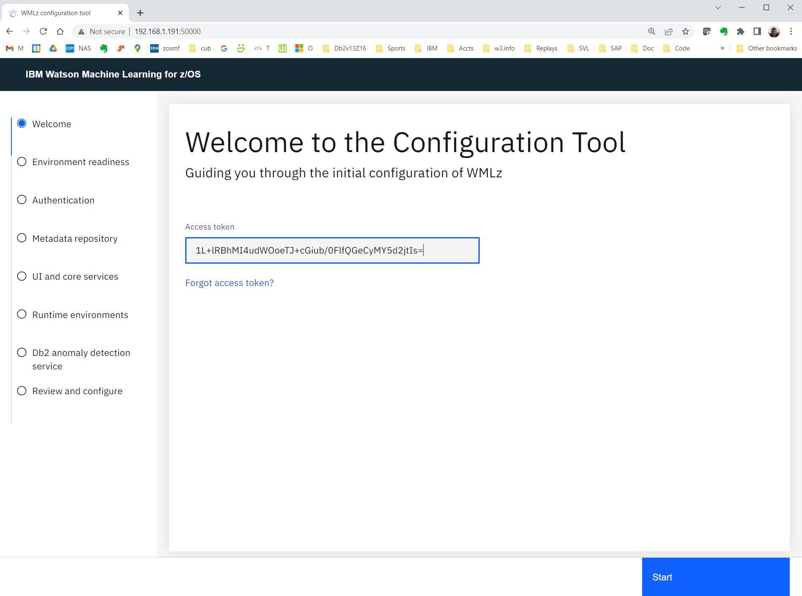
        
        
Review the environment readiness display
        
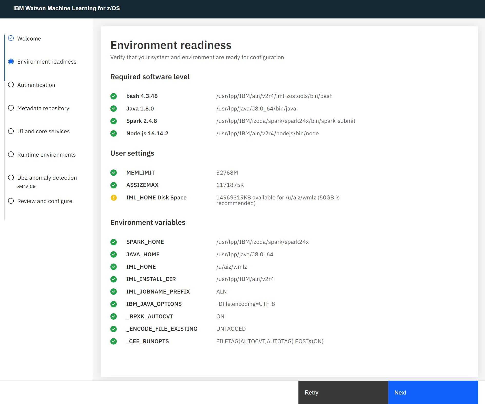
        
        
Enter the authentication credentials. Keystore, but no AT-TLSk. The GUI will spin for a bit, whilst it checks the RACF keyring.
        
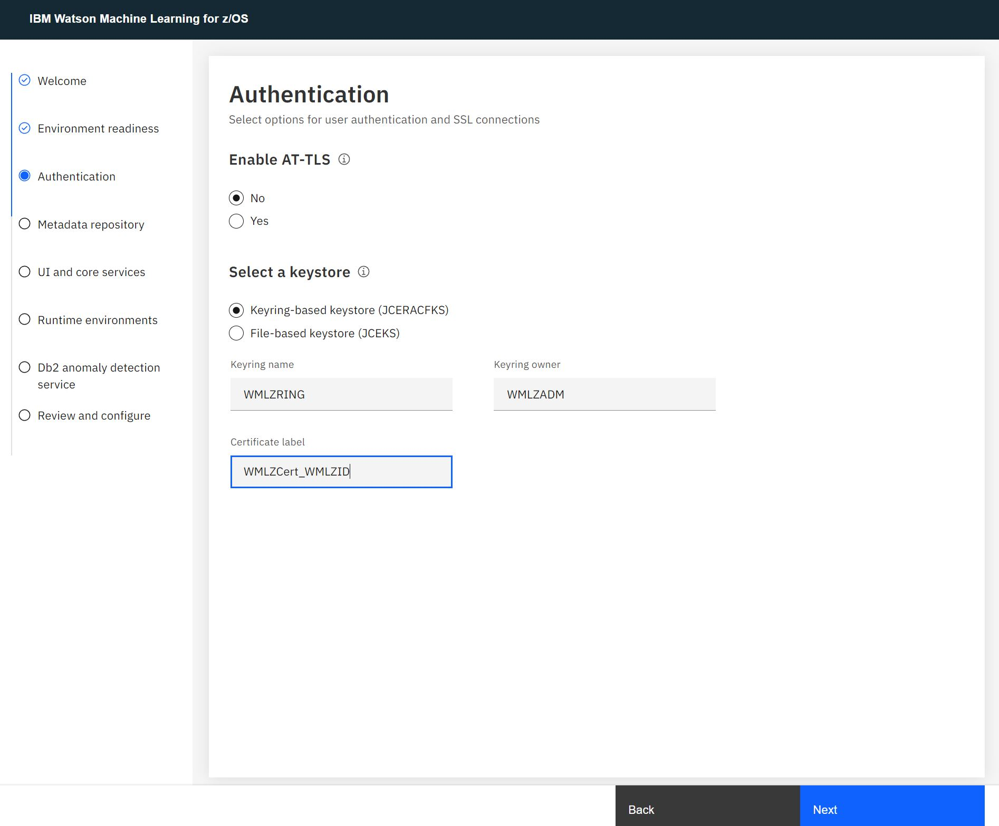
        
        
Provide the Db2 details for the repository. The GUI will spin for a bit, whilst it checks the Db2 connection.
        

        

If the Schema doesn't yet exist, click on the option to create new schema
        

        

The config tool will prompt you to provide a database name, stogroup and bufferpool (which must be a 32K bufferpool)
        
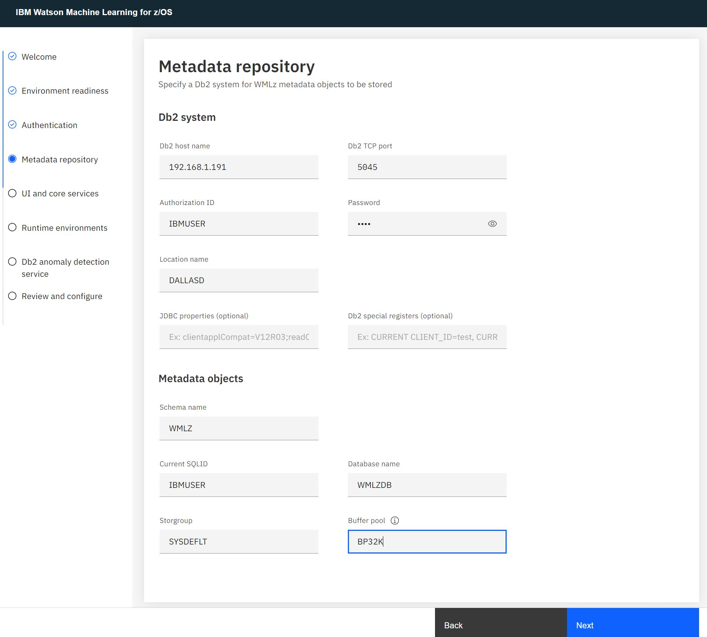
        

Provide Ports and TCPIP details for the UI and the core services. 
For this implementation we will not be deploying a core services HA cluster, and will will not be implementating traces for model governance.
Annoyingly the password needs to be 8 characters minimum
        
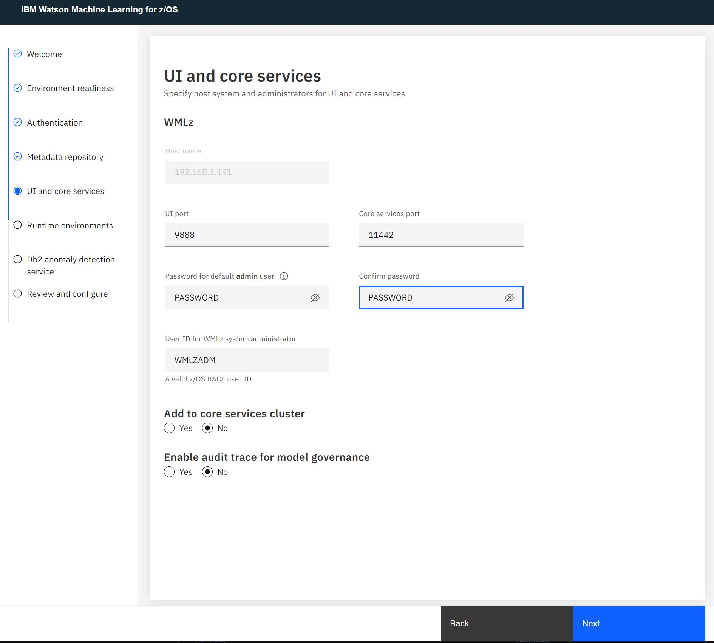
        

Specify the runtime environment. For this first deployment we will not bother with spark client authentication. 
We willa ccept all the default ports.
        
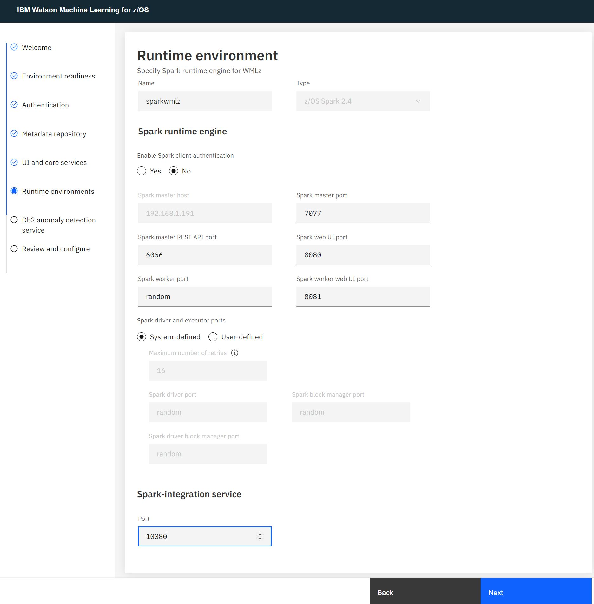
        

It has already worked out that we don't have the pre-reqs for the Db2 anomoly detection solution..
        
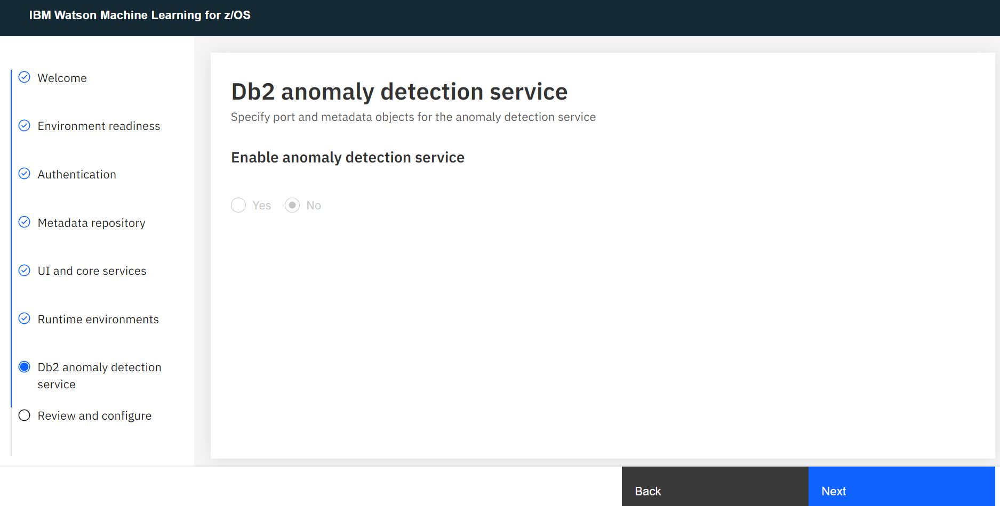
        
We are presented with a summary of our configuration choices, and can press the 'Configure' Button
        
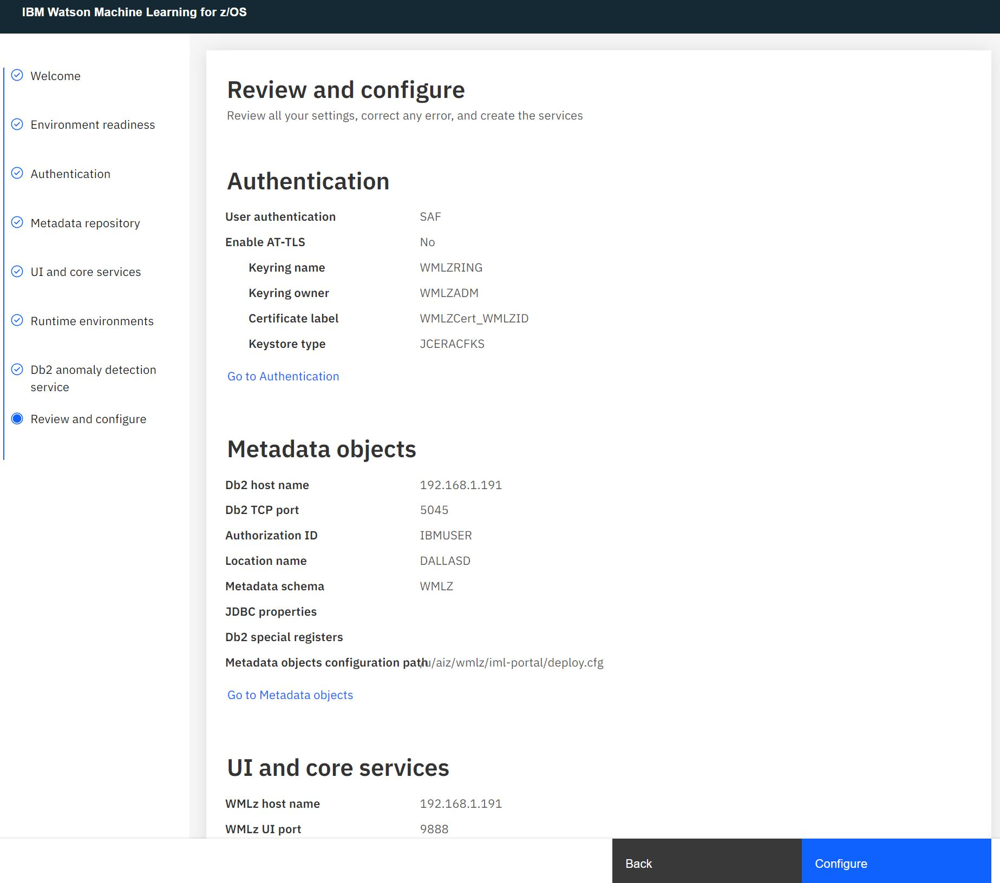

Now be patient
        
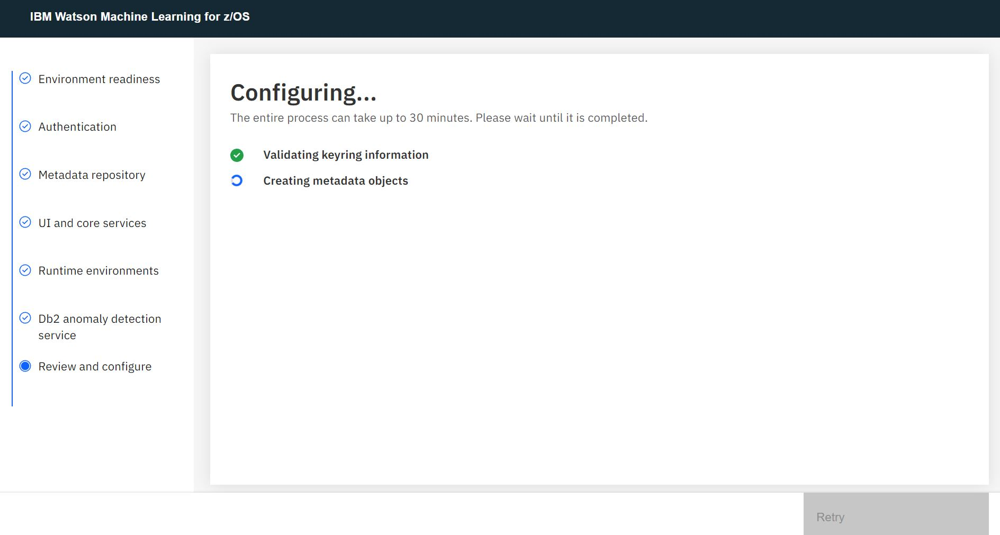
        
Not bad for a first attempt. Seems we have a connection error when trying to connect to the WMLZ UI.
        
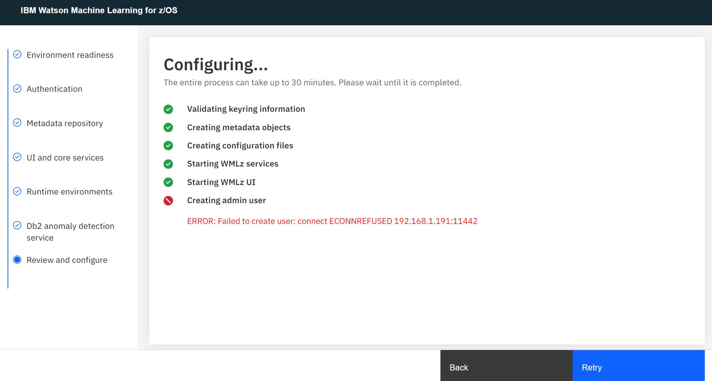

        
ERROR: Failed to create user: connect ECONNREFUSED 192.168.1.191:11442
        
Problem Determination
* SYSLOG - no error messages
* 2021 APAR for WMLZ V2.3 https://www.ibm.com/support/pages/apar/PH38510
        
      
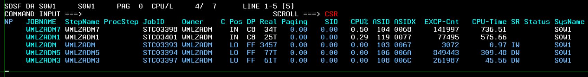

SDSF no use - cant see into a USSS service 
        
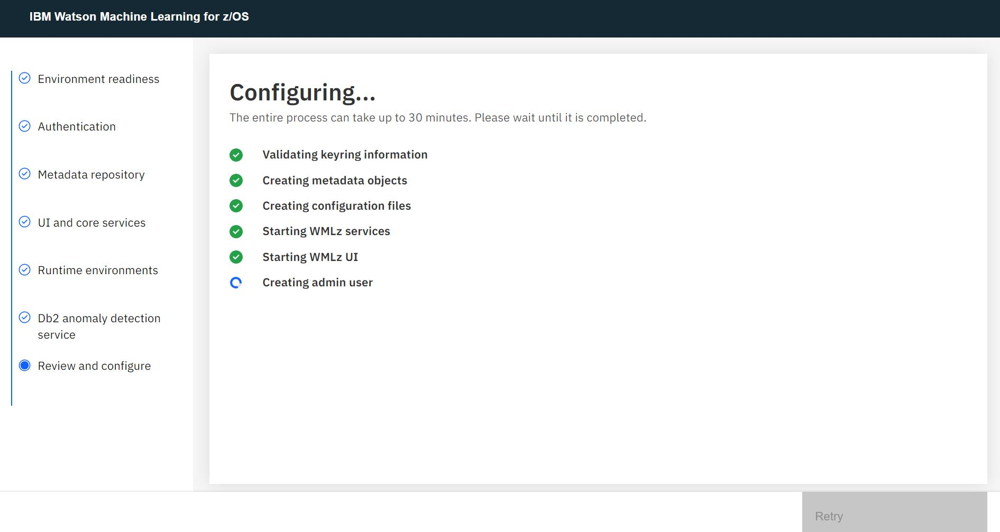

Wait for the service to come up.
        
Then check whether there is anything actually listening on the port

```
IBMUSER:/bin: >./netstat -a | grep 11442
WMLZADM7 000022B3 0.0.0.0..11442         0.0.0.0..0             Listen
```
        
Then press retry and we ge stuck into creating the admin user.
        
        
        
Unfortunately. The same thing happens when we start Spark. This was always a problem with SQLDI too.
        
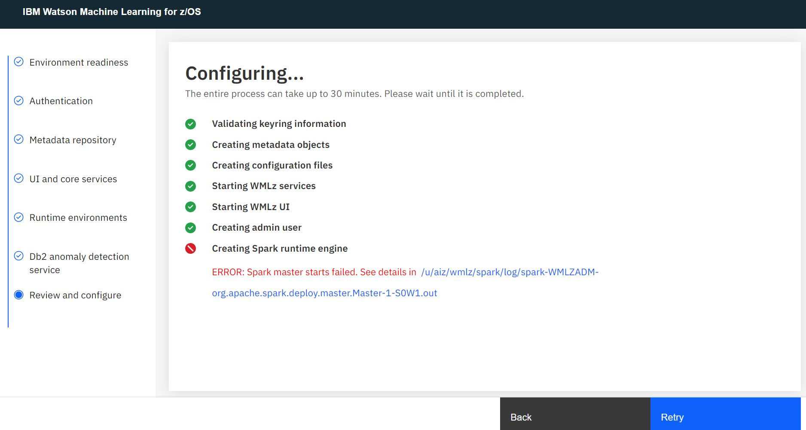  
        
```
IBMUSER:/bin: >ps -ef | grep wmlz
 WMLZADM   83952113          1  - 21:36:47 ttyp0000 14:49 /usr/lpp/java/J8.0_64/bin/java -classpath /u/aiz/wmlz/iml-services/imlservice_
 WMLZADM   67175090          1  - 21:36:49 ttyp0000 10:44 /usr/lpp/java/J8.0_64/bin/java -classpath /u/aiz/wmlz/iml-services/imlservice_
 WMLZADM   67175146          1  - 22:33:55 ttyp0000  2:00 /usr/lpp/java/J8.0_64/bin/java -cp /u/aiz/wmlz/spark/conf/:/usr/lpp/IBM/izoda/
OMVSKERN   33620722   16843466  - 22:46:08 ttyp0001  0:00 grep wmlz
IBMUSER:/bin: >
```

More patience. Press Retry.
        
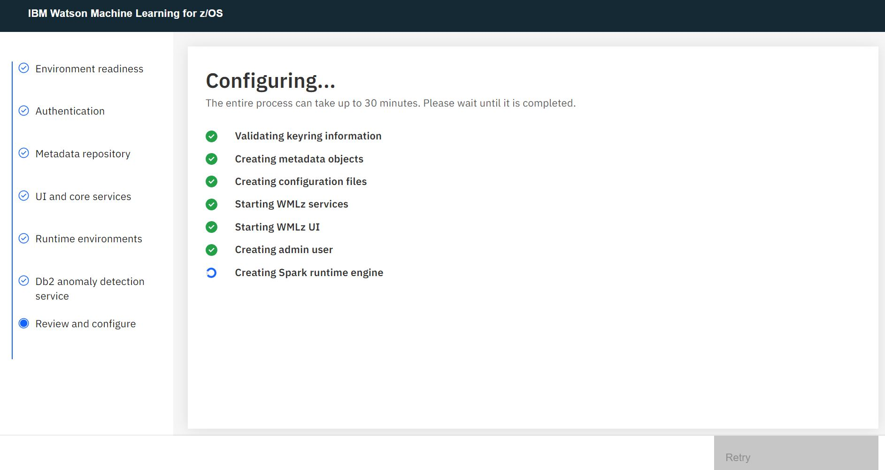  
        
        
        
        
## Step 11	Configuring ONNX compiler service ... Optional (Sysprog with USS skills)

Optional for ONNX models
        
```
./onnx-compiler.sh create
```

        
## Step 12	Configuring Python runtime environment ... Optional (Sysprog with USS skills)	

Optional - WML for z/OS uses the Python packages of z/OS Anaconda, a core IzODA component, for model training.

```
./create-python-runtime.sh
```
        
        
## Step 13	Configuring client authentication for z/OS Spark  ... Optional (Sysprog with USS skills)	

Optional - z/OS Spark includes a client authentication option for securing all connections to the Spark master and REST ports.
        
        
## Step 14	Configuring WML for z/OS scoring services (Sysprog with USS skills)	

Configuration method: administration dashboard ; interactive shell scripts 
        
        
### A standalone scoring service locally on the WMLz system (Non-HA, Standalone)
        
Sign in the WML for z/OS administration dashboard at https://<yourWMLzUI-URL>/admin-dashboard/configure by using your WMLz UI username and password.

From the sidebar, navigate to the System management - Scoring services page. 
    
Click Add standalone scoring service ...
        
        
### A standalone CICS scoring service locally on the WMLz system (Non-HA, Standalone)
        
Sign in the WML for z/OS administration dashboard at https://<yourWMLzUI-URL>/admin-dashboard/configure by using your WMLz UI username and password.

From the sidebar, navigate to the System management - Scoring services page. 
    
Click Add standalone scoring service ...        
        
        
## Step 15	Configuring WML for z/OS scoring services in a CICS region	... Optional (Sysprog with USS skills; CICS skills) 

        
Second pass maybe

## Step 16	Configuring scoring services for high availability ...	Optional	(Sysprog with USS skills; Network skills)	

n/a 
        
## Step 17	Configuring Db2 anomaly detection solution	... Optional (Sysprog with USS skills)

later
        
## Step 18	Configuring WMLz for high performance ...	Optional (Sysprog with USS skills)	

n/a 
        
## Step 19	Configuring a WMLz cluster for high availability	... Optional	(Sysprog with USS skills) 

n/a 
        
## Step 20	Configuring a standalone Jupyter notebook server	... Optional	(Sysprog with USS skills) 

n/a
        
## Step 21	Verifying WMLz installation and configuration	... Optional	(Sysprog with USS skills)

IVP time
        
        


