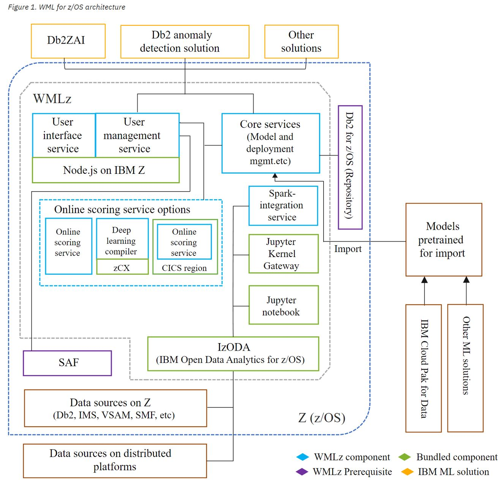

# WMLZ Demployment

These are the WMLZ moving parts.




There are the 21 implementation steps for WMLZ V2.4  

The [KC_Link](https://www.ibm.com/docs/en/wml-for-zos/2.4.0?topic=installation-roadmap) 


```
Step 1	Preparing for WMLz installation	(Sysprog, WMLz user)	 
Step 2	Planning system capacity for WMLz	(Sysprog, WMLz user)	 
Step 3	Obtaining SMP/E image and PTFs for WMLz	z/OS (Sysprog)	 
Step 4	Procuring, installing, and configuring prerequisites for WMLz (Sysprog with USS skills)	 
Step 5	Installing WMLz, including the bundled IzODA (Spark, Anaconda, and MDS) (Sysprog with USS skills) 
Step 6	Configuring WMLz setup user ID	(Sysprog with USS & Security skills)	 
Step 7	Configuring additional user IDs	(Sysprog with USS & Security skills)
Step 8	Configuring network ports for WMLz	(Sysprog with USS & Security skills)	 
Step 9	Configuring secure network communications for WMLz	(Sysprog with USS & Security skills)
        Security mechanisms: AT-TLS policy ; Keyring-based keystore ; File-based keystore
Step 10	Configuring WMLz (Sysprog with USS skills)	 
Step 11	Configuring ONNX compiler service ... Optional (Sysprog with USS skills)	
Step 12	Configuring Python runtime environment ... Optional (Sysprog with USS skills)	
Step 13	Configuring client authentication for z/OS Spark  ... Optional (Sysprog with USS skills)	 
Step 14	Configuring WML for z/OS scoring services (Sysprog with USS skills)	
        Configuration method: administration dashboard ; interactive shell scripts 
Step 15	Configuring WML for z/OS scoring services in a CICS region	... Optional (Sysprog with USS skills; CICS skills) 
Step 16	Configuring scoring services for high availability ...	Optional	(Sysprog with USS skills; Network skills)	 
Step 17	Configuring Db2 anomaly detection solution	... Optional (Sysprog with USS skills)
Step 18	Configuring WMLz for high performance ...	Optional (Sysprog with USS skills)	 
Step 19	Configuring a WMLz cluster for high availability	... Optional	(Sysprog with USS skills) 
Step 20	Configuring a standalone Jupyter notebook server	... Optional	(Sysprog with USS skills) 
Step 21	Verifying WMLz installation and configuration	... Optional	(Sysprog with USS skills)	


```


