# Audit Trail for SMPE installation of WMLZ V2.4

## Planning Notes

1. Problem with ZVA system installing PSI from ShopZ .... hence ; save to C:\z\WMLZ folder and install from Wkstn.
2. April PSI download has less files than the March Order
3. Provision DASD for space


## Planning z Volumes

DBCLASSD - add C5DBD3
SGUSER - USER0A - USER0F ; for products and SMPE work - all 3390-27
SGEXTEAV - for SQLDI and WMLZ instances - EAV001 - EAV004 - all 3390-27

## Shop Z Download April 2023

D:\ZSHOP_PSI\WMLZ_V24_APR2023

## Big ZFS Cluster ( 20GB many volumes )

```
DEFINE -                                                
     CLUSTER -                                          
       ( -                                              
           NAME(IBMUSER.PSI.ZFS) -                      
           LINEAR -                                     
           CYL(4000 500) VOLUME(USER0A USER0B USER0C) - 
           DATACLASS(DCEXTEAV) -                        
           SHAREOPTIONS(3) -                            
       )   
```

## SMPE CSI Zone

Allocated by SMPE PSI deployment process ```WMLZ.SMPE.GLOBAL.CSI```


## zOSMF workflow to install the PSI


Upload the PSI from D:\ZSHOP_PSI\WMLZ_V24_APR2023 to /u/smpe/smppsi/wmlz 


Switch to Deployments and start the deployment checklist


Deployment Properties


Type of Deployment = PSI


Create a New CSI


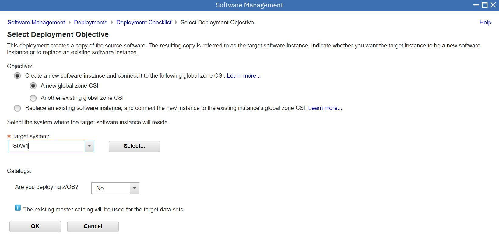

Start Configure Deployment Checklist


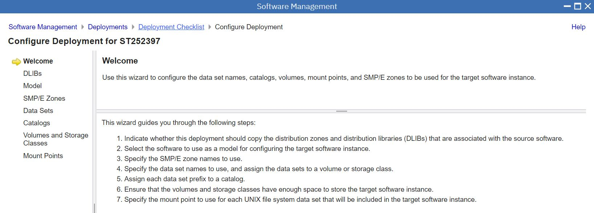

DLIBs = Yes Please


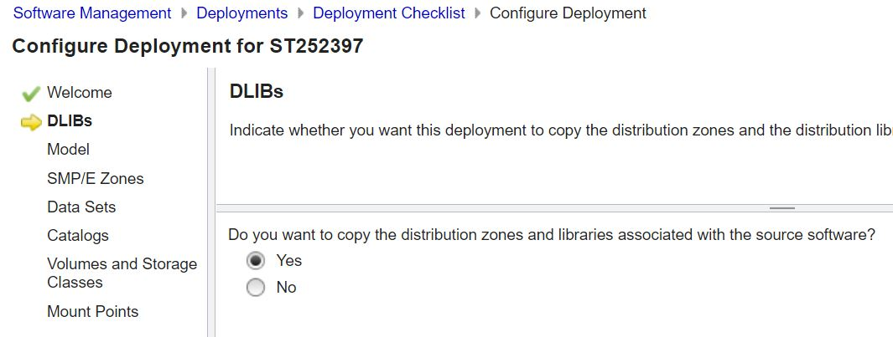


Use the Source Model (for SMPE zones)


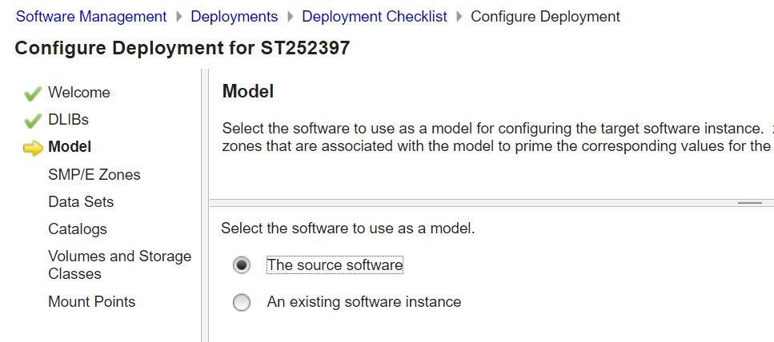

Accept Target and Distribution Zone names


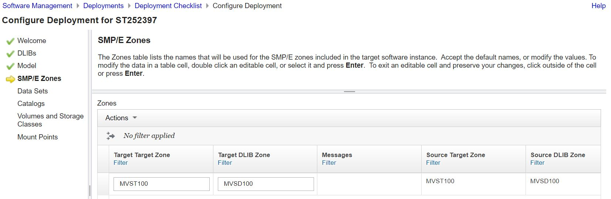

Modify HLQ of Libraries and create datasets in Store Class SCUSER


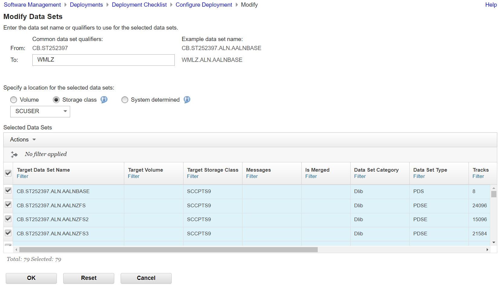

Accept the Master ICF Catalog


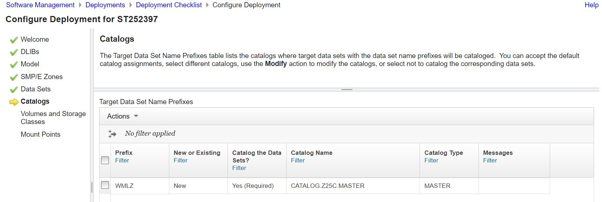

Not sure why volmes and storage classes report was empty


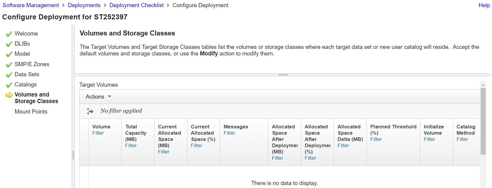

Override USS Paths to ZFS mounted ZFS files systems


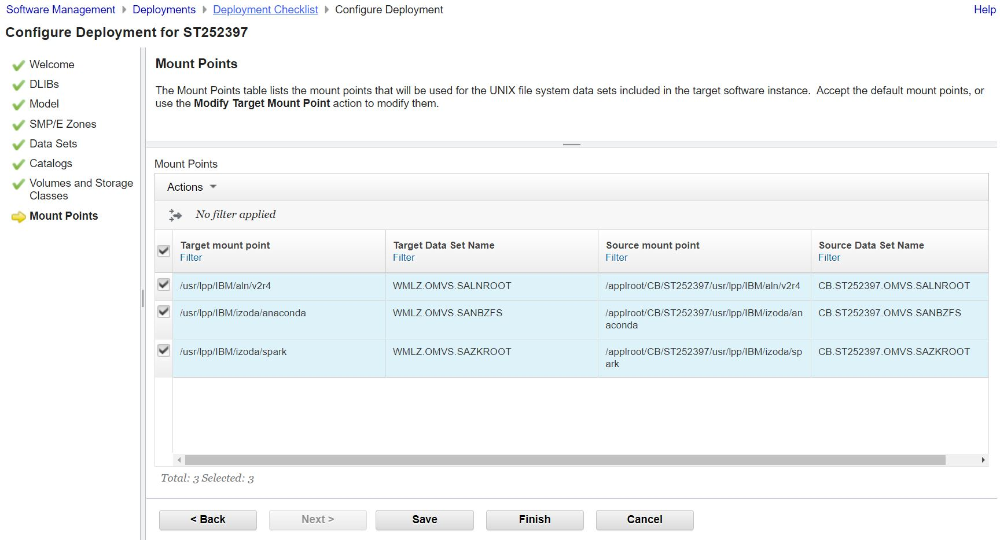

Specify PDS for JCLs


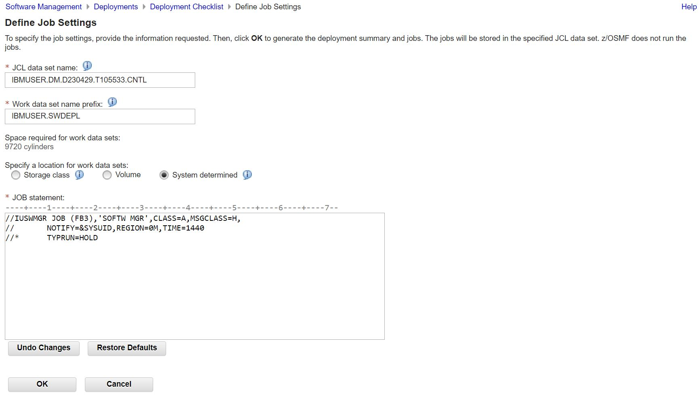


Submit Deployment Jobs


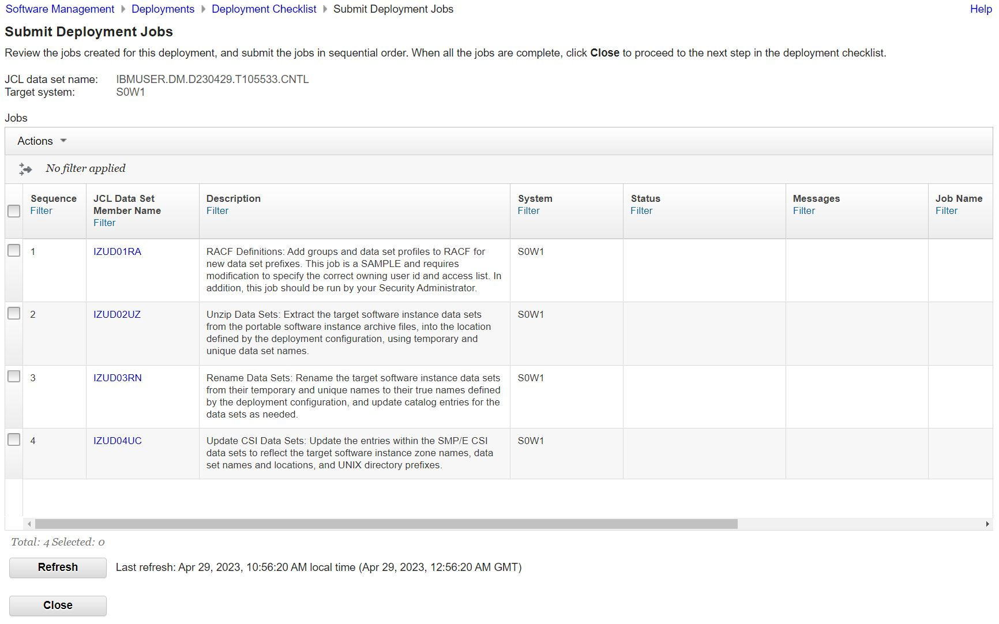

Override Complete for the optional RACF definitions; Submit and verify the rest.


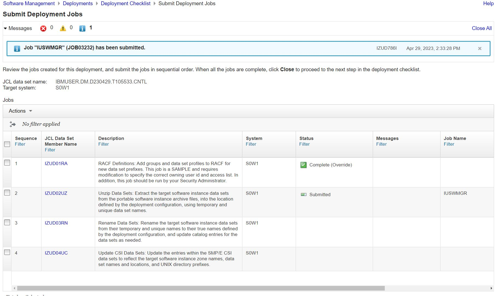


Post Installation Workflows - Your Order workflow is just motherhood and apple pie


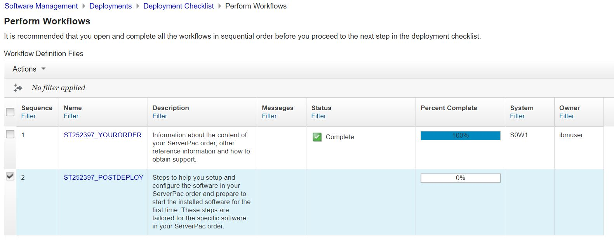

Post Deploy Workflow is important. Especially the RACF stuff (2), the Parmlib stuff (3) and thePARMLIB stuff (4) and the completion of SMPE zone.


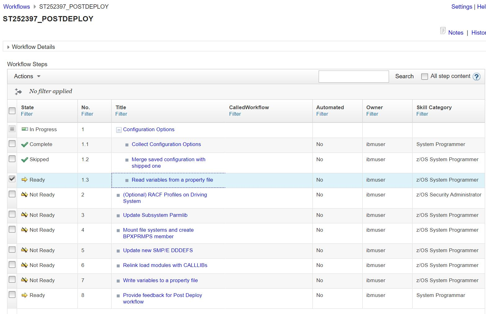


## Post Deploymemt Workflows

RACF Artefacts

```
1READY
   PROF MSGID WTPMSG
 READY
 /************ SETROPTS COMMAND SETS SYSTEM-WIDE RACF ************/
 READY
 /************ OPTIONS RELATED TO RESOURCE PROTECTION ************/
 READY
 SETROPTS GENERIC(DATASET STARTED) GENCMD(DATASET STARTED) CLASSACT(FACILITY LOGSTRM) RACLIST(FACILITY)
 ICH14070I SETROPTS RACLIST had no effect on class FACILITY.
 ICH14070I SETROPTS RACLIST had no effect on class XFACILIT.
 READY
 /***********  BEGIN SETUP FOR ZFS FILE SYSTEMS  **********/
 READY
 /** SPECIFIES Z/OS UNIX SYSTEM   **/
 READY
 /** SERVICES INFORMATION FOR THE **/
 READY
 /** GROUP BEING DEFINED TO RACF  **/
 READY
 ADDGROUP DFSGRP  SUPGROUP(SYS1) OMVS(GID(3))
 IRR52174I Incorrect GID 3.  This value is already in use by TTY.
 READY
 ADDGROUP ZFSGRP  SUPGROUP(SYS1) OMVS(GID(4))
 IKJ56702I INVALID GROUP, ZFSGRP
 IKJ56701I MISSING OMVS GID+
 IKJ56701I MISSING OMVS GROUP ID (GID), 1-10 NUMERIC DIGITS
 READY
 ADDUSER DFS DFLTGRP(DFSGRP) AUTHORITY(CREATE) OMVS(HOME(/opt/dfslocal/home/dfscntl) UID(0)) UACC(NONE)
 IRR52174I Incorrect UID 0.  This value is already in use by IBMUSER.
 READY
 ADDUSER ZFS DFLTGRP(ZFSGRP) AUTHORITY(CREATE) OMVS(UID(0)      HOME('/opt/dfslocal/home/dfscntl'))
 IRR52174I Incorrect UID 0.  This value is already in use by IBMUSER.
 READY
 RDEFINE STARTED DFS.* STDATA(USER(DFS))
 ICH10102I DFS.* ALREADY DEFINED TO CLASS STARTED.
 READY
 RDEFINE STARTED DFSCM.* STDATA(USER(DFS))
 ICH10102I DFSCM.* ALREADY DEFINED TO CLASS STARTED.
 READY
 RDEFINE STARTED ZFS.* STDATA(USER(ZFS))
 ICH10102I ZFS.* ALREADY DEFINED TO CLASS STARTED.
 READY
 CONNECT  ZFS   GROUP(DFSGRP) AUTH(CREATE)
 IKJ56702I INVALID USERID, ZFS
 READY
 /************** END SETUP FOR ZFS FILE SYSTEM ***************/
 READY
 /*****************  PERMIT ACCESS TO BPX FACILITY  ******************/
 READY
 PE BPX.DAEMON CLASS(FACILITY) ID(SYS1) ACC(READ)
 ICH06011I RACLISTED PROFILES FOR FACILITY WILL NOT REFLECT THE UPDATE(S) UNTIL A SETROPTS REFRESH IS ISSUED
 READY
 PE BPX.DAEMON CLASS(FACILITY) ID(IBMUSER) ACCESS(READ)
 ICH06011I RACLISTED PROFILES FOR FACILITY WILL NOT REFLECT THE UPDATE(S) UNTIL A SETROPTS REFRESH IS ISSUED
 READY
 /***************  DEFINE TTY, UUCPG AND UUCP GROUPS  ****************/
1READY
 ADDGROUP TTY  OMVS(GID(2))
 IKJ56702I INVALID GROUP, TTY
 IKJ56701I MISSING OMVS GID+
 IKJ56701I MISSING OMVS GROUP ID (GID), 1-10 NUMERIC DIGITS
 READY
 ADDGROUP UUCPG OMVS(GID(8765))
 IKJ56702I INVALID GROUP, UUCPG
 IKJ56701I MISSING OMVS GID+
 IKJ56701I MISSING OMVS GROUP ID (GID), 1-10 NUMERIC DIGITS
 READY
 ADDUSER UUCP DFLTGRP(UUCPG) OMVS(UID(396) HOME('/usr/spool/uucppublic') PROGRAM('/bin/sh'))
 IKJ56702I INVALID USERID, UUCP
 IKJ56701I MISSING OMVS UID+
 IKJ56701I MISSING OMVS USER ID (UID), 1-10 NUMERIC DIGITS
 READY
 /********** SET UID(0), HOME DIRECTORY AND **********/
 READY
 /********** PROGRAM DIRECTORY FOR IBMUSER  **********/
 READY
 ALTUSER IBMUSER OMVS(UID(0) HOME('/') PROGRAM('/bin/sh'))
 READY
 /****** BEGIN DEFINING DIFFERENT FACILITY CLASS, ******/
 READY
 /************ PERMIT ACCESS TO IBMUSER  ***************/
 READY
 RDEFINE FACILITY BPX.FILEATTR.APF UACC(NONE)
 ICH10102I BPX.FILEATTR.APF ALREADY DEFINED TO CLASS FACILITY.
 READY
 RDEFINE FACILITY BPX.FILEATTR.PROGCTL UACC(NONE)
 ICH10102I BPX.FILEATTR.PROGCTL ALREADY DEFINED TO CLASS FACILITY.
 READY
 RDEFINE FACILITY BPX.FILEATTR.SHARELIB UACC(NONE)
 ICH10102I BPX.FILEATTR.SHARELIB ALREADY DEFINED TO CLASS FACILITY.
 READY
 RDEFINE UNIXPRIV SUPERUSER.FILESYS.PFSCTL UACC(NONE)
 ICH10102I SUPERUSER.FILESYS.PFSCTL ALREADY DEFINED TO CLASS UNIXPRIV.
 READY
 PE BPX.FILEATTR.APF CLASS(FACILITY) ID(IBMUSER) ACC(READ)
 ICH06011I RACLISTED PROFILES FOR FACILITY WILL NOT REFLECT THE UPDATE(S) UNTIL A SETROPTS REFRESH IS ISSUED
 READY
 PE BPX.FILEATTR.PROGCTL CLASS(FACILITY) ID(IBMUSER) ACC(READ)
 ICH06011I RACLISTED PROFILES FOR FACILITY WILL NOT REFLECT THE UPDATE(S) UNTIL A SETROPTS REFRESH IS ISSUED
 READY
 PE BPX.FILEATTR.SHARELIB CLASS(FACILITY) ID(IBMUSER) ACC(READ)
 ICH06011I RACLISTED PROFILES FOR FACILITY WILL NOT REFLECT THE UPDATE(S) UNTIL A SETROPTS REFRESH IS ISSUED
 READY
 PE SUPERUSER.FILESYS.PFSCTL CLASS(UNIXPRIV) ID(IBMUSER) ACC(READ)
 ICH06011I RACLISTED PROFILES FOR UNIXPRIV WILL NOT REFLECT THE UPDATE(S) UNTIL A SETROPTS REFRESH IS ISSUED
 READY
 /******* END DEFINING DIFFERENT FACILITY CLASS, ********/
 READY
 /*******************************************************/
 READY
 /*********** BEGIN NEW SMP/E FACILITY CLASS  ***********/
 READY
1RDEFINE FACILITY GIM.CMD.* UACC(NONE)
 ICH10102I GIM.CMD.* ALREADY DEFINED TO CLASS FACILITY.
 READY
 PERMIT GIM.CMD.* CLASS(FACILITY) ID(IBMUSER) ACC(READ)
 ICH06011I RACLISTED PROFILES FOR FACILITY WILL NOT REFLECT THE UPDATE(S) UNTIL A SETROPTS REFRESH IS ISSUED
 READY
 RDEFINE FACILITY GIM.PGM.* UACC(NONE)
 ICH10102I GIM.PGM.* ALREADY DEFINED TO CLASS FACILITY.
 READY
 PERMIT GIM.PGM.* CLASS(FACILITY) ID(IBMUSER) ACC(READ)
 ICH06011I RACLISTED PROFILES FOR FACILITY WILL NOT REFLECT THE UPDATE(S) UNTIL A SETROPTS REFRESH IS ISSUED
 READY
 /*********** END NEW SMP/E FACILITY CLASS  ***********/
 READY
 /****************************************************************/
 READY
 /**** BEGIN DEFINE, PERMIT DIFFERENT FACILITY FOR LOGSTREAMS ****/
 READY
 RDEFINE FACILITY MVSADMIN.LOGR UACC(NONE)
 ICH10102I MVSADMIN.LOGR ALREADY DEFINED TO CLASS FACILITY.
 READY
 RDEFINE LOGSTRM SYSPLEX.OPERLOG UACC(NONE)
 ICH10102I SYSPLEX.OPERLOG ALREADY DEFINED TO CLASS LOGSTRM.
 READY
   RDEFINE LOGSTRM SYSPLEX.LOGREC.ALLRECS UACC(NONE)
 ICH10102I SYSPLEX.LOGREC.ALLRECS ALREADY DEFINED TO CLASS LOGSTRM.
 READY
 PE MVSADMIN.LOGR CLASS(FACILITY) ID(IBMUSER) ACC(UPDATE)
 ICH06011I RACLISTED PROFILES FOR FACILITY WILL NOT REFLECT THE UPDATE(S) UNTIL A SETROPTS REFRESH IS ISSUED
 READY
 PE SYSPLEX.OPERLOG CLASS(LOGSTRM) ID(IBMUSER) ACC(ALTER)
 ICH06011I RACLISTED PROFILES FOR LOGSTRM  WILL NOT REFLECT THE UPDATE(S) UNTIL A SETROPTS REFRESH IS ISSUED
 READY
 PE SYSPLEX.LOGREC.ALLRECS CLASS(LOGSTRM) ID(IBMUSER) ACC(ALTER)
 ICH06011I RACLISTED PROFILES FOR LOGSTRM  WILL NOT REFLECT THE UPDATE(S) UNTIL A SETROPTS REFRESH IS ISSUED
 READY
 /****  END DEFINE, PERMIT DIFFERENT FACILITY FOR LOGSTREAMS  ****/
 READY
 /****************************************************************/
 READY
 /*****  BEGIN DIGITAL CERTIFICATE DEFINITIONS AND PERMITS  *****/
 READY
 /* FOR SAF GENCERT AND EXPORT REQUESTS */
 READY
 /* WHERE THE APPLICATION HAS READ AND  */
 READY
 /* UPDATE ACCESS, SUBSEQUENT ACCESS    */
 READY
 /* CHECKS ARE PERFORMED AGAINST THE    */
 READY
 /* IRR.DIGTCERT.FUNCTION FACILITY      */
 READY
 /* RESOURCES.                          */
 READY
 RDEFINE FACILITY IRR.DIGTCERT.ADD UACC(NONE)
 ICH10102I IRR.DIGTCERT.ADD ALREADY DEFINED TO CLASS FACILITY.
1READY
 RDEFINE FACILITY IRR.DIGTCERT.ADDRING UACC(NONE)
 ICH10102I IRR.DIGTCERT.ADDRING ALREADY DEFINED TO CLASS FACILITY.
 READY
 RDEFINE FACILITY IRR.DIGTCERT.ALTER UACC(NONE)
 ICH10102I IRR.DIGTCERT.ALTER ALREADY DEFINED TO CLASS FACILITY.
 READY
 RDEFINE FACILITY IRR.DIGTCERT.ALTMAP UACC(NONE)
 ICH10102I IRR.DIGTCERT.ALTMAP ALREADY DEFINED TO CLASS FACILITY.
 READY
 RDEFINE FACILITY IRR.DIGTCERT.CONNECT UACC(NONE)
 ICH10102I IRR.DIGTCERT.CONNECT ALREADY DEFINED TO CLASS FACILITY.
 READY
 RDEFINE FACILITY IRR.DIGTCERT.DELETE UACC(NONE)
 ICH10102I IRR.DIGTCERT.DELETE ALREADY DEFINED TO CLASS FACILITY.
 READY
 RDEFINE FACILITY IRR.DIGTCERT.DELMAP UACC(NONE)
 ICH10102I IRR.DIGTCERT.DELMAP ALREADY DEFINED TO CLASS FACILITY.
 READY
 RDEFINE FACILITY IRR.DIGTCERT.DELRING UACC(NONE)
 ICH10102I IRR.DIGTCERT.DELRING ALREADY DEFINED TO CLASS FACILITY.
 READY
 RDEFINE FACILITY IRR.DIGTCERT.EXPORT UACC(NONE)
 ICH10102I IRR.DIGTCERT.EXPORT ALREADY DEFINED TO CLASS FACILITY.
 READY
 RDEFINE FACILITY IRR.DIGTCERT.EXPORTKEY UACC(NONE)
 ICH10102I IRR.DIGTCERT.EXPORTKEY ALREADY DEFINED TO CLASS FACILITY.
 READY
 RDEFINE FACILITY IRR.DIGTCERT.GENCERT UACC(NONE)
 ICH10102I IRR.DIGTCERT.GENCERT ALREADY DEFINED TO CLASS FACILITY.
 READY
 RDEFINE FACILITY IRR.DIGTCERT.GENREQ UACC(NONE)
 ICH10102I IRR.DIGTCERT.GENREQ ALREADY DEFINED TO CLASS FACILITY.
 READY
 RDEFINE FACILITY IRR.DIGTCERT.LIST UACC(NONE)
 ICH10102I IRR.DIGTCERT.LIST ALREADY DEFINED TO CLASS FACILITY.
 READY
 RDEFINE FACILITY IRR.DIGTCERT.LISTMAP UACC(NONE)
 ICH10102I IRR.DIGTCERT.LISTMAP ALREADY DEFINED TO CLASS FACILITY.
 READY
 RDEFINE FACILITY IRR.DIGTCERT.LISTRING UACC(NONE)
 ICH10102I IRR.DIGTCERT.LISTRING ALREADY DEFINED TO CLASS FACILITY.
 READY
 RDEFINE FACILITY IRR.DIGTCERT.MAP UACC(NONE)
 ICH10102I IRR.DIGTCERT.MAP ALREADY DEFINED TO CLASS FACILITY.
 READY
 RDEFINE FACILITY IRR.DIGTCERT.REMOVE UACC(NONE)
 ICH10102I IRR.DIGTCERT.REMOVE ALREADY DEFINED TO CLASS FACILITY.
 READY
 PE IRR.DIGTCERT.ADD CLASS(FACILITY) ID(*) ACC(READ)
 ICH06011I RACLISTED PROFILES FOR FACILITY WILL NOT REFLECT THE UPDATE(S) UNTIL A SETROPTS REFRESH IS ISSUED
 READY
 PE IRR.DIGTCERT.ADD CLASS(FACILITY) ID(IBMUSER) ACC(CONTROL)
 ICH06011I RACLISTED PROFILES FOR FACILITY WILL NOT REFLECT THE UPDATE(S) UNTIL A SETROPTS REFRESH IS ISSUED
 READY
 PE IRR.DIGTCERT.ADDRING CLASS(FACILITY) ID(*) ACC(READ)
1ICH06011I RACLISTED PROFILES FOR FACILITY WILL NOT REFLECT THE UPDATE(S) UNTIL A SETROPTS REFRESH IS ISSUED
 READY
 PE IRR.DIGTCERT.ADDRING CLASS(FACILITY) ID(IBMUSER) ACC(UPDATE)
 ICH06011I RACLISTED PROFILES FOR FACILITY WILL NOT REFLECT THE UPDATE(S) UNTIL A SETROPTS REFRESH IS ISSUED
 READY
 PE IRR.DIGTCERT.ALTER CLASS(FACILITY) ID(*) ACC(READ)
 ICH06011I RACLISTED PROFILES FOR FACILITY WILL NOT REFLECT THE UPDATE(S) UNTIL A SETROPTS REFRESH IS ISSUED
 READY
 PE IRR.DIGTCERT.ALTER CLASS(FACILITY) ID(IBMUSER) ACC(CONTROL)
 ICH06011I RACLISTED PROFILES FOR FACILITY WILL NOT REFLECT THE UPDATE(S) UNTIL A SETROPTS REFRESH IS ISSUED
 READY
 PE IRR.DIGTCERT.ALTMAP CLASS(FACILITY) ID(*) ACC(READ)
 ICH06011I RACLISTED PROFILES FOR FACILITY WILL NOT REFLECT THE UPDATE(S) UNTIL A SETROPTS REFRESH IS ISSUED
 READY
 PE IRR.DIGTCERT.ALTMAP CLASS(FACILITY) ID(IBMUSER) ACC(UPDATE)
 ICH06011I RACLISTED PROFILES FOR FACILITY WILL NOT REFLECT THE UPDATE(S) UNTIL A SETROPTS REFRESH IS ISSUED
 READY
 PE IRR.DIGTCERT.CONNECT CLASS(FACILITY) ID(*) ACC(READ)
 ICH06011I RACLISTED PROFILES FOR FACILITY WILL NOT REFLECT THE UPDATE(S) UNTIL A SETROPTS REFRESH IS ISSUED
 READY
 PE IRR.DIGTCERT.CONNECT CLASS(FACILITY) ID(IBMUSER) ACC(CONTROL)
 ICH06011I RACLISTED PROFILES FOR FACILITY WILL NOT REFLECT THE UPDATE(S) UNTIL A SETROPTS REFRESH IS ISSUED
 READY
 PE IRR.DIGTCERT.DELETE CLASS(FACILITY) ID(*) ACC(READ)
 ICH06011I RACLISTED PROFILES FOR FACILITY WILL NOT REFLECT THE UPDATE(S) UNTIL A SETROPTS REFRESH IS ISSUED
 READY
 PE IRR.DIGTCERT.DELETE CLASS(FACILITY) ID(IBMUSER) ACC(CONTROL)
 ICH06011I RACLISTED PROFILES FOR FACILITY WILL NOT REFLECT THE UPDATE(S) UNTIL A SETROPTS REFRESH IS ISSUED
 READY
 PE IRR.DIGTCERT.DELMAP CLASS(FACILITY) ID(*) ACC(READ)
 ICH06011I RACLISTED PROFILES FOR FACILITY WILL NOT REFLECT THE UPDATE(S) UNTIL A SETROPTS REFRESH IS ISSUED
 READY
 PE IRR.DIGTCERT.DELMAP CLASS(FACILITY) ID(IBMUSER) ACC(UPDATE)
 ICH06011I RACLISTED PROFILES FOR FACILITY WILL NOT REFLECT THE UPDATE(S) UNTIL A SETROPTS REFRESH IS ISSUED
 READY
 PE IRR.DIGTCERT.DELRING CLASS(FACILITY) ID(*) ACC(READ)
 ICH06011I RACLISTED PROFILES FOR FACILITY WILL NOT REFLECT THE UPDATE(S) UNTIL A SETROPTS REFRESH IS ISSUED
 READY
 PE IRR.DIGTCERT.DELRING CLASS(FACILITY) ID(IBMUSER) ACC(UPDATE)
 ICH06011I RACLISTED PROFILES FOR FACILITY WILL NOT REFLECT THE UPDATE(S) UNTIL A SETROPTS REFRESH IS ISSUED
 READY
 PE IRR.DIGTCERT.EXPORT CLASS(FACILITY) ID(*) ACC(READ)
 ICH06011I RACLISTED PROFILES FOR FACILITY WILL NOT REFLECT THE UPDATE(S) UNTIL A SETROPTS REFRESH IS ISSUED
 READY
 PE IRR.DIGTCERT.EXPORT CLASS(FACILITY) ID(IBMUSER) ACC(CONTROL)
 ICH06011I RACLISTED PROFILES FOR FACILITY WILL NOT REFLECT THE UPDATE(S) UNTIL A SETROPTS REFRESH IS ISSUED
 READY
 PE IRR.DIGTCERT.EXPORTKEY  CLASS(FACILITY) ID(*)  ACC(READ)
 ICH06011I RACLISTED PROFILES FOR FACILITY WILL NOT REFLECT THE UPDATE(S) UNTIL A SETROPTS REFRESH IS ISSUED
 READY
 PE IRR.DIGTCERT.EXPORTKEY CLASS(FACILITY) ID(IBMUSER) ACC(CONTROL)
 ICH06011I RACLISTED PROFILES FOR FACILITY WILL NOT REFLECT THE UPDATE(S) UNTIL A SETROPTS REFRESH IS ISSUED
 READY
 PE IRR.DIGTCERT.GENCERT CLASS(FACILITY) ID(*) ACC(READ)
 ICH06011I RACLISTED PROFILES FOR FACILITY WILL NOT REFLECT THE UPDATE(S) UNTIL A SETROPTS REFRESH IS ISSUED
 READY
1PE IRR.DIGTCERT.GENCERT CLASS(FACILITY) ID(IBMUSER) ACC(CONTROL)
 ICH06011I RACLISTED PROFILES FOR FACILITY WILL NOT REFLECT THE UPDATE(S) UNTIL A SETROPTS REFRESH IS ISSUED
 READY
 PE IRR.DIGTCERT.GENREQ CLASS(FACILITY)ID(*) ACC(READ)
 ICH06011I RACLISTED PROFILES FOR FACILITY WILL NOT REFLECT THE UPDATE(S) UNTIL A SETROPTS REFRESH IS ISSUED
 READY
 PE IRR.DIGTCERT.GENREQ CLASS(FACILITY) ID(IBMUSER) ACC(CONTROL)
 ICH06011I RACLISTED PROFILES FOR FACILITY WILL NOT REFLECT THE UPDATE(S) UNTIL A SETROPTS REFRESH IS ISSUED
 READY
 PE IRR.DIGTCERT.LIST CLASS(FACILITY) ID(*) ACC(READ)
 ICH06011I RACLISTED PROFILES FOR FACILITY WILL NOT REFLECT THE UPDATE(S) UNTIL A SETROPTS REFRESH IS ISSUED
 READY
 PE IRR.DIGTCERT.LIST CLASS(FACILITY) ID(IBMUSER) ACC(CONTROL)
 ICH06011I RACLISTED PROFILES FOR FACILITY WILL NOT REFLECT THE UPDATE(S) UNTIL A SETROPTS REFRESH IS ISSUED
 READY
 PE IRR.DIGTCERT.LISTMAP CLASS(FACILITY) ID(*) ACC(READ)
 ICH06011I RACLISTED PROFILES FOR FACILITY WILL NOT REFLECT THE UPDATE(S) UNTIL A SETROPTS REFRESH IS ISSUED
 READY
 PE IRR.DIGTCERT.LISTMAP CLASS(FACILITY) ID(IBMUSER) ACC(UPDATE)
 ICH06011I RACLISTED PROFILES FOR FACILITY WILL NOT REFLECT THE UPDATE(S) UNTIL A SETROPTS REFRESH IS ISSUED
 READY
 PE IRR.DIGTCERT.LISTRING CLASS(FACILITY) ID(*) ACC(READ)
 ICH06011I RACLISTED PROFILES FOR FACILITY WILL NOT REFLECT THE UPDATE(S) UNTIL A SETROPTS REFRESH IS ISSUED
 READY
 PE IRR.DIGTCERT.LISTRING CLASS(FACILITY) ID(IBMUSER) ACC(UPDATE)
 ICH06011I RACLISTED PROFILES FOR FACILITY WILL NOT REFLECT THE UPDATE(S) UNTIL A SETROPTS REFRESH IS ISSUED
 READY
 PE IRR.DIGTCERT.MAP CLASS(FACILITY) ID(*) ACC(READ)
 ICH06011I RACLISTED PROFILES FOR FACILITY WILL NOT REFLECT THE UPDATE(S) UNTIL A SETROPTS REFRESH IS ISSUED
 READY
 PE IRR.DIGTCERT.MAP CLASS(FACILITY) ID(IBMUSER) ACC(UPDATE)
 ICH06011I RACLISTED PROFILES FOR FACILITY WILL NOT REFLECT THE UPDATE(S) UNTIL A SETROPTS REFRESH IS ISSUED
 READY
 PE IRR.DIGTCERT.REMOVE CLASS(FACILITY) ID(*) ACC(READ)
 ICH06011I RACLISTED PROFILES FOR FACILITY WILL NOT REFLECT THE UPDATE(S) UNTIL A SETROPTS REFRESH IS ISSUED
 READY
 PE IRR.DIGTCERT.REMOVE CLASS(FACILITY) ID(IBMUSER) ACC(CONTROL)
 ICH06011I RACLISTED PROFILES FOR FACILITY WILL NOT REFLECT THE UPDATE(S) UNTIL A SETROPTS REFRESH IS ISSUED
 READY
 /********  END DIGITAL CERTIFICATE DEFINITIONS AND PERMITS  *******/
 READY
 /******************************************************************/
 READY
 /**************  REFRESH THE AFFECTED RACF CLASSES  ***************/
 READY
 SETROPTS RACLIST(FACILITY  DIGTCERT  DIGTCRIT  DIGTRING  LOGSTRM   STARTED   UNIXPRIV) REFRESH
 READY
 /**DEFINE STARTED TASK PROFILES AND ACTIVATING CIMS CLASS FOR IMS IVP**/
 READY
 /********* REFRESH ALL THE IMPACTED PROFILES  ********/
 READY
 SETROPTS RACLIST(STARTED FACILITY LOGSTRM) REFRESH
 READY
 SETROPTS GENERIC(DATASET STARTED) REFRESH
 READY
 END
```

HFS Mounts

```
//IUSWMGR JOB (FB3),'SOFTW MGR',CLASS=A,MSGCLASS=H,
//       NOTIFY=&SYSUID,REGION=0M,TIME=1440
//*      TYPRUN=HOLD
/*JOBPARM SYSAFF=S0W1
//JOBLIB   DD DSN=WMLZ.CPAC.SCPPLOAD,
//            DISP=SHR
//*
//*******************************************************************
//* This step will run IEBUPDTE to create a BPXPRMPS member in
//* your PARMLIB dataset with the new filesystem structure.
//* Update your IEASYS00 member with this new member.
//*******************************************************************
//*
//BPXPS01 EXEC PGM=IEBUPDTE,COND=(4000,LT)
//SYSPRINT DD SYSOUT=*
//SYSUT1   DD DSN=WMLZ.CPAC.PARMLIB,
//            DISP=SHR
//SYSUT2   DD DSN=WMLZ.CPAC.PARMLIB,
//            DISP=SHR
//SYSIN    DD   DATA,DLM='%%'
./    ADD  NAME=BPXPRMPS,LIST=ALL
/*******************************************************************/
/*  This member, as specified in IEASYS00, will cause Unix System  */
/*  Services to come up with all product filesystems mounted.      */
/*******************************************************************/
MOUNT FILESYSTEM
('WMLZ.OMVS.SALNROOT')
 MOUNTPOINT(
'/usr/lpp/IBM/aln/v2r4')
 TYPE(ZFS) MODE(RDWR)
MOUNT FILESYSTEM
('WMLZ.OMVS.SANBZFS')
 MOUNTPOINT(
'/usr/lpp/IBM/izoda/anaconda')
 TYPE(ZFS) MODE(RDWR)
MOUNT FILESYSTEM
('WMLZ.OMVS.SAZKROOT')
 MOUNTPOINT(
'/usr/lpp/IBM/izoda/spark')
 TYPE(ZFS) MODE(RDWR)
%%
//*
//NOTOK   EXEC PGM=CPPMAXRC,COND=((0,GE,BPXPS01),(4000,LT))
//*
//*******************************************************************
//* This step will create the mountpoint directory used in deployment
//*******************************************************************
//MKCOS1  EXEC PGM=BPXBATCH,COND=(4000,LT)
//STDPARM DD *
sh
mkdir -p 755
/usr/lpp/IBM/aln/v2r4
/*
//STDOUT DD SYSOUT=*
//STDERR DD SYSOUT=*
//*
//*******************************************************************
//* This step will create the mountpoint directory used in deployment
//*******************************************************************
//MKCOS2  EXEC PGM=BPXBATCH,COND=(4000,LT)
//STDPARM DD *
sh
mkdir -p 755
/usr/lpp/IBM/izoda/anaconda
/*
//STDOUT DD SYSOUT=*
//STDERR DD SYSOUT=*
//*
//*******************************************************************
//* This step will create the mountpoint directory used in deployment
//*******************************************************************
//MKCOS3  EXEC PGM=BPXBATCH,COND=(4000,LT)
//STDPARM DD *
sh
mkdir -p 755
/usr/lpp/IBM/izoda/spark
/*
//STDOUT DD SYSOUT=*
//STDERR DD SYSOUT=*
//*
//*******************************************************************
//* This step will mount the SMP/E filesystem dataset
//*******************************************************************
//STEP1   EXEC PGM=IKJEFT1B,COND=(4000,LT)
//SYSTSPRT DD   SYSOUT=*
//SYSTSIN  DD   *
  PROF MSGID WTPMSG
MOUNT FILESYSTEM +
('WMLZ.OMVS.SALNROOT') +
MOUNTPOINT(+
'/usr/lpp/IBM/aln/v2r4') +
TYPE(ZFS) MODE(RDWR)
MOUNT FILESYSTEM +
('WMLZ.OMVS.SANBZFS') +
MOUNTPOINT(+
'/usr/lpp/IBM/izoda/anaconda') +
TYPE(ZFS) MODE(RDWR)
MOUNT FILESYSTEM +
('WMLZ.OMVS.SAZKROOT') +
MOUNTPOINT(+
'/usr/lpp/IBM/izoda/spark') +
TYPE(ZFS) MODE(RDWR)
/*
//NOTOK   EXEC PGM=CPPMAXRC,COND=((0,GE,STEP1),(4000,LT))
//*

```

Notes on ZFS

```
Step will run IEBUPDTE to create a BPXPRMPS member in your PARMLIB dataset with the new filesystem structure.
>>> WMLZ.CPAC.PARMLIB

USER.Z25C.PARMLIB(BPXPRMZZ)
===========================
/* WMLZ ZFS */                                   
MOUNT FILESYSTEM('WMLZ.OMVS.SALNROOT')           
      TYPE(ZFS)                                  
      MODE(RDWR)                                 
      NOAUTOMOVE                                 
      MOUNTPOINT('/usr/lpp/IBM/aln/v2r4')        
/* WMLZ ANACONDA */                              
MOUNT FILESYSTEM('WMLZ.OMVS.SANBZFS')            
      TYPE(ZFS)                                  
      MODE(RDWR)                                 
      NOAUTOMOVE                                 
      MOUNTPOINT('/usr/lpp/IBM/izoda/anaconda')  
/* WMLZ SPARK */                                 
MOUNT FILESYSTEM('WMLZ.OMVS.SAZKROOT')           
      TYPE(ZFS)                                  
      MODE(RDWR)                                 
      NOAUTOMOVE                                 
      MOUNTPOINT('/usr/lpp/IBM/izoda/spark')     

IBMUSER:/Z25C/usr/lpp/IBM/aln/v2r4: >ls
IBM            bin            extra          iml-onnx       iml-utilities  node_modules   usr
README         cics-scoring   iml-db2ads     iml-portal     iml-zostools   nodejs         wlp
alnsamp        configuration  iml-library    iml-services   imlpython      sparkaas
 
IBMUSER:/Z25C/usr/lpp/IBM/izoda: >ls
anaconda  spark
IBMUSER:/Z25C/usr/lpp/IBM/izoda: >cd anaconda
IBMUSER:/Z25C/usr/lpp/IBM/izoda/anaconda: >ls
2017_ga_pkgs.txt          2020_q2_links             2022_alivy_sec1.txt       conda-meta
2018_q1_pkgs.txt          2020_q2_pkgs.txt          2022_alivy_sec1_links     configure-anaconda
2018_q3_links             2020_q2_pkgsn.txt         2022_alivy_sec2.txt       configure-anaconda-r
2018_q3_pkgs.txt          2020_q4_p1_links          2022_alivy_sec2_links     dsdbc
2018_sec_links            2020_q4_p2_links          2022_alivy_sec3.txt       envs
2018_sec_pkgs.txt         2020_q4_pkgs_p1.txt       2022_alivy_sec3_links     etc
2018_sec_pkgsn.txt        2020_q4_pkgs_p2.txt       2022_alivy_sec4.txt       ga_pkgs.txt
2019_q1_links             2021_alivy_sec.txt        2022_alivy_sec4_links     include
2019_q1_pe0_links         2021_alivy_sec2.txt       2022_q4_bundle_sec.txt    initial-install
2019_q1_pkgs.txt          2021_alivy_sec2_links     2022_q4_bundle_sec_links  install-march-ptf
2019_q1_pkgsn.txt         2021_alivy_sec3.txt       2023_alivy_sec1.txt       install_functions
2019_q2_links             2021_alivy_sec3_links     2023_alivy_sec1_links     install_functions_r
2019_q2_pkgsn.txt         2021_alivy_sec_links      2023_p1_bundle_sec.txt    lib
2019_q3_links             2021_amaven_sec.txt       2023_p1_bundle_sec_links  man
2019_q3_pkgs.txt          2021_amaven_sec_links     CHANGES.md                march_ptf_pkgs.txt
2019_q3_pkgs36.txt        2021_q1_links             IBM                       pkgs
2019_q3_r_links           2021_q1_pkgs.txt          README.md                 py37_pkgs.txt
2019_q4_links             2021_q2_p1_links          README_CONFIGURE.md       r_pkgs.txt
2019_q4_pkgs.txt          2021_q2_p2_links          README_PYTHON37.md        reinstall
2019_q4_pkgsn.txt         2021_q2_pkgs_p1.txt       README_R.md               share
2020_q1_pkgs_py.txt       2021_q2_pkgs_p2.txt       apar_notes.txt            ssl
2020_q1_pkgs_r.txt        2021_q2_pkgsn.txt         bin                       var
2020_q1_py_links          2021_q4_links             boot_pkgs.txt
2020_q1_r_links           2021_q4_pkgsn.txt         change-prefix
IBMUSER:/Z25C/usr/lpp/IBM/izoda/anaconda: >cd ..
IBMUSER:/Z25C/usr/lpp/IBM/izoda: >cd spark
IBMUSER:/Z25C/usr/lpp/IBM/izoda/spark: >ls
IBM       spark24x
IBMUSER:/Z25C/usr/lpp/IBM/izoda/spark: >

```
