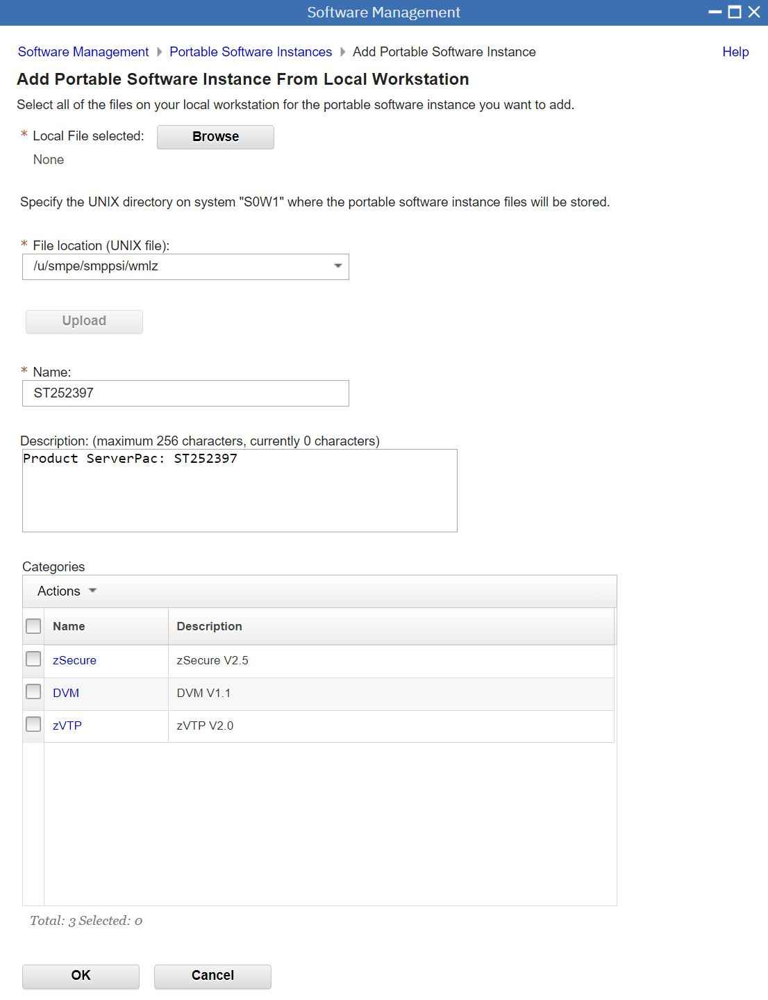
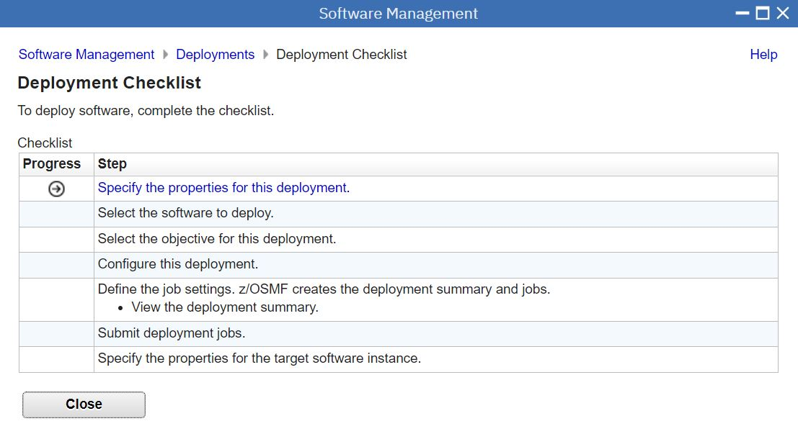
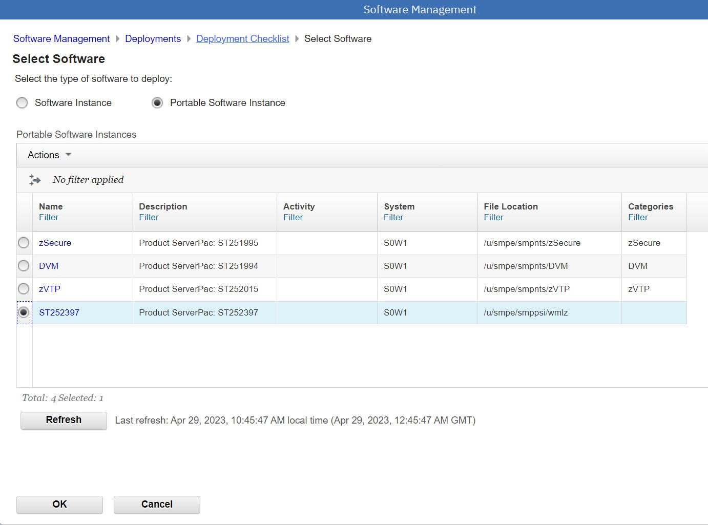

# Audit Trail for SMPE installation of WMLZ V2.4

## Planning Notes

1. Problem with ZVA system installing PSI from ShopZ .... hence ; save to C:\z\WMLZ folder and install from Wkstn.
2. April PSI download has less files than the March Order
3. Provision DASD for space

## Planning z Volumes

DBCLASSD - add C5DBD3
SGUSER - USER0A - USER0F ; for products and SMPE work - all 3390-27
SGEXTEAV - for SQLDI and WMLZ instances - EAV001 - EAV004 - all 3390-27

## Shop Z Download April 2023

D:\ZSHOP_PSI\WMLZ_V24_APR2023

## zOSMF workflow to install the PSI

Words

Word

Word

Word

Word

